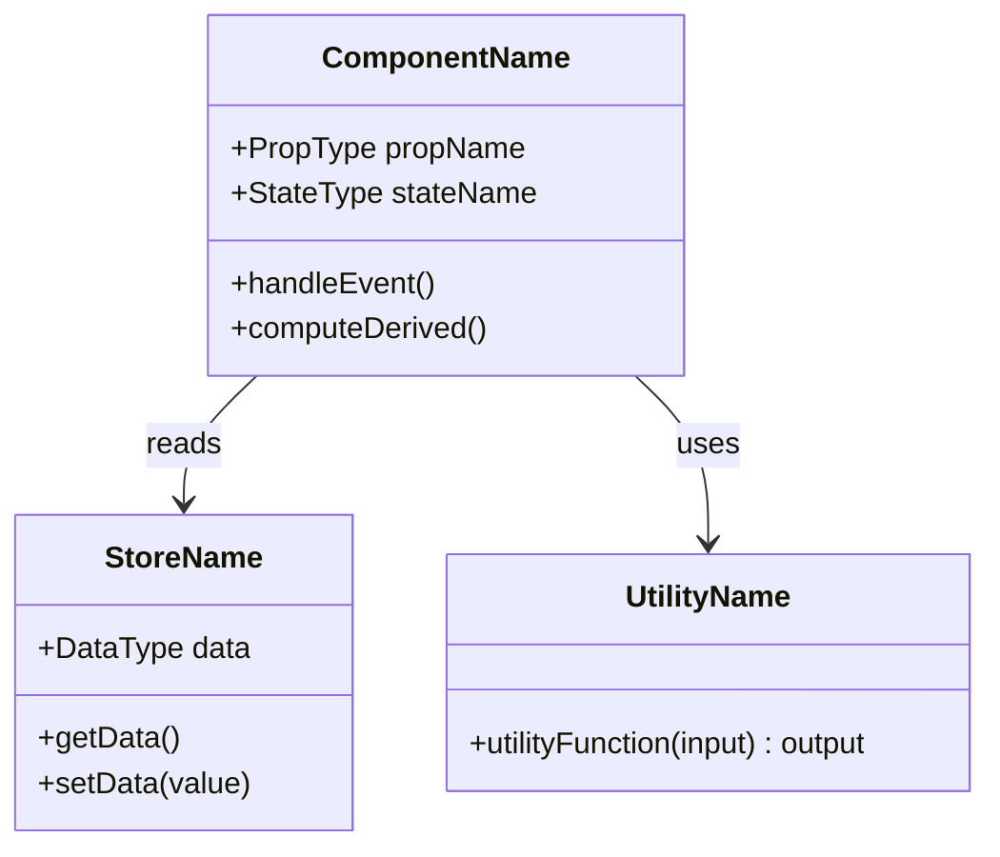

# VIEW B: THE ASSET INVENTORY (Matter)

**Last Updated:** [YYYY-MM-DD]

## Exported Functions

| Function | File | Parameters | Returns | Purpose |
|----------|------|------------|---------|---------|
| `functionName` | `path/to/file.ts` | `(param: Type)` | `ReturnType` | Description |

## Types & Interfaces

| Type | File | Definition |
|------|------|------------|
| `TypeName` | `path/to/types.ts` | `{ field: Type }` |

## Stores

| Store | File | State Shape | Purpose |
|-------|------|-------------|---------|
| `storeName` | `path/to/store.ts` | `Type` | Description |

---

*Update this file when: Exporting new functions, classes, or types; changing signatures.*
