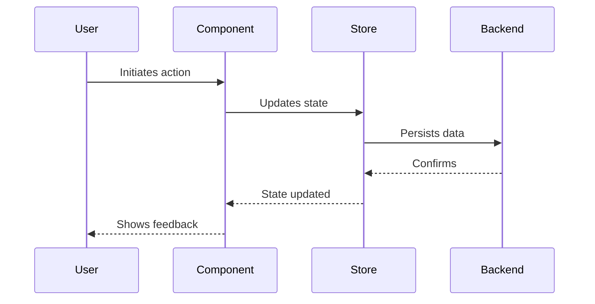

# VIEW E: FUNCTIONAL STORIES (Narratives)

**Last Updated:** [YYYY-MM-DD]

---

## [US-001] Story Title

**Narrative:** As a [Role], I want [Action], so that [Benefit].

**Status:** `[ ] PENDING` / `[x] VERIFIED`

### Functional Trace
1. **TRIGGER:** User clicks `[Component: Button]`
2. **EVENT:** Dispatches `[Event: ACTION_NAME]`
3. **GUARD:** Check `[Function: isValid()]`
4. **DATA FLOW:** Payload passed to `[Store: storeName]`
5. **SIDE EFFECT:** Write to database
6. **FEEDBACK:** Transition UI state, show toast

### Validation Criteria
- [ ] User can perform action
- [ ] Data persists correctly
- [ ] UI shows success feedback
- [ ] Error state handled gracefully

---

## [US-002] Another Story

**Narrative:** As a [Role], I want [Action], so that [Benefit].

**Status:** `[ ] PENDING`

### Functional Trace
1. **TRIGGER:** [Describe]
2. **EVENT:** [Describe]
3. **RESULT:** [Describe]

### Validation Criteria
- [ ] Criterion 1
- [ ] Criterion 2

---

*Update this file when: Starting new features, refactoring user-facing flows, marking stories complete.*
