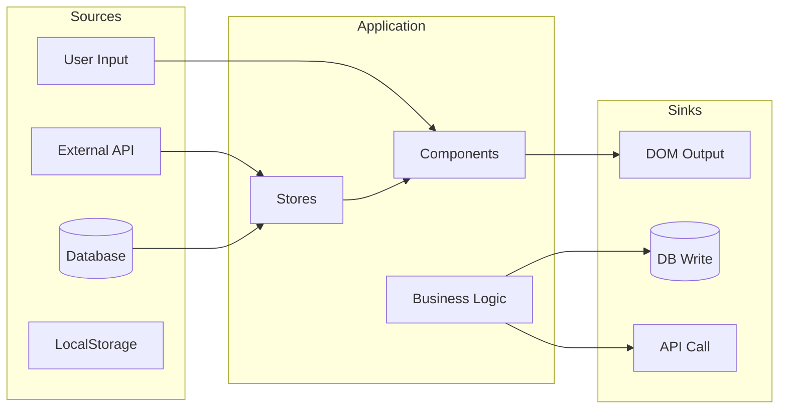

# VIEW C: THE I/O REGISTRY (Boundaries)

**Last Updated:** [YYYY-MM-DD]

## Data Sources

| Source | Type | Location | Data Shape |
|--------|------|----------|------------|
| User Input | Event | Component | `KeyboardEvent` |
| API | HTTP | `/api/endpoint` | `{ data: Type }` |
| Database | Query | `table_name` | `Record[]` |

## Data Sinks

| Sink | Type | Location | Data Shape |
|------|------|----------|------------|
| DOM | Render | Component | HTML |
| Database | Write | `table_name` | `Record` |
| API | POST | `/api/endpoint` | `Payload` |

## Transformations

| Transform | Input | Output | Location |
|-----------|-------|--------|----------|
| `transformFn` | `InputType` | `OutputType` | `file.ts` |

---

*Update this file when: Adding API calls, database queries, storage operations, or new stores.*
