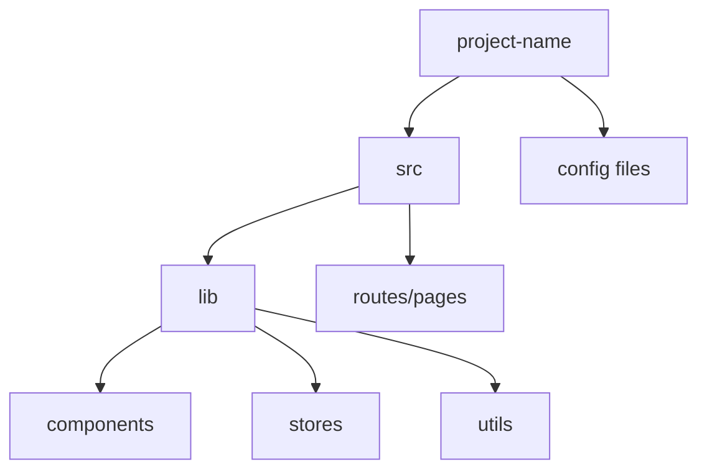

# VIEW A: THE PHYSICAL MAP (Space)

**Last Updated:** [YYYY-MM-DD]

## Physical Inventory

| File Path | Purpose |
|-----------|---------|
| `src/lib/components/` | Reusable UI components |
| `src/lib/stores/` | State management |
| `src/lib/utils/` | Utility functions |
| `src/routes/` | Application routes/pages |

## Key Files

- `src/lib/components/[Component].svelte`: [Description]
- `src/lib/stores/[store].ts`: [Description]
- `src/lib/utils/[utility].ts`: [Description]

---

*Update this file when: Creating, renaming, moving, or deleting files/directories.*
