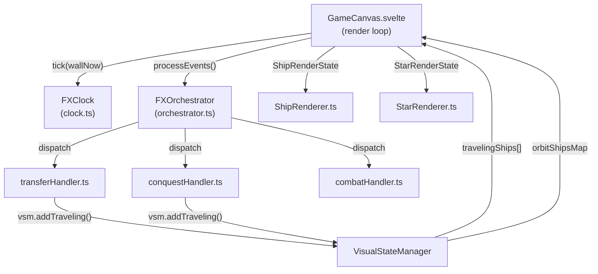

# Animation System Guide — Pax Fluxia

> Reference doc for implementing and debugging ship/star animations.
> Read this before touching any animation code.

## Architecture Overview



### Data Flow

1. **Server tick** → `activeGameStore.consumeTickEvents()` returns `TickEvents`
2. **FXOrchestrator.processEvents()** dispatches events to handlers
3. **Handlers** (transfer, conquest, combat) create `VisualShipState` entries in VSM
4. **GameCanvas** builds `ShipRenderState` and calls `renderShips()` / `renderTravelingShips()`
5. **ShipRenderer** advances ship lifecycle: depart → travel → arrive → settle → orbit

---

## Time Domains — CRITICAL

There are **two time domains**. Using the wrong one is the #1 animation bug source.

| Field | Source | Scales with speed? | Pauses? | Use for |
|-------|--------|--------------------|---------|---------|
| `state.gameNowMs` | `fxOrchestrator.gameTime` (= `FXClock.now`) | ✅ Yes | ✅ Yes | **Travel** — must match game ticks |
| `state.gameNowMs` | `fxOrchestrator.gameTime` | ✅ Yes | ✅ Yes | **All VFX** — travel, settle, surge, orbit, conquest |

### Single-Clock Axiom

All in-game VFX timing uses **one clock: game time** (`gameNowMs`). This clock is speed-scaled and pause-aware. All animation durations (even raw ms values like `SETTLE_DURATION_MS`) scale coherently with the speed multiplier.

Wall time (`performance.now()`) is used only as the **input** to `FXClock.tick()` for computing frame deltas — never by renderers directly.

See [VFX_TIMING_MODEL.md](file:///c:/Users/mikep/Desktop/WebDev/PRISM-Atlas-DART%20v1/.agent/SPECIFICATIONS/VFX_TIMING_MODEL.md) for the full rationale.

### The FXClock

Source: [clock.ts](file:///c:/Users/mikep/Desktop/WebDev/PRISM-Atlas-DART%20v1/pax-fluxia/src/lib/fx/clock.ts)

- `tick(wallNow)` — call once per frame with `performance.now()`
- `pause()` / `resume()` — freezes/resumes time accumulation
- `setSpeed(mult)` — speed multiplier (1.0 = normal)
- `reset()` — zeros everything (call on game restart)
- `now` — accumulated game time in ms (speed-scaled, pause-aware)
- `dt` — frame delta in ms (0 when paused)

Speed multiplier = `BASE_TICK_MS / ANIMATION_SPEED_MS` (set via `FXOrchestrator.setAnimationSpeed()`).

---

## Ship Lifecycle

```
SPAWN → ORBITING → DEPART → TRAVELING → ARRIVE → SETTLE → ORBITING
                                                    ↑
                                              settleStartTime stamped here
```

### Key Properties on `VisualShipState`

| Property | Set when | Used for |
|----------|----------|----------|
| `departTime` | Handler creates ship | Travel start timestamp (`gameNowMs` domain) |
| `travelDuration` | Handler creates ship | Total travel time in game-ms |
| `departDuration` | Handler creates ship | Initial departure phase (leave orbit) |
| `settleStartTime` | Ship arrives at dest | Settle animation start (`gameNowMs` domain) |
| `settleStartAngle` | Ship arrives at dest | Starting angle for settle arc |
| `settleStartRadius` | Ship arrives at dest | Starting radius for settle spiral |
| `targetIndex` | Ship arrives / re-indexed | Orbit slot index |
| `arrowSpiralDeg` | Conquest handler | Extra rotation degrees for spiral effect |
| `spawnTime` | Ship spawned | Fade-in start (`wallNowMs` domain) |

### Settle Animation ([ShipRenderer.ts lines ~660-700](file:///c:/Users/mikep/Desktop/WebDev/PRISM-Atlas-DART%20v1/pax-fluxia/src/lib/renderers/ShipRenderer.ts#L660-L700))

```typescript
const now = state.wallNowMs;           // ← unscaled time
const elapsed = now - ship.settleStartTime;
const t = clamp(elapsed / settleDur, 0, 1);
const ease = 1 - (1 - t)^3;           // cubic ease-out

// Interpolate radius (spiral) and angle (arc)
curRadius = settleStartRadius + (targetRadius - settleStartRadius) * ease;
curAngle  = settleStartAngle  + angleDelta * ease;
```

Settle duration is chosen based on ship type:
- **Arrowhead conquest**: `ARROW_SPIRAL_DURATION_MS` (default 800ms)
- **Conquest settle**: `CONQUEST_SETTLE_MS` (default 500ms)
- **Normal transfer**: `SETTLE_DURATION_MS` (default 830ms)

---

## Key Config Parameters

All tuneable via `GAME_CONFIG` and exposed in the UI panels.

### Travel
| Param | Default | Effect |
|-------|---------|--------|
| `TRAVEL_DURATION_MULT` | 1.9 | Travel time = `mult * effectiveTickMs` |
| `DEPART_FRACTION` | 0.55 | Fraction of travel spent in departure phase |
| `DEPART_JITTER_MS` | 105 | Random per-ship departure delay |
| `TRAVEL_MODE` | `"bezier"` | `"linear"` or `"bezier"` path |
| `TRAVEL_ARC_INTENSITY` | 1.15 | Bezier curve bulge |

### Settle & Orbit
| Param | Default | Effect |
|-------|---------|--------|
| `SETTLE_DURATION_MS` | 830 | Regular settle animation duration |
| `ARRIVAL_SPREAD` | 0 | Stagger window = `spread * tickMs` (batch-relative) |
| `ORBIT_RING_MULT` | 1.6 | Orbit radius = `starRadius * mult` |
| `ORBIT_DENSITY` | 1.7 | Ships per orbit ring |
| `STATIC_ORBITS` | false | If true, ships don't rotate in orbit |

### Conquest
| Param | Default | Effect |
|-------|---------|--------|
| `ARROW_ENGULF_RADIUS` | 145 | Engulf orbit radius in px |
| `ARROW_SPIRAL_DURATION_MS` | 800 | Spiral settle duration for conquest |
| `ARROW_SPIRAL_MIN_DEG` / `MAX_DEG` | 30/180 | Random rotation range for spiral |
| `CONQUEST_SETTLE_MS` | 500 | Non-arrowhead conquest settle |
| `CONQUEST_COLOR_DELAY_MS` | 300 | Delay before star changes color |
| `CONQUEST_FLASH_DURATION_MS` | 600 | Flash effect duration |

---

## Anti-Patterns — Lessons Learned

### ❌ Never use `performance.now()` in renderers or handlers
Use `state.gameNowMs`, `state.wallNowMs`, or `ctx.gameTime`. See [D-17](file:///c:/Users/mikep/Desktop/WebDev/PRISM-Atlas-DART%20v1/.atlas/DECISIONS.md).

### ❌ Never create opaque timing formulas
Every delay, stagger, and duration MUST be a `GAME_CONFIG` key or documented formula. The stagger bug (D-18) used `destShips.length / (destShips.length+1) * staggerWindow`, creating 2000ms+ delays at busy stars that were invisible to the user. See [D-18](file:///c:/Users/mikep/Desktop/WebDev/PRISM-Atlas-DART%20v1/.atlas/DECISIONS.md).

### ❌ Never set `settleStartTime = wallNowMs` for initial spawns
Initial ships (map load) should use `settleStartTime = -1e9` so they're already settled on first frame. Otherwise ships appear collapsed until the clock starts.

### ❌ Never mix time domains
If a duration is specified in raw ms (e.g., `SETTLE_DURATION_MS = 190`), the elapsed time check must use `wallNowMs`, not `gameNowMs`. If a duration is relative to ticks (e.g., `TRAVEL_DURATION_MULT * tickMs`), use `gameNowMs`.

---

## Game Restart Checklist

On session change ([GameCanvas.svelte ~line 577](file:///c:/Users/mikep/Desktop/WebDev/PRISM-Atlas-DART%20v1/pax-fluxia/src/lib/components/game/GameCanvas.svelte#L577)), these MUST be cleared:

- `visualShips.clear()` — orbit ship maps
- `visualDamagedShips.clear()` — damaged ship maps
- `fxOrchestrator.reset()` — clears VSM (traveling, combat, conquests, flashes) + resets FXClock
- `animationTime = 0` — reset wall time
- `attackRampProgress.clear()` — surge ramp state
- `surgeLockedDir.clear()` — surge direction locks
- `lastSurgeFrameTime = 0`
- `nextShipId = 0`
- `starShipCounts.clear()` — spawn tracking
- `shipSpawnTimers.clear()` — spawn timers

---

## File Reference

| File | Role |
|------|------|
| [clock.ts](file:///c:/Users/mikep/Desktop/WebDev/PRISM-Atlas-DART%20v1/pax-fluxia/src/lib/fx/clock.ts) | Pausable, speed-scaled game clock |
| [orchestrator.ts](file:///c:/Users/mikep/Desktop/WebDev/PRISM-Atlas-DART%20v1/pax-fluxia/src/lib/fx/orchestrator.ts) | Central coordinator: clock + VSM + registry |
| [types.ts](file:///c:/Users/mikep/Desktop/WebDev/PRISM-Atlas-DART%20v1/pax-fluxia/src/lib/fx/types.ts) | `FXContext` interface |
| [VisualStateManager.ts](file:///c:/Users/mikep/Desktop/WebDev/PRISM-Atlas-DART%20v1/pax-fluxia/src/lib/fx/VisualStateManager.ts) | Ship state storage and mutation API |
| [transferHandler.ts](file:///c:/Users/mikep/Desktop/WebDev/PRISM-Atlas-DART%20v1/pax-fluxia/src/lib/fx/handlers/transferHandler.ts) | Transfer event → traveling ship |
| [conquestHandler.ts](file:///c:/Users/mikep/Desktop/WebDev/PRISM-Atlas-DART%20v1/pax-fluxia/src/lib/fx/handlers/conquestHandler.ts) | Conquest event → arrowhead animation |
| [ShipRenderer.ts](file:///c:/Users/mikep/Desktop/WebDev/PRISM-Atlas-DART%20v1/pax-fluxia/src/lib/renderers/ShipRenderer.ts) | Ship drawing, travel lifecycle, settle animation |
| [StarRenderer.ts](file:///c:/Users/mikep/Desktop/WebDev/PRISM-Atlas-DART%20v1/pax-fluxia/src/lib/renderers/StarRenderer.ts) | Star rendering, conquest flash, pending conquest |
| [GameCanvas.svelte](file:///c:/Users/mikep/Desktop/WebDev/PRISM-Atlas-DART%20v1/pax-fluxia/src/lib/components/game/GameCanvas.svelte) | Render loop, ShipRenderState construction |
| [game.config.ts](file:///c:/Users/mikep/Desktop/WebDev/PRISM-Atlas-DART%20v1/pax-fluxia/src/lib/config/game.config.ts) | All config keys and defaults |
| [animationStore.svelte.ts](file:///c:/Users/mikep/Desktop/WebDev/PRISM-Atlas-DART%20v1/pax-fluxia/src/lib/stores/animationStore.svelte.ts) | Animation speed persistence |
