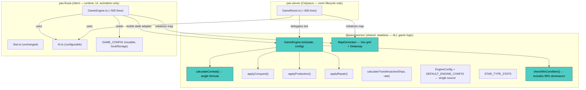

# Engine Architecture — Target State

**Last Updated:** 2026-02-12  
**Purpose:** Desired state after engine unification. Use this as the reference while refactoring.

---

## Architecture Overview



---

## What Changes

### Removed from Client

| What | Why |
|------|-----|
| `resolveMultiSourceCombat()` | Delegates to `GameEngine.tick()` |
| `resolveCombat()` | Delegates to `GameEngine.tick()` |
| `executeTransferOrders()` | Delegates to `GameEngine.tick()` |
| `Combat.ts` / `calculateCombatV4()` | Uses shared `calculateCombat()` |
| `checkWinCondition()` | Uses shared (after adding 99% dominance) |
| Config bridging code | Direct `EngineConfig` construction from `GAME_CONFIG` |

### Stays in Client

| What | Why |
|------|-----|
| Tick loop / timing / `requestAnimationFrame` | Browser-specific |
| `AI.ts` evaluation | Configurable AI with UI sliders |
| Combat logging (`combatLog.add()`) | Post-processes TickEvents |
| History recording | Client-only telemetry |
| `getState()` serialization | Svelte store binding |
| Sound / animation hooks | Client-only |

### Added to Common

| What | From |
|------|------|
| `MapGenerator` (hex grid + Delaunay) | Client's `HexGrid.ts` + map init |
| 99% dominance in `checkWinCondition()` | Client's win check |
| `calculateTransfer(ships, rate)` accepts rate as parameter | Remove `ORDER_CONFIG` |

### Added to Server

| What | From |
|------|------|
| Shared `MapGenerator` replaces random scatter | Common |
| Shared AI (or simplified version using `AI.ts` from client) | Common or client |

---

## Target Duplication Matrix

| Feature | Common | Client | Server | Status |
|---------|--------|--------|--------|--------|
| Combat formula | `calculateCombat()` | via Common | via Common | ✅ Single |
| Transfer rate | `EngineConfig.TRANSFER_RATE` | via `GAME_CONFIG` | via config | ✅ Single, UI-tunable |
| Tick orchestration | `GameEngine.tick()` | Calls Common | Calls Common | ✅ Delegates |
| Production | `applyProduction()` | via Common | via Common | ✅ Already unified |
| Repair | `applyRepair()` | via Common | via Common | ✅ Already unified |
| Conquest | `applyConquest()` | via Common | via Common | ✅ Already unified |
| Win condition | Includes 99% dominance | via Common | via Common | ✅ Single |
| Map generation | `MapGenerator` | via Common | via Common | ✅ Single |
| AI | optionally shared | Configurable `AI.ts` | Uses same or simplified | ✅ No duplication |
| Star type stats | `STAR_TYPE_STATS` | via Common | via Common | ✅ Already unified |

---

## Target Data Flow — Single Player

```
GAME_CONFIG (mutable, localStorage)
    ↓ constructs EngineConfig
Client GameEngine.executeTick()
    ├── Build state adapter (Star objects → GameRoomState-compatible)
    ├── GameEngine.tick(state, config)  ✅ SHARED
    │   ├── processProduction()        ✅ shared
    │   ├── processOrders()            ✅ shared
    │   │   └── calculateCombat()      ✅ single formula
    │   │   └── applyConquest()        ✅ shared
    │   ├── processRepair()            ✅ shared
    │   └── checkWinCondition()        ✅ shared (with 99% dominance)
    ├── Apply mutations back to Star objects
    ├── Post-process TickEvents → combatLog, logging
    ├── AI.evaluate()
    └── Record history
```

## Target Data Flow — Multiplayer

```
Client: gameplayConfig from GAME_CONFIG → sent at room creation
    ↓
Server: GameRoom.executeTick()
    ├── AI.evaluate() (shared or simplified)
    ├── GameEngine.tick(state, config)  ✅ same as SP
    └── broadcasts TickEvents
```

---

## Interface Contract: IStar

The key enabler is an `IStar` interface that both `Star` (client) and `StarSchema` (server) implement:

```typescript
interface IStar {
    id: string;
    ownerId: string;
    activeShips: number;
    damagedShips: number;
    targetId: string;
    starType: string;
    productionOverflow: number;
    repairOverflow: number;
    lastCombatTick: number;
    productionRate: number;
    queuedOrderTargetId: string;
}
```

Both `Star.ts` and `StarSchema` already have these fields. The interface just formalizes the contract.

---

## Migration Path

1. **Phase 1**: Verify `calculateCombat` ≡ `calculateCombatV4`, unify → delete `Combat.ts`
2. **Phase 2**: Delete `ORDER_CONFIG`, `calculateTransfer()` accepts rate param
3. **Phase 3**: Client combat delegates to Common (via state adapter)
4. **Phase 4**: Client `executeTick()` calls `GameEngine.tick()` (full delegation)
5. **Phase 5**: Move hex grid map gen to Common, server adopts it
6. **Phase 6**: Sync `DEFAULT_ENGINE_CONFIG` with user's tuned values

---

*See `ENGINE_ARCHITECTURE_CURRENT.md` for the AS-IS state. Diff the two docs to understand the work required.*
