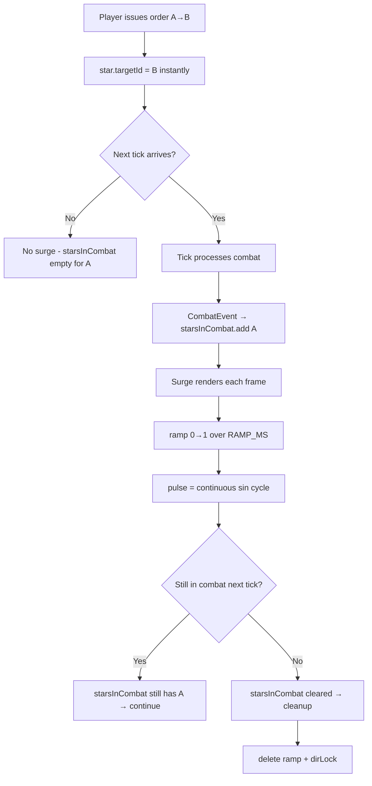

# Attack Surge Animation — Technical Specification

> Precise description of how the ship surge works, traced from code at `ShipRenderer.ts:617-689`.

## What It Is

A **render-only displacement offset** applied to orbiting ships when their star is attacking an enemy. Ships pulse toward the enemy, creating a "lunging" battle effect. The offset is NOT baked into `ship.x/ship.y` — it's applied only at draw-time.

## Trigger Condition

```
ShipRenderer.ts:622
if (isAttack && targetStar && state.starsInCombat.has(star.id))
```

Three conditions must ALL be true:

| Condition | Source | When it becomes true |
|-----------|--------|---------------------|
| `isAttack` | `star.targetId` points to enemy (different `ownerId`) | Immediately on order (Colyseus schema sync) |
| `targetStar` | Target star exists in current stars array | Always (if target exists) |
| `starsInCombat.has(star.id)` | `CombatEvent` processed via `combatHandler.ts` | **At tick boundary only** |

**Key**: `starsInCombat` is the gate. It's populated from `CombatEvent`s during `processTickEvents()` (called when `consumeTickEvents()` returns events). It's **cleared** at the start of each tick event processing.

**Between ticks**: `starsInCombat` retains stars from the LAST tick. Stars stay "in combat" between ticks until the next tick clears and repopulates the set.

## Direction

```
ShipRenderer.ts:594-600
dirX = targetStar.x - star.x  (normalized)
dirY = targetStar.y - star.y  (normalized)
```

Points from the attacking star toward the target star.

### Direction Lock (`surgeLockedDir`)

Prevents mid-tick direction flip when target changes:

```
ShipRenderer.ts:625-637
```

| Situation | Behavior |
|-----------|----------|
| No lock exists | Lock current direction + targetId |
| Lock exists, same target | Use locked direction |
| Lock exists, different target, `tickProgress < 0.1` | **Update** lock to new direction (early-tick window) |
| Lock exists, different target, `tickProgress >= 0.1` | **Keep** old direction until tick boundary |

## Ramp-In (`attackRampProgress`)

A per-star 0→1 ramp that prevents instant full-surge on combat start.

```
ShipRenderer.ts:639-654
```

- **Storage**: `state.attackRampProgress: Map<starId, number>`
- **Advance**: `rampVal += frameDelta / ATTACK_SURGE_RAMP_MS` each frame (game-time delta, not wall clock)
- **Guard**: Only advances when `!gamePaused && state.lastSurgeFrameTime > 0`
- **Easing**: `rampFactor = 1 - (1 - rampVal)^3` (cubic ease-out)
- **Duration**: `ATTACK_SURGE_RAMP_MS` (default 300ms) — time for ramp to go 0→1
- **Cleanup**: On exit (star no longer in combat), ramp is deleted: `state.attackRampProgress.delete(star.id)`

## Pulse

A continuous sine wave that makes ships pulse (push out, retract, push out).

```
ShipRenderer.ts:664-670
```

```
pulseDur     = SURGE_PULSE_DURATION_MS || BASE_TICK_MS     (default 1200ms)
surgeProgress = (gameNowMs % pulseDur) / pulseDur           (0→1 repeating)
rawPulse     = sin(surgeProgress * π)                       (0→1→0 per cycle)
surgePulse   = rawPulse ^ ATTACK_SURGE_SHAPE                (1 = sine, >1 = sharper peak)
```

**Important**: This is a **continuous modulo cycle** driven by `gameNowMs`. It does NOT reset per tick. Each surge cycle lasts exactly `pulseDur` ms.

### Per-Ship Phase Variation

```
ShipRenderer.ts:671
phaseAmplitude = 0.75 + 0.25 * sin(shipPhase * π * 2)
```

Where `shipPhase = (ship.id % 17) / 17`. This gives each ship a slightly different amplitude (±25%), so they don't all pulse in perfect unison.

## Amplitude

```
ShipRenderer.ts:656-682
```

### Facing Factor

Ships on the side facing the enemy pulse more than those on the far side:

```
facingFactor = dot(shipNorm, useDirX/Y)     — how much ship faces enemy
surgeFactor  = max(0, facingFactor) ^ 1.5   — only forward-facing ships
```

### Surge Maximum

```
surgeMax = star.radius * ATTACK_SURGE_MULT   (default 0.4 = 40% of star radius)
```

**Optional proportional mode** (`ATTACK_SURGE_PROPORTIONAL`):
```
ratio = myShips / theirShips
forceBoost = 1 + log₂(max(0.25, ratio)) * ATTACK_SURGE_FORCE_COFACTOR
surgeMax *= max(0.2, forceBoost)
```

This makes larger forces surge more aggressively.

## Final Offset

```
ShipRenderer.ts:684-685
surgeOffsetX = useDirX * surgePulse * phaseAmplitude * surgeMax * surgeFactor * rampFactor
surgeOffsetY = useDirY * surgePulse * phaseAmplitude * surgeMax * surgeFactor * rampFactor
```

Applied at draw-time: `drawShip(x + surgeOffsetX, y + surgeOffsetY, ...)`

## Cleanup on Exit

```
ShipRenderer.ts:686-689
} else {
    state.attackRampProgress.delete(star.id);
    state.surgeLockedDir.delete(star.id);
}
```

When a star is no longer in combat (or no longer attacking), ramp and direction lock are cleared.

## Frame Time Tracking

```
ShipRenderer.ts:816
state.lastSurgeFrameTime = state.gameNowMs;
```

Updated once per render call (after all stars processed). Used to compute `frameDelta` for ramp advancement.

## Lifecycle Summary



## Config Values

| Config Key | Default | Controls |
|------------|---------|----------|
| `ATTACK_SURGE_MULT` | 0.4 | Max displacement as fraction of star radius |
| `ATTACK_SURGE_RAMP_MS` | 300 | Time for ramp-in (0→1) |
| `ATTACK_SURGE_SHAPE` | 1 | Pulse shape exponent (1=sine, >1=sharper) |
| `ATTACK_SURGE_PROPORTIONAL` | false | Scale by force ratio? |
| `ATTACK_SURGE_FORCE_COFACTOR` | 0.5 | Strength of proportional scaling |
| `SURGE_PULSE_DURATION_MS` | 1200 | Duration of one pulse cycle (fallback: `BASE_TICK_MS`) |

All read live from `GAME_CONFIG` each frame — slider changes take effect immediately.

## Files

| File | Role |
|------|------|
| [ShipRenderer.ts](file:///c:/Users/mikep/Desktop/WebDev/PRISM-Atlas-DART%20v1/pax-fluxia/src/lib/renderers/ShipRenderer.ts#L617-L689) | Surge rendering logic |
| [GameCanvas.svelte](file:///c:/Users/mikep/Desktop/WebDev/PRISM-Atlas-DART%20v1/pax-fluxia/src/lib/components/game/GameCanvas.svelte#L696-L706) | Tick boundary: clear/populate starsInCombat, set lastTickGameTimeMs |
| [combatHandler.ts](file:///c:/Users/mikep/Desktop/WebDev/PRISM-Atlas-DART%20v1/pax-fluxia/src/lib/fx/handlers/combatHandler.ts) | Populates starsInCombat from CombatEvents |
| [game.config.ts](file:///c:/Users/mikep/Desktop/WebDev/PRISM-Atlas-DART%20v1/pax-fluxia/src/lib/config/game.config.ts) | Config defaults |
