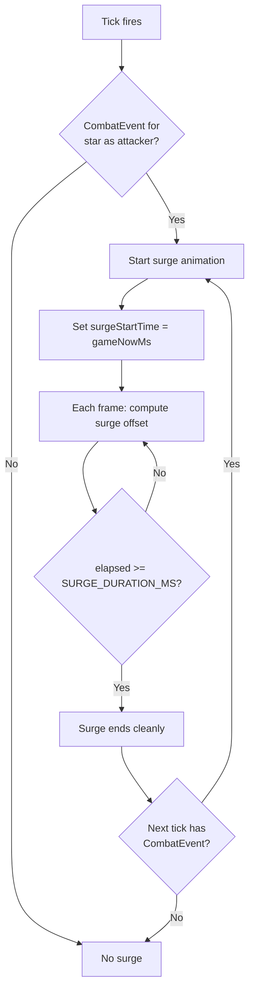

# Attack Surge Animation V2 — Redesign Specification

## Problem with V1

The current surge is a **continuous pulsing loop** that renders as long as `starsInCombat.has(star.id)` is true. This has fundamental issues:

1. **Stale trigger**: `starsInCombat` persists between ticks. A star in combat from tick N stays in the set until tick N+1 clears it. If the user changes target mid-tick, surge can fire in wrong direction because `isAttack` updates immediately.

2. **No defined lifecycle**: The surge never "completes" — it's just ON while the star is in combat and OFF when it's not. There's no start, middle, or end.

3. **Render-only offset hiding a design flaw**: `surgeOffsetX/Y` is applied at draw-time but NOT baked into `ship.x/ship.y` because B-89 showed that baking caused teleport glitches on tick boundaries. But this is treating a symptom, not the cause. The real cause was that settle animations captured surged positions. If surge had a proper lifecycle that completes before the next tick processes, this wouldn't be an issue.

4. **`targetStar` guard is pointless**: It's always true if the target exists. Not a meaningful gate condition.

---

## V2 Design: Per-Tick Event-Driven Surge

### Core Principle

> A surge animation is a **discrete visual event** triggered by a `CombatEvent`. It starts when a tick fires combat, plays for a fixed duration, and always completes. The combat outcome (kills, captured, conquered) is **already determined** before any animation frame is drawn.

### Trigger

A surge starts when **all** of these are true:
1. A `CombatEvent` fires for a star (at tick boundary)
2. The star is attacking (not defending, not being conquered)
3. The star has a `targetId` pointing to an enemy

**One thing triggers it: a CombatEvent arriving via tick processing.**

Not `starsInCombat`. Not `isAttack`. Not `targetStar !== null`. Just the event.

### Lifecycle



### Per-Star Surge State

```typescript
interface SurgeState {
    startTime: number;      // gameNowMs when surge started
    direction: { x: number; y: number };  // normalized toward target
    targetId: string;       // which target this surge is toward
}

// Stored as: Map<starId, SurgeState>
```

- **Created**: When a CombatEvent fires with this star as an attacker
- **Read**: Each render frame to compute offset
- **Deleted**: When `elapsed >= SURGE_DURATION_MS`

No ramp maps. No direction locks. No frame-time deltas. Just a start time and a direction.

### Per-Frame Computation

Each frame, for stars with an active `SurgeState`:

```
elapsed  = gameNowMs - surge.startTime
progress = elapsed / SURGE_DURATION_MS              // 0→1
pulse    = sin(progress * π)                         // 0→1→0 (one full lunge)
offset   = surge.direction * pulse * surgeAmplitude * facingFactor
```

Where:
- `surgeAmplitude = star.radius * ATTACK_SURGE_MULT` (optionally proportional to force ratio)
- `facingFactor = max(0, dot(shipNorm, surgeDir)) ^ 1.5` — only forward-facing ships lunge
- `ATTACK_SURGE_SHAPE` can modify the pulse curve: `pulse = sin(progress * π) ^ shape`

### Why This Fixes Everything

| V1 Problem | V2 Solution |
|------------|-------------|
| Stale `starsInCombat` triggers surge for wrong target | Surge triggered by CombatEvent, stored per-star with `targetId` |
| Continuous pulse never ends | Fixed duration, always completes |
| Mid-tick target change causes direction jump | Direction captured at surge start, immutable |
| `lastSurgeFrameTime` frame-delta ramp is fragile | Simple `elapsed / duration` — no frame deltas |
| Render-only offset hides a conceptual flaw | Surge has a defined lifecycle; offset IS the animation |
| `starsInCombat` persists between ticks | No persistent set — surge state lives only for its duration |

### Duration

`SURGE_DURATION_MS` — new config, default = `BASE_TICK_MS`. One full lunge per tick.

If the next tick fires another CombatEvent for the same star, a new surge starts (replacing the old one). This creates continuous pulsing during sustained combat — but each pulse is a distinct, triggered animation.

### What Gets Removed

- `starsInCombat: Set<string>` — no longer needed for surge (may still be useful for other purposes)
- `attackRampProgress: Map<string, number>` — replaced by `elapsed / duration`
- `surgeLockedDir: Map<string, ...>` — direction captured at surge start
- `lastSurgeFrameTime` — no longer needed
- The direction-lock tickProgress window logic
- The continuous modulo pulse cycle

### Config Values

| Config Key | Default | Controls |
|------------|---------|----------|
| `ATTACK_SURGE_MULT` | 0.4 | Max displacement as fraction of star radius |
| `ATTACK_SURGE_SHAPE` | 1 | Pulse shape exponent (1=sine, >1=sharper peak) |
| `ATTACK_SURGE_PROPORTIONAL` | false | Scale by force ratio? |
| `ATTACK_SURGE_FORCE_COFACTOR` | 0.5 | Strength of proportional scaling |
| `SURGE_DURATION_MS` | = `BASE_TICK_MS` | How long one surge lunge takes |

Removed: `ATTACK_SURGE_RAMP_MS`, `SURGE_PULSE_DURATION_MS` (replaced by `SURGE_DURATION_MS`).

### Should Ships Actually Move?

V1 uses render-only offset because baking into `ship.x/ship.y` caused settle animations to capture surged positions (B-89).

V2 can safely bake if:
- Surge always completes before the next tick fires new settle animations
- OR surge state is checked during settle start to offset the captured position

However, render-only offset is ALSO fine for V2 — it's cleaner conceptually since surge is a visual effect overlaid on orbiting ships. The key difference is V2 has a **defined lifecycle** rather than a continuous ON/OFF based on stale state.

**Recommendation**: Keep render-only offset for V2. It's the right abstraction for a visual-only effect. The problem with V1 wasn't the offset approach — it was the lack of lifecycle.
