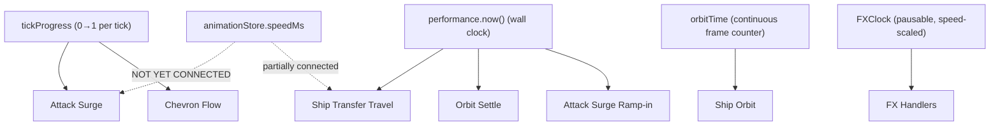

# Pax Fluxia — Animation & VFX Specification

**Version:** 1.0  
**Last Updated:** 2026-02-16

This document is the canonical reference for ALL visual animation systems in Pax Fluxia.

---

## 1. Animation System Map

The game has **6 distinct visual animation systems**, each with its own timing source and code location:



---

## 2. Attack Surge (THE Primary Combat Animation)

> [!IMPORTANT]
> This is the most visible animation in the game. When players say "attack animation" they mean THIS — the rhythmic pulse of orbiting ships surging toward the target star during combat.

### 2.1. How It Works

Ships orbiting a star that is attacking an enemy are visually displaced toward the target on each tick. The displacement follows a sine wave pulse:

```
surgePulse = sin(tickProgress × π)         // peaks at tickProgress=0.5
surgeOffset = direction × surgePulse × phaseAmplitude × surgeMax × surgeFactor × rampFactor
```

| Factor | Purpose | Source |
|--------|---------|--------|
| `tickProgress` | 0→1 sine wave pulse within each tick | `state.tickProgress` (from `gameStore`) |
| `direction` | Vector toward target star | Computed, direction-locked to prevent flicker |
| `surgeFactor` | Ships facing target surge more | Dot product of ship position vs target direction |
| `phaseAmplitude` | Per-ship phase offset | `0.75 + 0.25 × sin(shipPhase × π × 2)` |
| `surgeMax` | Maximum displacement | `starRadius × ATTACK_SURGE_MULT` |
| `rampFactor` | Smooth ramp-in from 0→1 | `performance.now()` delta, cubic ease |

### 2.2. Timing Dependencies

The attack surge pulse is driven by **`state.tickProgress`**, which is computed from the tick interval:

```
tickProgress = (now - lastTickTime) / tickIntervalMs
```

- When tick interval decreases (faster game speed) → pulse cycles faster
- When tick interval increases (slower game speed) → pulse cycles slower
- **Animation speed slider currently has NO effect on this** — the pulse is locked to tick rate

### 2.3. Code Location

- **Surge computation**: [ShipRenderer.ts L557-616](file:///c:/Users/mikep/Desktop/WebDev/PRISM-Atlas-DART%20v1/pax-fluxia/src/lib/renderers/ShipRenderer.ts#L557-L616)
- **tickProgress source**: [gameStore.svelte.ts](file:///c:/Users/mikep/Desktop/WebDev/PRISM-Atlas-DART%20v1/pax-fluxia/src/lib/stores/gameStore.svelte.ts) `startProgressLoop()`
- **Ramp tracking**: `state.attackRampProgress` map
- **Direction locking**: `state.surgeLockedDir` map

### 2.4. Config Variables

| Variable | Default | Effect |
|----------|---------|--------|
| `ATTACK_SURGE_MULT` | 0.4 | Base surge amplitude (× star radius) |
| `ATTACK_SURGE_RAMP_MS` | 300 | Ramp-in duration for new attacks |
| `ATTACK_SURGE_SHAPE` | 1 | Power curve (1 = sine, >1 = sharper pulse) |
| `ATTACK_SURGE_PROPORTIONAL` | false | Scale with force ratio? |
| `ATTACK_SURGE_FORCE_COFACTOR` | 0.5 | Force ratio scaling factor |

---

## 3. Ship Transfer Travel

Ships physically traveling along lanes (reinforcements or conquest transfers).

### 3.1. Lifecycle

```
Depart (orbit → lane start) → Travel (along lane) → Arrive (lane end → orbit)
```

### 3.2. Timing

- `ship.departTime` = `performance.now()` at creation
- `ship.travelDuration` = derived from `effectiveTickMs`
- `elapsed = performance.now() - ship.departTime`
- `travelProgress = min(1, elapsed / ship.travelDuration)`

### 3.3. Code Location

- **Render loop**: [ShipRenderer.ts L201-350](file:///c:/Users/mikep/Desktop/WebDev/PRISM-Atlas-DART%20v1/pax-fluxia/src/lib/renderers/ShipRenderer.ts#L201-L350) `renderTravelingShips()`
- **Ship creation**: [transferHandler.ts L30-100](file:///c:/Users/mikep/Desktop/WebDev/PRISM-Atlas-DART%20v1/pax-fluxia/src/lib/fx/handlers/transferHandler.ts#L30-L100)
- **Travel behaviors**: [behaviors.ts](file:///c:/Users/mikep/Desktop/WebDev/PRISM-Atlas-DART%20v1/pax-fluxia/src/lib/fx/phases/behaviors.ts)

---

## 4. Ship Orbit

Ships continuously orbit their home star.

### 4.1. Timing

- `orbitTime` is incremented per-frame: `orbitTime += 0.003` (when not paused)
- Orbit position computed via `getOrbitSlot(index, starX, starY, radius, orbitTime, ...)`

### 4.2. Code Location

- **Orbit rendering**: [ShipRenderer.ts L470-555](file:///c:/Users/mikep/Desktop/WebDev/PRISM-Atlas-DART%20v1/pax-fluxia/src/lib/renderers/ShipRenderer.ts#L470-L555) `renderOrbitingShips()`
- **Orbit math**: [render.utils.ts](file:///c:/Users/mikep/Desktop/WebDev/PRISM-Atlas-DART%20v1/pax-fluxia/src/lib/utils/render.utils.ts) `getOrbitSlot()`

---

## 5. Orbit Settling

When a ship's target orbit index changes, it arc-interpolates from old position to new position.

### 5.1. Timing

- `ship.settleStartTime` = `performance.now()` when orbit index changes
- `SETTLE_DURATION_MS` = default 150ms
- Ease: cubic ease-out `1 - (1-t)³`

### 5.2. Code Location

- [ShipRenderer.ts L622-630](file:///c:/Users/mikep/Desktop/WebDev/PRISM-Atlas-DART%20v1/pax-fluxia/src/lib/renderers/ShipRenderer.ts#L622-L630)

---

## 6. Animation Speed Architecture (CURRENT vs DESIRED)

### 6.1. Current State (Broken)

- `animationStore.speedMs` exists and persists via localStorage
- `animationStore.speedMultiplier` computes `defaultSpeed / currentSpeed`
- The multiplier is applied to `elapsed` in `renderTravelingShips` (travel only)
- **Attack surge is NOT connected** — it uses `tickProgress` which is tick-bound
- **Orbit speed is NOT connected** — it uses frame-based `orbitTime`
- **Settle duration is NOT connected** — it uses hardcoded `SETTLE_DURATION_MS`

### 6.2. Desired State

The Animation Speed slider should scale ALL visual animations:
- ✅ Ship transfer travel duration
- ❌ Attack surge pulse speed (currently tick-locked)
- ❌ Orbit speed (frame-based, no scaling)
- ❌ Settle duration (hardcoded)
- ❌ Spawn/despawn timing

### 6.3. The Attack Surge Problem

The attack surge pulse uses `tickProgress` which goes 0→1 within each tick interval. To decouple from tick rate:

**Option A**: Create a separate `animationProgress` that runs at `animationStore.speedMs` rate instead of `BASE_TICK_MS` rate. The surge would pulse at animation speed, not tick speed.

**Option B**: Scale the surge computation directly: `rawPulse = sin(tickProgress * π * animSpeedMultiplier)`. This would make the pulse cycle multiple times per tick (fast) or partially cycle (slow).

**Option C**: Replace `tickProgress`-based pulsing with a continuous animation phase that runs on the FXClock, completely decoupling from ticks.
