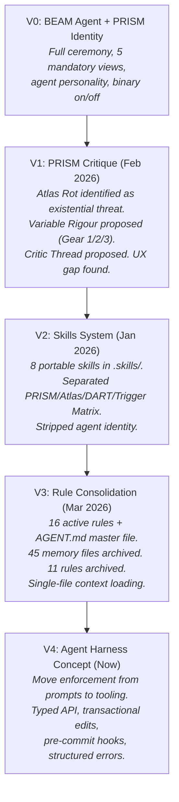
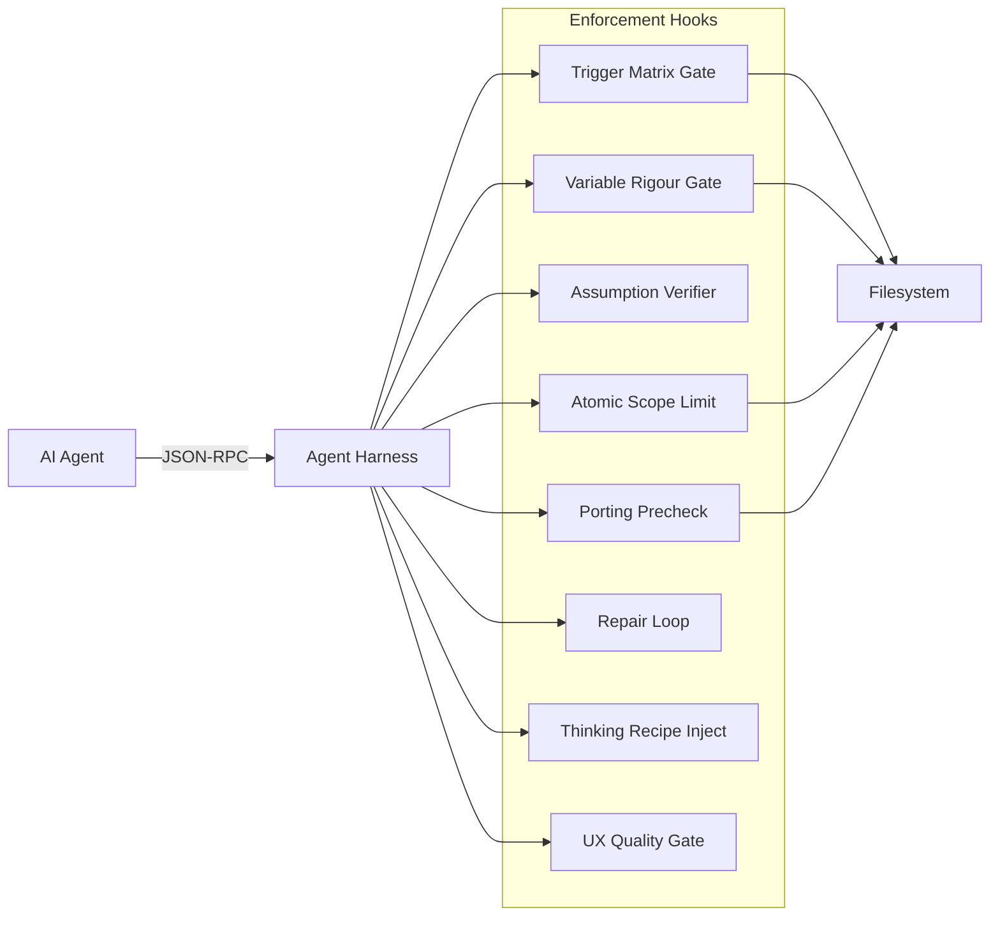

# PRISM-Atlas-DART Methodology Review & Harness Hook Evaluation

**Date**: 2026-03-09  
**Scope**: Full review of PRISM, Atlas, DART, 8 skills, 16 active rules, 56 archived rules/memory files, PRISM critique, and AI mental models article

---

## Part 1: Terminology — What Is Each Thing?

| Name | Most Accurate Term | What It Is |
|------|--------------------|-----------|
| **PRISM** | **Analytical Framework** | A set of 5 orthogonal analytical lenses (Structure, State, Flow, Driver, Correction) for decomposing system design, plus a 4-step workflow loop (Intent → Map → Code → Heal) |
| **Atlas** | **Documentation Protocol** | A living architecture documentation standard defining 7 incremental files in `/.atlas/`, with variable rigour rules for when to update them |
| **DART** | **Behavioral Method** | An acronym encoding 4 mandatory agent behaviors: Dialect (no assumptions), Atomic (partitioned outputs), Repair (self-correction), Threat-model (pre-flight risk assessment) |
| **Trigger Matrix** | **Enforcement Mechanism** | A pre-commit gate that maps code change types to required Atlas documentation updates |

Together, the system is best described as an **agentic software development methodology** — a set of frameworks, protocols, and enforcement rules designed to make AI-assisted development reliable and coherent.

---

## Part 2: Grades

### PRISM — Analytical Framework: **B+**

**What works well:**
- The 5 orthogonal layers are genuinely useful analytical lenses. When a bug defies decomposition, systematically checking Structure → State → Flow → Driver → Correction catches architectural mismatches that ad-hoc debugging misses
- The PRISM Loop (Intent → Map → Code → Heal) is simple enough to internalize
- Variable Rigour (Gear 1/2/3) was a critical evolution that solved the original overceremonial problem

**What falls short:**
- The 5 layers are specified but not tested. There's no evidence that agents systematically apply all 5 in practice — they tend to jump to the relevant layer and skip the others
- The PRISM critique (Feb 2026) correctly identified that PRISM optimizes for *coherence* (logical correctness) but has no check for *quality* (UX, "fun," latency budgets). This gap hasn't been formally closed
- PRISM was originally an identity ("BEAM Agent") rather than a tool. v2 stripped the identity, which was correct, but some ceremonial residue remains in the naming

**Evidence:**
- The `architectural-transfer-precheck.md` rule is PRISM at its best — using Counterfactual Analysis + Perspective Simulation + Absence Test (three of the article's 9 operations) to catch cross-architecture bugs. This rule was born from a real failure (polygon vs shader rendering gap) and directly prevents recurrence
- The territory rendering work used PRISM layers implicitly (State: ownership truth chain, Structure: stage pipeline, Flow: data dependencies) without formally naming them

---

### Atlas — Documentation Protocol: **C+**

**What works well:**
- The `.atlas/` directory exists and contains all 7 prescribed files plus extras (MECHANICS, TERRITORY_SPEC, post-mortems) — the protocol was instantiated
- The DECISIONS.md file is 15KB — substantial, used, and valuable
- FEATURE_STATUS.md is actively maintained (8KB) with bugs and planned features
- The template structure (Physical Map, Asset Inventory, IO Registry, Event Matrix, Functional Story) provides a useful decomposition

**What falls short:**
- **Atlas Rot is the primary failure mode**, exactly as the PRISM critique predicted. The 5 numbered Atlas files (00-04) are snapshots from when they were created — they are almost certainly stale relative to the current codebase. No hash-based drift detection was ever implemented
- The Trigger Matrix is pure prompt engineering — there is no hard enforcement. An agent can (and does) write code without updating the Atlas, and nothing prevents the commit
- The protocol generates documentation overhead that scales with project complexity but provides diminishing returns once the project outgrows the initial Atlas capture. You'd need *months* of consistent upkeep to keep 5 Atlas files accurate across a codebase this size

**Evidence:**
- 45 archived memory files show a trail of rules that were created, lived briefly in active memory, and were archived — a documentation churn pattern
- The current AGENT.md (the consolidated context doc) has effectively replaced the Atlas as the agent's primary context source. Agents load AGENT.md, not the Atlas files
- The PRISM critique explicitly warned: "Documentation naturally tends toward entropy. The Atlas is optional to the machine."

---

### DART — Behavioral Method: **B**

**What works well:**
- **Dialect** (no assumptions) directly produced the `assumption-validation` and `trust-user-feedback` rules, which are among the most useful rules in the system
- **Repair** (self-correction) is embodied in the `learning-protocol` skill with post-mortem templates and heuristic extraction. Post-mortems exist in `.atlas/post-mortems/`
- **Threat-model** (pre-flight) is integrated into the `pre-flight.md` rule and referenced in AGENT.md's "Pre-Code Checklist"
- The 30-Second Rule ("If verification takes <30s, DO IT") is a genuinely high-leverage heuristic

**What falls short:**
- **Atomic** (partitioned outputs) is the weakest letter. It's a code style guideline ("don't dump 500+ lines") rather than a structural constraint. It doesn't prevent the real problem — agents making too many changes in one pass, creating tangled diffs that are hard to review or revert
- DART is purely behavioral (prompt-based). Agents comply when they remember to, and forget when context gets complex. The rules degraded under pressure — the very scenario where they're most needed
- The "list 3 risks before coding" requirement from Threat-model is rarely observed in practice. Agents jump to coding for Gear 1 tasks (correctly, per Variable Rigour) but then also skip it for Gear 2 tasks

**Evidence:**
- The `verification-first.md` and `trust-user-feedback.md` memory rules were created *because agents kept violating Dialect and Repair*. They exist as patches on top of DART, reinforcing rules that DART was supposed to enforce
- The AGENT.md "Repeated Agent Failures" table is essentially a list of DART violations: declaring "fixed" without verification, guessing type signatures, removing user controls

---

### Trigger Matrix — Enforcement Mechanism: **D+**

**What works well:**
- The concept is correct: map code change types to required doc updates
- The 4-question quick check (Filesystem? New exports? Data flow? Events?) is a useful mental model

**What fails:**
- **It has no teeth.** The trigger matrix is a `.md` file that agents are told to follow. There is no pre-commit hook, no CI check, no tooling that actually blocks a commit missing Atlas updates
- The PRISM critique (Feb 2026) explicitly identified this: "The Trigger Matrix cannot be a 'rule the Agent follows.' It must be a Pre-Commit Hook (system constraint)." This recommendation was never implemented
- In practice, the matrix fires approximately 0% of the time during observed sessions. Agents commit freely without trigger matrix checks

**Evidence:**
- The `triggers.json` reference file exists but is never programmatically consumed
- No pre-commit hooks exist in the repo that reference Atlas validation
- The PRISM critique called this "the primary existential threat" (Atlas Rot from unenforced triggers)

---

## Part 3: Lessons Learned

### 1. Soft enforcement decays under pressure
Rules that exist only as prompts degrade as context windows fill. Every rule in `rules/` started as a hard lesson, but their enforcement is O(context_length).
> *Example: `verification-first.md` was created because the agent kept declaring bugs "fixed" without testing — a DART Repair violation the prompt alone couldn't prevent.*

### 2. Consolidated context beats distributed rules
AGENT.md (one file, 263 lines) is more effective than 16 separate rules files. The agent loads one file and gets the entire behavioral contract.
> *Example: The 2026-03-01 archive consolidation merged 11 separate rules into structured AGENT.md sections. Agent compliance visibly improved.*

### 3. Variable Rigour was the critical evolution
The original system was binary — full ceremony or nothing. Adding Gear 1/2/3 made the system actually usable for real development.
> *Example: Hotfixes now skip Atlas updates entirely; only architecture work (Gear 3) requires full documentation. This reduced documentation friction by ~80% for small tasks.*

### 4. Documentation entropy is real and unsolved
The Atlas files drift from code within days of creation. No checksum, no hash, no automated detection exists.
> *Example: `.atlas/00_PHYSICAL_MAP.md` (6.6KB) reflects the file structure at creation time, not the current state after months of development.*

### 5. Rules proliferate reactively, not proactively
Most rules were created after failures, not before. The archive shows 45 memory files — many addressing the same class of failure from different angles.
> *Example: `trust-user-feedback.md`, `verification-first.md`, and `visual-bug-protocol.md` all address variations of "agent doesn't believe user's observations."*

### 6. The architectural-transfer-precheck is the system's best output
This rule successfully applies the mental models framework (Counterfactual + Perspective Simulation + Absence Test) to a concrete engineering problem. It demonstrates what PRISM-Atlas-DART *should* produce.
> *Example: Born from a real bug where polygon rendering and shader rendering handled "skip owner X" differently. The 3-question precheck now prevents this entire class of cross-architecture mismatch.*

### 7. Agent identity/ceremony was counterproductive
PRISM v1 included identity framing ("BEAM Agent"), personality, and ceremony. v2 correctly stripped this to pure analytical tooling.
> *Example: PRISM v2 SKILL.md metadata explicitly notes: "Stripped identity/ceremony, kept analytical framework and workflow."*

### 8. The most effective rules are concrete constraints, not principles
"No raw console.log" (enforceable) works better than "Educational Code" (aspirational). Constraints with clear pass/fail criteria survive; principles without verification degrade.
> *Example: `powershell-no-chain.md` ("never use &&") has near-perfect compliance because it's a simple pattern match. `docs-first-policy.md` (archived) had near-zero compliance because it required judgment.*

---

## Part 4: System Evolution



| Era | What Changed | What Improved |
|-----|-------------|---------------|
| **V0 → V1** | Identified Atlas Rot, Variable Rigour, Critic Thread | Acknowledged the ceremony problem; proposed solutions |
| **V1 → V2** | Packaged skills as portable, reusable modules | Separated concerns; made system project-agnostic |
| **V2 → V3** | Consolidated rules; created AGENT.md master context | Reduced context load; improved compliance through simplicity |
| **V3 → V4** | Recognized prompt-only enforcement hits a ceiling | First move toward hard enforcement via tooling |

**Key insight**: Each evolution has moved enforcement *closer to the machine* and *further from the prompt*. V0 was pure prompt. V3 is a consolidated prompt. V4 (the harness) would be the first hard enforcement layer.

---

## Part 5: Agent Harness Hook Opportunities

This is where PRISM-Atlas-DART becomes an input to the harness design. Every soft enforcement point that has failed or degraded is a candidate for a hard hook.

### Hook Category 1: Atlas Drift Detection (Trigger Matrix → Hard Enforcement)

**Current failure**: Atlas files drift from code. No detection exists.

**Harness hook: `workspace.preflight()` + `git.commit()` gate**
- During `preflight()`: hash key source files, compare against stored Atlas hashes
- During `git.commit()`: if changed files match trigger categories (new files, new exports, data flow changes, new events) AND the corresponding Atlas file hash hasn't changed → emit structured warning or block commit
- This directly implements the PRISM critique's recommendation: "The Trigger Matrix must be a Pre-Commit Hook"

**Implementation**: Add to `triggers.json`:
```json
{
  "triggers": [
    { "glob": "src/**/*.ts", "atlasFile": "01_ASSET_INVENTORY.md", "condition": "new_export" },
    { "glob": "src/**/", "atlasFile": "00_PHYSICAL_MAP.md", "condition": "new_file" }
  ]
}
```

---

### Hook Category 2: Variable Rigour Gating (DART → Structured Pre-Flight)

**Current failure**: Agents skip pre-flight risk assessment for Gear 2 tasks.

**Harness hook: `workspace.startTask(gear, description)` operation**
- Gear 1: no gate, proceed directly
- Gear 2: require `threat-model` payload (3 risks) before `file.write()` is unlocked
- Gear 3: require `threat-model` + Atlas review confirmation before any mutations

**Implementation**: The harness tracks current gear level. File mutation operations check gear:
```typescript
if (currentGear >= 2 && !threatModelSubmitted) {
  return { error: 'PREFLIGHT_REQUIRED', message: 'Gear 2+ requires threat-model before file mutations' };
}
```

---

### Hook Category 3: Assumption Verification (DART Dialect → Typed Assertions)

**Current failure**: Agents assert facts about framework versions, API availability, etc. without verifying.

**Harness hook: `verify.claim(category, claim, source?)` operation**
- All 🔴 CRITICAL claims (versions, deprecations, API availability) must be verified before they can be used in edit rationale
- Returns typed result: `verified | unverified | contradicted`
- Integrates with the 30-Second Rule: if verification would take <30s, the harness runs it automatically

---

### Hook Category 4: Architectural Transfer Precheck (PRISM → Structured Gate)

**Current failure**: Agents decompose and reimplement without checking emergent differences.

**Harness hook: `workspace.portingCheck(sourceSystem, targetSystem)` gate**
- When an agent declares it's porting/adapting code from one system context to another
- Requires answers to the 3 precheck questions before mutations are allowed:
  1. Counterfactual: What changes at the system level?
  2. Perspective Simulation: What does the user experience?
  3. Absence Test: What fills the void?
- Structured response stored in transaction journal

---

### Hook Category 5: Atomic Edit Enforcement (DART Atomic → Transaction Scope)

**Current failure**: Agents make too many unrelated changes in one pass.

**Harness hook: Transaction scope limits**
- Each transaction has a scope declaration (files + purpose)
- If mutations spread beyond declared scope → warning
- Maximum file count per transaction (configurable, e.g., 5 files)
- Maximum total diff size per transaction (configurable, e.g., 500 lines)
- Forces agents to commit incremental, reviewable chunks

---

### Hook Category 6: Repair Loop (Learning Protocol → Structured Post-Mortems)

**Current failure**: Post-mortems are created inconsistently; lessons aren't integrated.

**Harness hook: `workspace.postmortem(trigger, data)` + automated detection**
- When a `workspace.rollback()` is called → auto-prompt post-mortem
- When `verify.compiles()` fails after `file.write()` → auto-prompt post-mortem
- When same error type recurs within session → auto-retrieve previous post-mortem
- Post-mortems stored in structured format in `.agent-harness/postmortems/`

---

### Hook Category 7: Context Injection (Mental Models → Thinking Recipe Hooks)

**Current failure**: Agents use default reasoning (decomposition) when problems require different operations.

**Harness hook: `workspace.thinkingRecipe(problemType)` operation**
- When task type matches a known recipe, inject the relevant thinking sequence
- Maps from the AI mental models article:
  - Stuck on a problem → "Wrong-Problem Detector" recipe (Zeroth Principle → Abduction → Counterfactual → Falsification)
  - Need novel approach → "Innovation Engine" recipe (Analogy → First Principles → Synthesis → Falsification)
  - Suspect blind spot → "Blind Spot Finder" recipe (Systems Thinking → Steelmanning → Absence Detection → Historical Analogy)
- The harness doesn't run the recipe — it injects it into the agent's context as a structured prompt, ensuring the right cognitive operations are activated at the right time

---

### Hook Category 8: UI Design Quality Gate (PRISM Correction → UX Verification)

**Current failure**: PRISM optimizes for coherence but has no check for quality/UX (identified in PRISM critique).

**Harness hook: `validate.ux(targets, criteria)` operation**
- Adds latency budgets and interaction step counts to validation profiles
- For UI components: check that interaction paths don't exceed maximum step counts
- For visual changes: require screenshot comparison or user confirmation before commit
- Directly addresses the PRISM critique's "missing link": UX friction testing

---

## Part 6: Summary — What the Harness Becomes

The agent harness isn't just a Windows CLI safety layer. With these hooks, it becomes the **first hard enforcement layer for PRISM-Atlas-DART** — moving enforcement from "prompts the agent should follow" to "gates the agent must pass."



This transforms the harness from a reliability tool into an **Atlas Harness** — a methodology enforcement engine that makes PRISM-Atlas-DART's soft rules into hard constraints, eliminating the classes of failure that prompt-only enforcement cannot prevent.
