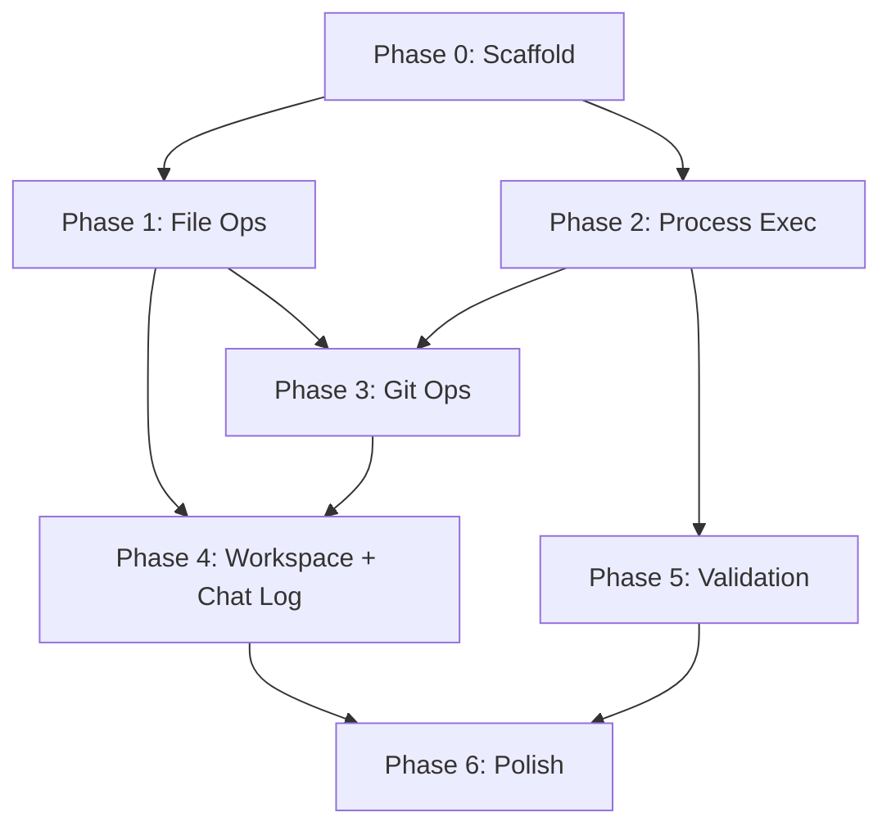

# Basic Agent Harness — Build Plan

A standalone TypeScript JSON-RPC service for deterministic, safe agent workspace operations on Windows. Includes built-in lossless conversation logging.

**Project**: New standalone repo (`agent-harness`)  
**Runtime**: Bun first, Node LTS fallback  
**IPC**: stdio + named pipe + HTTP localhost (all three)  
**Source spec**: [Agentic harness for Windows CLI.md](file:///c:/Users/mikep/Desktop/WebDev/PRISM-Atlas-DART%20v1/.agent/SYSTEM/Agentic%20harness%20for%20Windows%20CLI.md)

---

## What This Delivers

The Basic Harness eliminates these observed failure classes:
- Shell quoting / metacharacter breakage on Windows
- Line-ending mismatches causing patch failures
- Regex-based file edits breaking source code
- Git hook incompatibilities
- Process execution differences (`.exe` vs `.cmd` vs `.bat`)
- Simple rules falling out of agent context (bun vs npm, `&&` chaining, git aliases)
- **Loss of conversation context across sessions** (new: lossless chat log)

---

## Phase 0: Project Scaffold

- Initialize TypeScript project with strict config
- Set up JSON-RPC server with **three transport modes**:
  - stdio (default, simplest integration)
  - Named pipe (persistent, lower latency)
  - HTTP localhost (easiest to debug)
- Define complete error taxonomy (typed, machine-readable)
- Define request/response schemas for all operations
- Set up test harness (Bun test runner, Node test runner fallback)
- Create `.agent-harness.json` config schema

**Delivers**: Running service that accepts JSON-RPC on any transport, responds to `ping`, returns typed errors.

---

## Phase 1: File Operations

The foundation. Every other phase depends on reliable, atomic file I/O.

**Operations**:
| Method | Description |
|--------|-------------|
| `file.read` | Read with encoding detection, returns content + hash + EOL mode |
| `file.stat` | Size, mtime, encoding, EOL mode, SHA-256 hash |
| `file.write` | Atomic: temp → fsync → verify → rename. Hash guard optional |
| `file.patch` | Anchor-based structured edits with verification |
| `file.replaceBetween` | Replace content between start/end anchors |
| `file.insertAt` | Insert before/after anchor |
| `file.deleteRange` | Delete between anchors |

**Key constraints**:
- All writes atomic (temp file → fsync → rename)
- Every mutation returns: `beforeHash`, `afterHash`, `newlineModeBefore/After`, `anchorsMatched`, `reversiblePatch`
- EOL normalization: detect on read, preserve or convert per policy
- `expectedHash` guard prevents stale overwrites
- Forbidden by default: free-form regex on source files (requires `dangerouslyAllowRegex=true`)

---

## Phase 2: Process Execution

Safe, typed process launching with Windows-specific handling.

**Operations**:
| Method | Description |
|--------|-------------|
| `proc.which` | Resolve executable, distinguishing .exe/.cmd/.bat |
| `proc.execFile` | Direct spawn without shell, structured capture |
| `proc.execShell` | Shell mode — disabled by default, requires explicit enable |
| `proc.kill` | Process-tree kill (`taskkill /T /F /PID`) |
| `proc.stream` | Stream stdout/stderr for long-running processes |

**Key constraints**:
- `.cmd`/`.bat` auto-routed through `cmd.exe /d /s /c` with tested quoting
- `windowsHide: true` default
- Every execution captures: stdout, stderr, exit code, start/end time, cwd, resolved exe, env diff
- Environment allowlist model, `PATH`/`Path` casing normalized

---

## Phase 3: Git Operations

Built on Phase 2. All git operations via `proc.execFile('git.exe', [...args])` — never shell.

**Operations**:
| Method | Description |
|--------|-------------|
| `git.status` | Structured: staged, unstaged, untracked |
| `git.diff` | Typed diff output per file |
| `git.add` | Stage specific paths |
| `git.restore` | Unstage or restore |
| `git.commit` | With `verifyMode`: repo-default / no-verify / isolated-hooks |
| `git.stash` | Named stash create/apply |
| `git.branch` | Create branch |
| `git.checkout` | Checkout ref |

**Isolated hooks**: Harness-managed Windows-safe hook directory with only approved wrappers (message validation, whitespace check, optional project validator).

---

## Phase 4: Workspace + Transactions + Lossless Chat Log

The orchestration layer, PLUS the built-in conversation log.

### Workspace Operations
| Method | Description |
|--------|-------------|
| `workspace.open` | Validate root, run preflight |
| `workspace.preflight` | Check git, permissions, EOL policy, tool health |
| `workspace.snapshot` | Stash-based checkpoint |
| `workspace.rollback` | Restore to snapshot |
| `workspace.status` | Aggregate file + git + session status |

### Context Persistence Operations
| Method | Description |
|--------|-------------|
| `context.rules` | Return all active project rules (from `.agent/rules/`, `AGENT.md`, etc.) — ensures rules never fall out of context |
| `context.projectConfig` | Return project-specific config (bun vs npm, git aliases, shell constraints) |
| `context.activeSession` | Return current session state and recent history |

### Lossless Chat Log Operations
| Method | Description |
|--------|-------------|
| `chatlog.append` | Append a timestamped entry (user prompt, agent response summary, tool calls, outcomes) |
| `chatlog.query` | Search/filter log by date, keyword, entry type |
| `chatlog.session` | Start/end session markers with metadata |
| `chatlog.export` | Export session or date range as markdown |

**Chat log implementation**:
- Storage: append-only JSONL file per session in `.agent-harness/logs/`
- Each entry: `{ timestamp, sessionId, type, content, metadata }`
- Entry types: `user_prompt`, `agent_action`, `tool_call`, `tool_result`, `error`, `commit`, `rollback`, `session_start`, `session_end`
- Auto-generates daily markdown summary in `.agent/WIP Work-In-Progress/CHAT_YYYY-MM-DD.md` format
- Survives agent context window limits — the harness retains what the agent forgets
- Query interface allows agents to search prior context without needing it in their window

**Context persistence model**:
- On `workspace.open()`, harness loads and caches all rules files
- `context.rules()` returns the full rule set — agent never has to remember rules, just ask for them
- This directly solves the "rules falling out of context" problem (bun vs npm, `&&` chaining, git aliases)
- Rules are injected into the agent's context on every new task, not just at session start

**Transaction flow**: snapshot → edits → verify → rollback-or-commit

---

## Phase 5: Validation Runner

Pluggable validation with scoped profiles.

| Method | Description |
|--------|-------------|
| `validate.run` | Run named profile against targets |
| `validate.parse` | Parse tool output into structured results |
| `validate.classify` | Classify failures by severity |

**Profiles** (from `.agent-harness.json`):
- `fast`: file-level diagnostics only
- `targeted`: package/project subset  
- `full`: repo-wide
- `precommit`: mandatory before commit

---

## Phase 6: Polish + Distribution

- Bundle as single distributable
- CLI entry points:
  - `agent-harness serve` (stdio/pipe/http mode)
  - `agent-harness preflight <path>` (standalone check)
  - `agent-harness chatlog <query>` (search prior sessions)
- `.agent-harness.json` per-workspace config
- API reference documentation
- Example client library (TypeScript)

---

## Dependency Graph

P1 and P2 can run in parallel. Everything else is sequential.

---

## Risk Assessment

| Phase | Risk | Mitigation |
|-------|------|------------|
| P2: Process Exec | `.cmd`/`.bat` quoting edge cases on Windows | Build comprehensive quoting test suite from known failure cases |
| P4: Chat Log | JSONL file growth over long projects | Rotation policy + compressed archives per month |
| P4: Context Rules | Rules format varies across projects | Normalize to canonical format during `workspace.open()` |
| P5: Validation | Tool adapter maintenance burden | Start with just `tsc` and `bun check`; add others on demand |

---

## MVP Cut

If time-constrained, cut P5 (validation runner) and P6 (distribution polish). Run from source during development. The MVP is **P0–P4**: scaffold + file ops + process exec + git + workspace/transactions + chat log + context persistence.

This MVP eliminates all observed failure classes and adds the two new capabilities (lossless logging, context persistence) that address the "rules falling out of context" problem.
