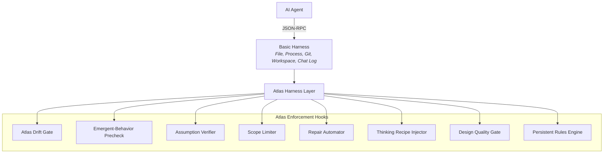
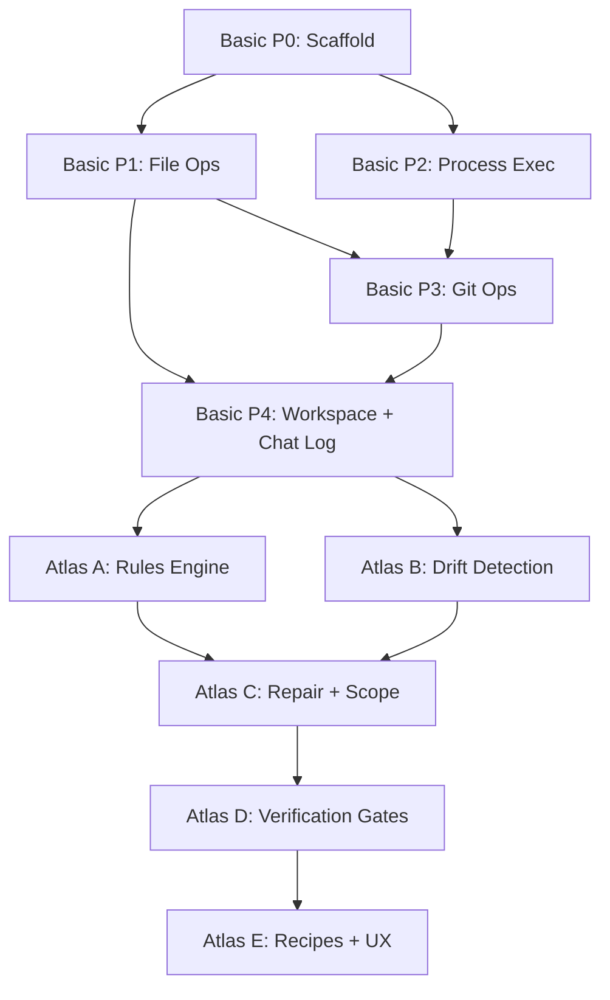

# Atlas Harness — Build Plan

The Atlas Harness is a methodology enforcement layer built on top of the Basic Harness. It transforms prompt-based rules that agents forget into hard gates that agents cannot bypass.

**Prerequisite**: [Basic Harness](file:///C:/Users/mikep/.gemini/antigravity/brain/eeb0cb70-9b79-47a9-99c7-d2aefda13100/basic_harness_plan.md) (Phases 0–4 minimum)  
**Core vision**: Permanently eliminate docs-out-of-sync by making it structurally impossible  
**Source analysis**: [Methodology Review](file:///C:/Users/mikep/.gemini/antigravity/brain/eeb0cb70-9b79-47a9-99c7-d2aefda13100/methodology_review.md)

---

## The Problem This Solves

Every PRISM-Atlas-DART rule that relies on prompt enforcement degrades under pressure:
- Simple rules (bun vs npm, no `&&`, git aliases) keep falling out of context
- Complex rules (trigger matrix, pre-flight checks) fire approximately 0% of the time
- Atlas documentation drifts from code within days
- Agents declare things "fixed" without verification

The Atlas Harness moves enforcement from the agent's context window (finite, lossy) to a persistent service (always running, always enforcing).

---

## Architecture: Basic + Atlas Layers



---

## Hook 1: Atlas Drift Detection

**Problem it solves**: Atlas files drift from code. The current Trigger Matrix is a `.md` file with no teeth.

**How it works**:
- On `workspace.open()`: hash all Atlas-tracked source files, compare against stored hashes in `.agent-harness/atlas-hashes.json`
- On `git.commit()`: if changed files match trigger categories (new files → Physical Map, new exports → Asset Inventory, data flow → IO Registry, new events → Event Matrix) AND the corresponding Atlas file hash hasn't changed → **block commit with structured reason**
- Agent receives: `{ error: 'ATLAS_DRIFT_DETECTED', trigger: 'new_export', atlasFile: '01_ASSET_INVENTORY.md', changedFiles: [...] }`
- Agent must call `atlas.update(file, content)` before commit is allowed

**Configuration** (`.agent-harness.json`):
```json
{
  "atlas": {
    "enabled": true,
    "enforcement": "warn" | "block",
    "triggers": [
      { "condition": "new_file", "glob": "src/**/*", "atlasFile": "00_PHYSICAL_MAP.md" },
      { "condition": "new_export", "glob": "src/**/*.ts", "atlasFile": "01_ASSET_INVENTORY.md" },
      { "condition": "data_flow_change", "glob": "src/**/*.ts", "atlasFile": "02_IO_REGISTRY.md" },
      { "condition": "new_event", "glob": "src/**/*.{ts,svelte}", "atlasFile": "03_EVENT_MATRIX.md" }
    ]
  }
}
```

**Enforcement modes**:
- `warn`: log structured warning, allow commit (for adoption)
- `block`: reject commit until Atlas is updated (target state)

This is the single most important hook. It directly implements the PRISM critique's recommendation and makes docs-out-of-sync structurally impossible.

---

## Hook 2: Emergent-Behavior Precheck

**Problem it solves**: Agents decompose and reimplement across architectures without checking emergent differences (the polygon-vs-shader bug class).

> [!NOTE]
> Renamed from "Architectural Transfer Precheck" — this pattern has broader utility beyond architecture porting.

**How it works**:
- New operation: `workspace.emergentCheck(sourceContext, targetContext)`
- When an agent declares it's porting, adapting, or translating code between systems/contexts
- Requires structured answers to 3 questions before mutations are unlocked:
  1. **Counterfactual**: What changes at the system level even if every part is reimplemented correctly?
  2. **Perspective Simulation**: Walk through the user's experience step by step — what do they perceive?
  3. **Absence Test**: Where the original removes/hides/suppresses something — what fills that void in the new system?
- Responses stored in transaction journal for auditability

**Trigger**: Agent calls a `file.write` or `file.patch` referencing a different source system → harness prompts for emergent check.

---

## Hook 3: Assumption Verification

**Problem it solves**: Agents assert facts about framework versions, API availability, deprecations without verifying.

**How it works**:
- New operation: `verify.claim(category, claim, source?)`
- Categories: `version`, `api_available`, `deprecation`, `breaking_change`, `temporal`
- Returns: `{ status: 'verified' | 'unverified' | 'contradicted', evidence?, source? }`
- The 30-Second Rule enforced: if claim is in the `CRITICAL` category and no source is provided, harness flags it
- Integrates with chat log: unverified claims are tagged in the session record

**Configuration**: Category-level enforcement (block / warn / log)

---

## Hook 4: Atomic Scope Limiter

**Problem it solves**: Agents make too many unrelated changes in one pass, creating tangled diffs.

**How it works**:
- Each transaction has a declared scope: `{ purpose: string, files: string[], maxFiles?: number, maxLines?: number }`
- Default limits (configurable):
  - Max 8 files per transaction
  - Max 500 lines changed per transaction
- If mutations exceed declared scope → structured warning with option to expand scope explicitly
- Forces incremental, reviewable commits

**Configuration**: Per-project limits in `.agent-harness.json`

---

## Hook 5: Repair Loop Automator

**Problem it solves**: Post-mortems are created inconsistently; the same class of error recurs.

**How it works**:
- Auto-detect failure signals:
  - `workspace.rollback()` called → prompt post-mortem
  - `validate.run()` fails after `file.write()` → prompt post-mortem
  - Same error type recurs within session → auto-retrieve previous post-mortem and inject into context
- Post-mortems stored as structured JSONL in `.agent-harness/postmortems/`
- On `workspace.open()`: load recent post-mortems and make searchable via `context.postmortems(query)`
- Heuristic extraction: when a post-mortem is created, harness asks for a one-line heuristic rule → stored and injected in future sessions

---

## Hook 6: Thinking Recipe Injector

**Problem it solves**: Agents use default reasoning (decomposition) when problems require different cognitive operations.

**How it works**:
- New operation: `context.thinkingRecipe(problemType)`
- Maps problem types to thinking sequences from the [mental models taxonomy](file:///c:/Users/mikep/Desktop/WebDev/PRISM-Atlas-DART%20v1/.agent/SPECIFICATIONS/AI_mental_models_article.md):

| Problem Type | Recipe | Operations Chained |
|-------------|--------|-------------------|
| Stuck / stalled progress | Wrong-Problem Detector | Zeroth Principle → Abduction → Counterfactual → Falsification |
| Need novel approach | Innovation Engine | Analogy → First Principles → Synthesis → Pre-Mortem |
| Suspect blind spot | Blind Spot Finder | Systems Thinking → Steelmanning → Absence Detection → Historical Analogy |
| Cross-system porting | Emergent-Behavior Check | Counterfactual → Perspective Simulation → Absence Test |

- The harness doesn't run the recipe — it injects the structured prompt into the agent's next context payload
- Trigger: agent can request explicitly, OR harness auto-suggests when patterns match (e.g., 3+ rollbacks on same file → suggest Wrong-Problem Detector)

---

## Hook 7: Design Quality Gate

**Problem it solves**: The system optimizes for code coherence but has no check for UX quality (the PRISM critique's "missing link").

**How it works**:
- New validation profile: `validate.ux(targets, criteria)`
- Criteria types:
  - **Latency budget**: maximum acceptable response time for interaction paths
  - **Interaction steps**: maximum clicks/taps to complete a user task
  - **Visual regression**: screenshot comparison against baseline (requires browser integration)
- For UI component changes: can require user confirmation before commit
- Stores UX baselines in `.agent-harness/ux-baselines/`

**Implementation note**: This is the most ambitious hook. Start with the latency budget and interaction step count checks. Visual regression (screenshot comparison) is a Phase 2 feature.

---

## Hook 8: Persistent Rules Engine

**Problem it solves**: Simple, unambiguous rules keep falling out of agent context windows.

**How it works**:
- On `workspace.open()`: harness scans all rules sources:
  - `.agent/rules/*.md`
  - `.agent/AGENT.md`
  - `.agent-harness.json` custom rules
  - Project-level constraints (package manager, shell, git aliases)
- Rules compiled into a canonical format:
  ```json
  {
    "rules": [
      { "id": "no-npm", "pattern": "npm ", "replacement": "bun ", "level": "block", "reason": "Bun only project" },
      { "id": "no-chain", "pattern": "&&", "context": "shell_command", "level": "block", "reason": "PowerShell incompatible" },
      { "id": "git-alias", "pattern": "git add . && git commit", "replacement": "git ac", "level": "suggest" },
      { "id": "no-console-log", "pattern": "console.log", "context": "source_file", "level": "warn", "reason": "Use log.sys() etc." }
    ]
  }
  ```
- **Enforcement points**:
  - `proc.execFile` / `proc.execShell`: scan command against pattern rules before execution
  - `file.write` / `file.patch`: scan content against source-file rules before write
  - Always-available via `context.rules()` for agent to query
- Rules are **never in the agent's context window** — they're in the harness. The agent can't forget them because it never had to remember them.

---

## Build Phases (Atlas Layer)

All Atlas phases require the Basic Harness MVP (Phases 0–4) as prerequisite.

### Atlas Phase A: Persistent Rules Engine (Hook 8)
Start here — it provides immediate value by solving the context-loss problem.
- Compile rules from project sources
- Add pattern matching to `proc.execFile` and `file.write`
- Add `context.rules()` query interface

### Atlas Phase B: Atlas Drift Detection (Hook 1)
The highest-impact hook. Makes doc-sync structurally enforced.
- Implement hash tracking for Atlas-mapped source files
- Add trigger condition detection (new file, new export, etc.)
- Gate `git.commit()` on Atlas currency

### Atlas Phase C: Repair Loop + Scope Limiter (Hooks 4, 5)
Prevents tangled diffs and ensures learning from failures.
- Transaction scope tracking and limits
- Auto-detect failure signals
- Post-mortem storage and retrieval
- Heuristic extraction

### Atlas Phase D: Assumption + Emergent-Behavior Checks (Hooks 2, 3)
Quality gates for reasoning.
- Claim verification interface
- Emergent-behavior precheck gate
- Integration with chat log for auditability

### Atlas Phase E: Thinking Recipes + Design Quality (Hooks 6, 7)
The most ambitious hooks — add last.
- Recipe injection based on problem type patterns
- Latency budget and interaction step checks
- UX baseline storage

---

## Dependency Graph (Combined)



---

## The End State

When the Atlas Harness is complete, an agent operating through it:
1. **Cannot forget project rules** — they're in the harness, not the context window
2. **Cannot commit without updating docs** — drift detection blocks it
3. **Cannot port code without checking emergent behavior** — precheck gate
4. **Cannot make unbounded changes** — scope limiter enforces atomic transactions
5. **Cannot repeat the same failure** — repair loop retrieves prior post-mortems
6. **Has the right thinking tool for the problem** — recipe injection matches problem type to cognitive sequence
7. **Has a complete, lossless record** — chat log captures everything

This is what PRISM was always meant to be: not a document the agent follows, but a **tool the agent operates through**.
