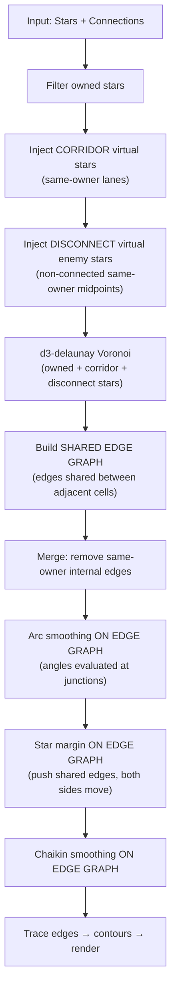

# F-138 Pipeline Redesign — Architecture Analysis

> **Context:** Three proposed solutions for eliminating territory gaps and improving the pipeline.
> **Method:** Red-team (what could go wrong) + Architect (how to build it right)

---

## Idea 1: Star Margin as Constraint, Not a Stage

### Concept
Instead of a post-processing step that pushes vertices after all other stages, star margin becomes a **constraint** — either injected into the Voronoi computation itself or checked iteratively within a processing loop.

### Architect Analysis ✅

**Option 1a: Power Diagram (Weighted Voronoi)**
- A power diagram assigns weights to sites. Heavier weight = larger cell. If each star has weight proportional to its desired margin, boundaries naturally stay far from star centers.
- **Problem:** d3-delaunay does NOT support power diagrams. Would need a different library (e.g., `d3-weighted-voronoi`, or a custom Fortune's sweep implementation).
- **Verdict:** Theoretically ideal, practically expensive to adopt.

**Option 1b: Virtual Exclusion Ring**
- Place a ring of virtual enemy-neutral sites at `marginRadius` around each star. These sites push the Voronoi boundary outward.
- **Problem:** "Enemy-neutral" doesn't exist in the ownership model — virtual sites must belong to someone. Could create artifact polygons.
- **Verdict:** Fragile, creates new problems.

**Option 1c: Post-Voronoi Constraint on Edge Graph (recommended)**
- After building the shared edge graph (Idea 3), star margin becomes a constraint checked on each edge vertex:
  - For each shared edge vertex, check distance to all stars of both adjacent owners
  - If too close to a star, push the vertex outward along the star→vertex ray
  - Because the edge is SHARED, both adjacent polygons move identically — no gap
- This can be iterative (loop until all constraints satisfied) or single-pass
- **Verdict:** Natural fit if we build the edge graph (Idea 3). No library change needed.

### Red Team 🔴

| Risk | Severity | Mitigation |
|------|----------|------------|
| Power diagram needs new library | High | Avoid — use Option 1c instead |
| Virtual exclusion sites create artifacts | Medium | Avoid — use constraint approach |
| Iterative constraint may not converge | Low | Cap iterations, use relaxation factor |
| Two adjacent stars' margin zones overlap | Medium | Already handled: margin capped at `minStarDist/2` |

### Verdict: ✅ Star margin as a constraint on the shared edge graph (Option 1c) is sound

---

## Idea 2: Virtual Enemy Stars for Disconnect Buffer

### Concept
Instead of pushing vertices post-merge, inject virtual enemy stars near the connection vector between non-connected same-owner stars. The Voronoi itself creates enemy cells in the gap zone — naturally, with perfect tiling.

### Architect Analysis ✅

**How it works:**
```
Same-owner stars A and B (no lane connection)
Connection vector: A ──────── B

Step 1: Find which enemy players border this vector
        (from Voronoi adjacency or nearest-enemy lookup)

Step 2: Place virtual enemy star(s) near the midpoint,
        offset slightly toward the enemy's territory side

        A ──── ★enemy ──── B
               ↑ virtual star

Step 3: Voronoi naturally gives the virtual enemy star
        a cell that wedges between A and B's territories
```

**Consistency with corridor pattern:**
- Corridors inject same-owner virtual stars along lanes → territory connects
- Disconnect buffer injects enemy virtual stars at midpoints → territory separates
- Same mechanism, opposite ownership — elegant symmetry

**Determining which enemy to use:**
1. Compute the midpoint M of vector A→B
2. Find the nearest star to M that belongs to a different owner
3. That owner provides the virtual enemy star
4. Position: place virtual star at M (directly on the midpoint), or offset slightly toward the enemy's existing territory

**How many virtual stars:**
- Start with ONE per disconnect zone (at the midpoint)
- If the gap is wide, may need 2-3 spaced along the center third
- Spacing parameter could be configurable

### Red Team 🔴

| Risk | Severity | Mitigation |
|------|----------|------------|
| Which enemy to assign? Multiple enemies may border the vector | Medium | Use nearest-enemy-star lookup from midpoint; if multiple enemies are equidistant, pick the one with the most adjacent territory |
| Virtual enemy star steals too much territory from A and B | Medium | Position the virtual star precisely at the midpoint; the Voronoi will allocate it proportional space naturally |
| Ownership changes cause virtual stars to appear/disappear → flicker | Low | Fingerprint includes ownership, so full recompute on change is correct behavior |
| Compounds virtual site count (corridors + disconnects) | Low | Disconnect zones are far fewer than corridor sites (O(pairs) vs O(lane_length/spacing)) |
| Which side of the vector? | Low | AT the midpoint, not offset. The Voronoi itself will determine the boundary shape. |
| Virtual enemy star too close to real star → tiny cells | Medium | Enforce minimum distance from existing stars (reuse minStarDist/2 cap) |

### Verdict: ✅ Strongly recommended — clean, consistent with corridor pattern, preserves tiling

---

## Idea 3: Unified Boundary Edge Graph

### Concept
Instead of processing each merged polygon independently (where shared vertices exist as separate copies), treat ALL territory boundaries as a single shared edge graph. Every edge is a shared data structure referenced by both adjacent owners. Modifications move edges, not polygon vertices — both sides move together.

### Architect Analysis ✅

**Data model transformation:**

```
CURRENT (polygon-centric):
  MergedPolygon {
    points: [x,y][]     ← independent copy of vertices
    ownerId: string
  }
  
  Red polygon: [V1, V2, V3, V4, V1]
  Blue polygon: [V2', V5, V6, V1', V2']   ← V1'/V2' are COPIES of V1/V2

PROPOSED (edge-centric):
  SharedEdge {
    v1: [x,y]           ← single source of truth
    v2: [x,y]           ← single source of truth
    ownerLeft: string    ← owner on one side
    ownerRight: string   ← owner on other side
  }
  
  Edge(V1→V2): shared between Red and Blue
  Moving V1 moves it for BOTH polygons simultaneously
```

**How pipeline stages work on the edge graph:**

| Stage | Current (per-polygon) | Proposed (edge graph) |
|-------|----------------------|----------------------|
| Arc smoothing | Modify each polygon's vertices independently | Evaluate angles at junctions in the unified graph; insert Bézier arc points on shared edges |
| Star margin | Push each polygon's vertices outward | Push shared edge vertices outward; both adjacent polygons move identically |
| Disconnect buffer | Not needed if using virtual enemy stars (Idea 2) | N/A |
| Chaikin smoothing | Smooth each polygon independently | Smooth the edge graph; both sides stay consistent |

**Three-way junctions:**
Where 3 owners meet, a single vertex is shared by 3 edges. The edge graph correctly represents this — moving the junction vertex affects all 3 owners consistently. The current per-polygon approach can't even detect three-way junctions.

**Rendering from edge graph:**
To draw polygon fills, trace edges to reconstruct polygon contours:
1. For each owner, collect all edges where `ownerLeft == owner` or `ownerRight == owner`
2. Chain edges into closed contours (same algorithm as current merge step)
3. Fill the contour

### Red Team 🔴

| Risk | Severity | Mitigation |
|------|----------|------------|
| Significant refactoring (~400 lines of polygon logic) | High | Incremental: build edge graph from merge output, convert back to polygons for rendering. Refactor stages one at a time. |
| Edge chaining is already the most complex code | Medium | The edge graph simplifies chaining — edges are already linked via shared vertices |
| Three-way junction handling is complex | Medium | Three-way junctions are rare (only where 3 owners meet). Can handle as special case. |
| Performance: edge graph traversal vs polygon iteration | Low | Edge count ≈ vertex count. No significant difference. |
| Current Bézier arc logic assumes polygon winding order | Medium | Arcs need prev/next vertex context. Edge graph provides this via adjacency list. |
| d3-delaunay already provides adjacency | Low | `delaunay.neighbors(i)` gives adjacent cells — can derive shared edges directly |

### Verdict: ✅ Most architecturally sound. Solves gaps BY CONSTRUCTION. Higher effort but eliminates an entire class of bugs.

---

## Combined Approach — Recommended Architecture



**Why this works:**
1. **Virtual stars (corridors + disconnect)** solve ownership topology at the Voronoi level — no post-hoc vertex manipulation
2. **Shared edge graph** ensures all boundary modifications preserve tiling — no gaps by construction
3. **Star margin as constraint** on shared edges — both sides move identically

**Migration path:**
1. First: implement disconnect virtual enemy stars (small, self-contained, immediate value)
2. Second: build shared edge graph from merge output (the hard refactor)
3. Third: migrate arc smoothing and star margin to operate on edge graph
4. Fourth: remove per-polygon stages that became redundant

---

## Open Design Questions

1. **Disconnect virtual star ownership:** Should the virtual enemy star use the nearest enemy, or should we check Voronoi adjacency to find the "natural" enemy for that zone?
2. **Edge graph granularity:** Should the edge graph include map-boundary edges (where territory meets void), or only inter-owner boundaries?
3. **Star margin at three-way junctions:** When 3 owners meet, which star's margin constraint wins? (Likely: all constraints checked, vertex pushed to satisfy the closest one)
4. **Incremental vs. big-bang:** Should we refactor to edge graph all at once, or keep the per-polygon code as a fallback during migration?
