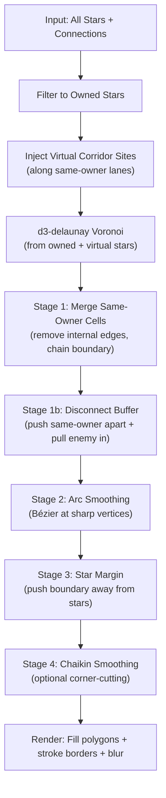

# Modified Voronoi Territory Pipeline — Complete Design Document

> **Purpose:** Shared understanding of what the pipeline does, what it should do, and how each stage works.
> **File:** `ModifiedVoronoiRenderer.ts` (910 lines)

---

## 1. Desired Visual Outcome

### What Should the Map Look Like?

Every point on the game map belongs to exactly one player's territory. There are **no empty or dark gaps** between territories. Adjacent territories of different players **butt up against each other** — their borders touch perfectly with no space between them.

### Visual Rules

| Rule | Description |
|------|-------------|
| **100% coverage** | Every pixel on the map is inside some player's territory polygon |
| **No stacking** | Only ONE layer of polygons. No "base layer + top layer" tricks |
| **Star margin** | Territory boundaries stay at least N px from their own star centers |
| **Smooth borders** | Sharp Voronoi vertices are rounded with Bézier arcs |
| **Connected corridors** | Same-owner stars with a lane get continuous territory along the lane |
| **Disconnect buffer** | Same-owner stars WITHOUT a lane get enemy territory wedged between them |

---

## 2. Current Pipeline (What the Code Does Now)



### Stage 0: Input Preparation

- `stars[]` = ALL stars passed from GameCanvas (currently all are owned)
- `ownedStars[]` = filtered to those with `ownerId` (currently = all stars)
- `connections[]` = lane connections between stars

### Stage 0b: Virtual Corridor Sites

- For each lane connecting same-owner stars, sample virtual Voronoi sites every `CORRIDOR_SPACING` px along the lane
- These virtual sites participate in the Voronoi, creating cells that merge with the owner's territory
- Each virtual site inherits the source star's `clusterIdx` for merge grouping

### Stage 0c: Voronoi Computation

- d3-delaunay computes Voronoi from `[...ownedStars, ...virtualStars]`
- Bounds = world ± 30% padding
- **PROPERTY: The Voronoi tiles perfectly — every point belongs to exactly one cell, with no gaps**

### Stage 1: Merge Same-Owner Cells — `mergeSameOwnerCells()`

- Extracts all edges from all Voronoi cells
- Canonical edge key (direction-independent) identifies shared edges
- **Internal edges** (shared by 2 cells of the same owner+cluster) → removed
- **External edges** (boundary between different owners) → kept
- Chains remaining edges into closed polygons per owner-cluster
- **RESULT:** One polygon per connected same-owner region

> [!IMPORTANT]
> **This is where gaps can be introduced.** After merge, two adjacent different-owner polygons share the SAME Voronoi edge vertices (identical coordinates). But subsequent stages modify vertices INDEPENDENTLY per polygon. If vertex A is shared by polygon Red and polygon Blue, and Stage 2 moves Red's copy differently than Blue's copy, a gap opens.

### Stage 1b: Disconnect Buffer — `applyDisconnectBuffer()`

**Goal:** Same-owner stars without a lane should NOT have continuous territory. Enemy territory should visibly separate them.

**Current implementation:**
1. Find all same-owner star pairs NOT lane-connected, within 400px
2. Compute connection vector between them, split into thirds
3. Define a "center third zone" around the midpoint
4. **Phase A:** Push same-owner polygon vertices AWAY from center zone
5. **Phase B:** Pull enemy polygon vertices INTO center zone

**Problem with current implementation:** The vertex-pushing approach is imprecise. It moves arbitrary polygon vertices that happen to be near the zone, distorting polygon shapes unpredictably. The algorithm doesn't understand polygon topology — it just nudges coordinates.

### Stage 2: Arc Smoothing — `smoothSharpVertices()`

For each vertex of each merged polygon:
1. Compute interior angle (using `Math.acos(dot product)`)
2. If angle < `ARC_THRESHOLD` (sharp corner):
   - Find nearest same-owner star center
   - Retract vertex toward that star by `ARC_STRENGTH`
   - Tessellate a quadratic Bézier arc: prev → retracted → next
   - Replace the sharp vertex with the arc segments

**Gap issue:** Shared vertices between adjacent different-owner polygons are modified independently. Each polygon retracts toward its OWN nearest star, causing the previously-coincident vertex copies to diverge.

### Stage 3: Star Margin — `applyMinStarMargin()`

For each vertex of each polygon, if it's closer than `STAR_MARGIN` px to a same-owner star:
- Push the vertex outward along the star→vertex ray until it's exactly at `STAR_MARGIN`
- Margin is auto-capped at `minStarDist/2` to prevent overlaps

**Gap issue:** Same as Stage 2 — pushes vertices per-polygon without coordinating with adjacent polygons.

### Stage 4: Chaikin Smoothing — `chaikinSmooth()`

Optional corner-cutting algorithm. Replaces each edge midpoint pair with 25%/75% interpolants. Applied N iterations.

### Render

- Fill each polygon with owner color at configured alpha
- Stroke unified border path per polygon
- Optional GPU blur filter on the fill layer

---

## 3. The Gap Problem — Root Cause Analysis

### How d3-delaunay Tiling Works

The Voronoi diagram partitions the plane perfectly. Every point belongs to exactly one cell. Adjacent cells share edge vertices with **identical coordinates**. There are zero gaps.

### How Gaps Are Introduced

```
BEFORE (perfect tiling):          AFTER (gap introduced):

  Red polygon                      Red polygon
  ┌────────┐                       ┌──────┐
  │        │                       │      │
  │     V1─┤ ← same coords        │   V1'│   ← moved differently
  │        │                       │      │ ↗ GAP
  └────────┘                       └──────┘
  ┌────────┐                       ┌──────────┐
  │     V1─┤ ← same coords        │      V1''│ ← moved differently  
  │        │                       │          │
  │ Blue   │                       │ Blue     │
  └────────┘                       └──────────┘
```

Vertex V1 exists as a copy in Red's polygon AND Blue's polygon. Stages 2 and 3 modify each copy independently. V1 becomes V1' in Red and V1'' in Blue. If V1' ≠ V1'', a gap opens.

### Why This Matters

The Voronoi's tiling guarantee is destroyed by any per-polygon vertex modification that doesn't coordinate shared vertices between adjacent polygons.

---

## 4. Proposed Fix: Shared-Edge Coordination

### Concept

Before applying any pipeline stage that modifies vertices, build a **shared vertex registry** that catalogs which polygon vertices were originally at the same coordinates. After all modifications, force shared vertices back to consistent coordinates.

### Approach Options

**Option A: Pre-register shared vertices, post-reconcile**
1. After merge (Stage 1), scan all polygon vertices
2. Build a map: `snapped(x,y)` → list of `{ polyIdx, vertexIdx }` entries
3. Run all pipeline stages normally (arcs, margin, disconnect buffer)
4. After ALL stages: for each group of shared vertices, set them all to their average position
5. **Result:** Shared edges remain coincident, preserving tiling

**Option B: Modify vertices in coordinated pairs**
1. When moving a vertex, check if it has a shared partner
2. Move both copies identically
3. More complex but potentially more precise

**Option C: Work on the edge graph, not individual polygons**
1. Store the topology (which edges are shared between which owners)
2. Pipeline stages operate on edges, not vertices
3. Most mathematically correct but requires significant refactoring

### Recommendation

Option A is simplest: post-reconcile shared vertices by averaging. It preserves existing per-polygon stage logic and just adds a coordination step at the end.

---

## 5. Disconnect Buffer — Correct Approach

The user's algorithm (from annotated screenshot):

1. For each player, enumerate star pairs
2. Check: is this pair directly lane-connected?
3. If NOT connected, compute connection vector between them
4. Split the vector into thirds
5. Look at adjacent enemy territories on either side of the connection vector
6. If not same player: enemy territory fills into center 1/3rd, meeting at the connection vector line

### Implementation Consideration

The current vertex-pushing approach is unprincipled — it moves coordinates without understanding the polygon topology. A better approach might be to:

1. Use the original Voronoi to identify **which enemy cells** border the connection vector
2. After merge, flag the same-owner pair as "already processed"
3. Extend the enemy merged polygons specifically toward the connection vector midpoint

This requires knowing the Voronoi adjacency graph (which cells neighbor which), not just the merged polygon vertices.

---

## 6. Open Questions for User

1. **Shared-vertex reconciliation:** Does Option A (average shared vertices after all stages) sound right?
2. **Disconnect buffer priority:** Should we fix general gap tiling first, or the disconnect buffer first?
3. **Corridor spacing glitch at <45px:** Known issue — too many virtual sites destabilize the merge. Should we add a minimum spacing cap?
4. **Performance concern:** The O(n²) same-owner pair enumeration in disconnect buffer could be expensive with many stars. Is 400px distance threshold appropriate?
