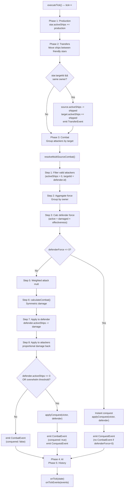
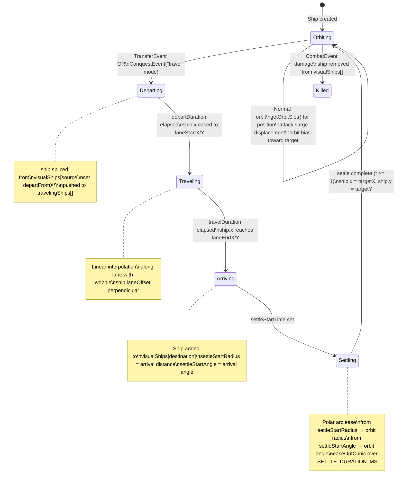
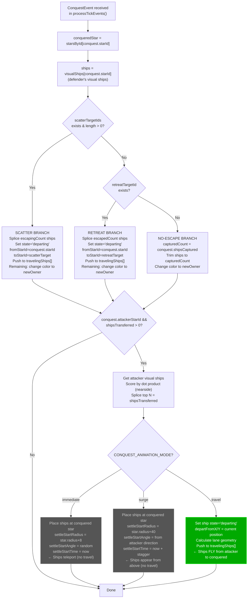

# 02 — Event Matrix: Attack-Conquest Ship & Star Animations

**Date:** 2026-02-13

## Mermaid Diagram 1: Engine Tick Sequence

## Mermaid Diagram 2: Visual Ship Lifecycle

## Mermaid Diagram 3: Conquest Event Handler (Client)

## Key Variables

| Variable | File | Line | Purpose |
|----------|------|------|---------|
| `conquest.starId` | TickEvents.ts | 31 | Conquered star ID |
| `conquest.attackerStarId` | TickEvents.ts | 32 | Victor's source star ID |
| `conquest.newOwner` | TickEvents.ts | 34 | New owner player ID |
| `conquest.shipsTransferred` | TickEvents.ts | 38 | How many ships transfer |
| `conquest.shipsCaptured` | TickEvents.ts | 35 | Defender ships captured |
| `conquest.shipsEscaped` | TickEvents.ts | 36 | Defender ships escaped |
| `conquest.retreatTargetId` | TickEvents.ts | 39 | Retreat destination |
| `conquest.scatterTargetIds` | TickEvents.ts | 40 | Scatter destinations |
| `visualShips` | GameCanvas.svelte | 74 | Map<starId, VisualShipState[]> |
| `travelingShips` | GameCanvas.svelte | 79 | Ships in-flight |
| `starsInCombat` | GameCanvas.svelte | 85 | Set for surge animation |
| `CONQUEST_ANIMATION_MODE` | game.config.ts | 121 | 'immediate' / 'surge' / 'travel' |
