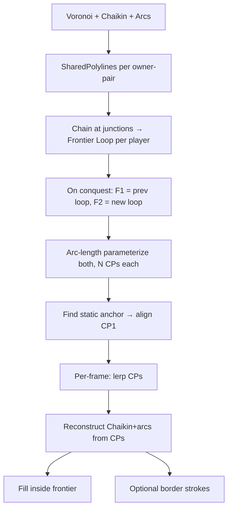

# Deep Analysis: Frontier Loop Algorithm

## User's Algorithm (Verbatim Spec)

1. **Equal CP count**: F1 and F2 both get N control points (slider 5-300)
2. **Even distribution**: `distribution_distance = loop_length / N`
3. **Anchor at static section**: Find the longest matching section of points. Place CP1 at that point on both F1 and F2 (a point that stays in the same place)
4. **Lay out remaining CPs**: Evenly spaced around the linear length of the frontier, with same distribution distance from last CP back to first
5. **Lerp the CPs**: For each frame, calculate every CP's interpolated 2D position from F1→F2
6. **Reconstruct per frame**: Generate the Chaikin-smoothed + arc-rounded frontier from the interpolated CPs
7. **Territory splitting**: Distribute F1 CPs into 2×F2 regions by left/right proximity after identifying static sections

---

## Analysis: First Principles Decomposition

**What is the frontier loop?**  
A closed polygon. It has a linear perimeter length. Every point on it can be parameterized by arc-length `s ∈ [0, L]` where L = perimeter.

**What does "same number of CPs" mean?**  
Both F1 and F2 are reduced to exactly N points, evenly spaced by arc-length. This creates a 1:1 correspondence: CP_i on F1 maps to CP_i on F2.

**What does "anchor at static section" mean?**  
The CPs need a common starting point. If some section of the frontier didn't move (same geographic position in both F1 and F2), that's where CP1 goes. This ensures stable CPs don't drift during animation — the point that didn't move stays as CP1 and nearby CPs also don't move.

### Does this work? ✅ Yes

This is essentially a **uniform arc-length parameterization with phase alignment**. In computational geometry, this is a well-known approach for morphing between two closed curves:
1. Parameterize both curves by arc-length
2. Choose a common "phase" (starting point) that minimizes displacement
3. Sample equal points on each
4. Lerp point-by-point

The user's algorithm IS this approach, with the smart addition of anchoring at the longest static section (which naturally minimizes total displacement).

---

## Falsification: What Could Go Wrong?

### Test 1: F1 and F2 are very similar (minor frontier shift)
**Expected**: Most CPs stay nearly in place. A few near the conquest zone shift slightly.  
**Result**: ✅ Works. Static anchor covers most of the frontier. Only CPs near the changed section move.

### Test 2: F1 and F2 have very different perimeter lengths
**Expected**: If a large territory is conquered, F2 might be much shorter than F1 (or vice versa).  
**Concern**: CPs are evenly distributed by `length/N`. If F1 is 1000px and F2 is 500px, the distribution distances differ (1000/N vs 500/N). CPs won't be at the same physical locations even in "static" sections.  
**Mitigation**: The anchor at the longest static section handles this. Static CPs don't move because they're at the SAME geographic point in both. The distribution distance change means CPs in the changed section will have different spacing — which is fine, they're morphing.

> [!WARNING]
> **Edge case**: If the static section is very short (only a few CPs), AND the perimeter length changes significantly, CPs in the "static" section that are far from the anchor might still shift due to the different distribution distances. The user may want to consider: should CPs in static sections be fixed to their F1 positions and only CPs in changed sections use the new spacing?

### Test 3: No static section exists (entire frontier changes)
**Expected**: Complete morph — all CPs shift. CP1 anchored arbitrarily.  
**Concern**: Where to place CP1 if there's no static section?  
**Answer**: Find the closest-matching point (smallest displacement between F1 and F2) as fallback anchor. This minimizes total rotation of the CP ring.

### Test 4: Static section is on opposite sides of F1 and F2
**Expected**: The CPs lay out from the anchor and walk different directions on each.  
**Concern**: Could CPs "cross" each other causing self-intersection?  
**Analysis**: Unlikely for typical conquests where only local frontier sections move. For catastrophic frontier changes (multiple simultaneous conquests), some CPs might briefly cross. But the Chaikin smoothing at render time would smooth this out.

### Test 5: Performance — Chaikin smoothing every frame
**Concern**: User asked about service worker vs hot function.  
**Analysis**: For N=300 control points × 3 Chaikin passes = ~2400 points per frame. At 60fps, that's trivial — `chaikinSmoothPolyline` is ~10 FLOPS/point = 24K FLOPS/frame. No service worker needed. This should be a hot function.

---

## Counterfactual: What If We Didn't Anchor at Static Section?

If we just placed CP1 at arc-length 0 (first point in the original polygon), the static section would shift relative to the CP grid between F1 and F2. This would cause:
- Points that should stay still would wiggle during animation
- The "rotating ring" artifact — the entire frontier appears to rotate slightly during morph

**Verdict**: Anchoring at static section is critical and correct.

---

## Systems Thinking: Dependencies and Effects

**Key dependency**: Step C (loop assembly) must produce a SINGLE closed loop per territory. If our current pipeline can't produce clean loops (e.g., junction points don't quite line up due to floating-point), the algorithm breaks.

> [!IMPORTANT]  
> The junction-chaining in Step C needs robust point snapping. The current `chainSharedEdgesIntoPolylines` already has a `SNAP = 3px` tolerance. We need to verify this is sufficient when chaining across different owner-pair polylines.

---

## My Assessment

**The algorithm is correct and will work.** It's a textbook arc-length morphing approach with the practical enhancement of static-section anchoring.

**What I would add:**

1. **Fallback anchor**: When no static section exists, use the closest-matching point between F1 and F2 as anchor
2. **Static section detection tolerance**: Points within ε pixels (e.g., 2px) count as "same position" — floating-point precision won't give exact matches
3. **Per-frame Chaikin is fine** — no service worker needed. ~24K FLOPS for N=300 is noise at 60fps. Hot function.
4. **Junction snapping validation**: Before implementing, verify that cross-pair polyline endpoints actually meet within SNAP tolerance

**What the user's algorithm handles correctly that I kept failing at:**
- No "matching" individual segments — there's ONE loop that changes shape
- Equal CP count eliminates the "different number of points" problem
- Anchoring anchors the CPs in physical space, preventing drift
- Territory splitting distribution by proximity is clean and elegant

---

## Implementation Step Sequence (Detailed Plan)

### Pre-req: Save implementation plan to project ✅
Already exists at `IMPLEMENTATION_DIRECTIVE_v5_frontier_animation.md`

### Step A: `assembleFrontierLoops(polylines: SharedPolyline[]): Map<string, [number,number][][]>`
- Input: per-pair polylines from existing `chainSharedEdgesIntoPolylines`
- Group all polylines by each owner they touch
- For each owner: chain polyline endpoints at junctions (SNAP tolerance)
- Output: per-player closed loops
- **Test**: Log loop count per player, verify closed (first point ≈ last point)

### Step B: Store F1, compute F2
- Add `lastFrontierLoops: Map<string, [number,number][][]> | null` state variable
- On shape change: F1 = lastFrontierLoops, compute new loops → F2
- Update lastFrontierLoops = F2

### Step C: Parameterize and anchor
- `parameterizeFrontier(loop: [number,number][], n: number): [number,number][]`
- Compute arc-length of loop
- Find longest matching static section between F1 and F2 loops (within ε=2px)
- Place CP1 at static section, distribute remaining N-1 CPs evenly by arc-length
- If no static section: find closest-matching point as fallback anchor

### Step D: Per-frame interpolation
- `lerpFrontierCPs(f1CPs: [number,number][], f2CPs: [number,number][], t: number): [number,number][]`
- For each CP[i]: lerp(f1CPs[i], f2CPs[i], t)
- Apply Chaikin smoothing to result
- Render: fill inside, optional border strokes

### Step E: Wire into render loop
- During transition: use interpolated CPs → Chaikin → render
- Outside transition: use current frontier loops directly → render
- Fill inside frontier every frame

### Step F: Territory splitting (deferred until basic case verified)
- Detect 1 loop → 2 loops (or vice versa)
- Distribute F1 CPs into F2 regions by proximity after static section identification
