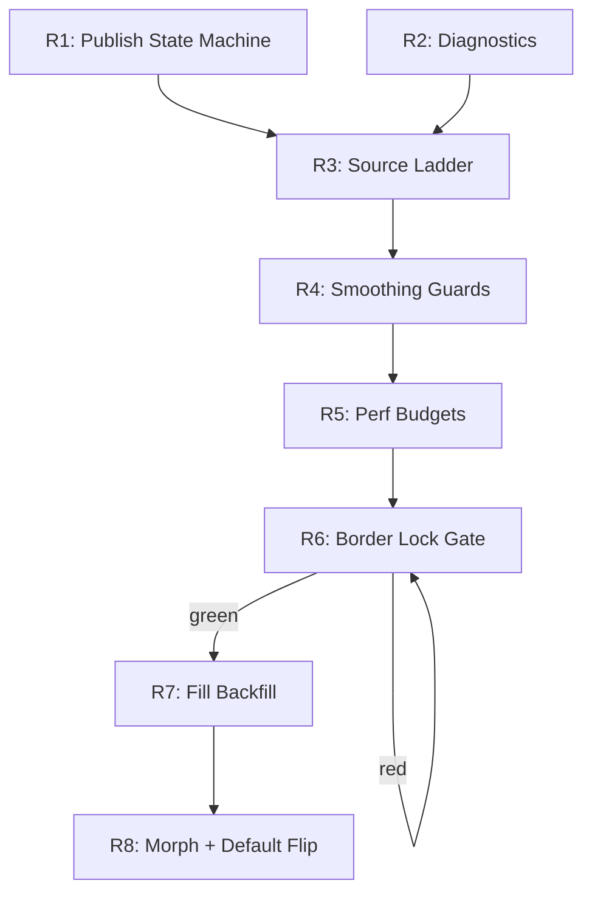

# Canonical Graph-Native Territory Rendering — Implementation Directive v3

**Date**: 2026-03-09  
**Status**: REMAINING-ONLY COMPLETION PLAN  
**Supersedes**: v1 (full spec), v2 (first reality check)  
**Baseline**: Commit `10698ca` + completed chunks 1–3, 5–8, 10, 12, and most of 13–14

---

## 0. Current State Assessment

### What's Done
Over half of v1's 6-stage pipeline is implemented across `DistanceFieldTerritoryRenderer.ts`, `frontierGraph.ts`, and `strokeMeshBorders.ts`:
- Stage 1 (Multi-source Dijkstra) — canonical, working
- Stage 2A (Lane frontier extraction) — implemented
- Stage 2B (Field frontier extraction) — contour-local adjacency-based, reads CPU `Int16Array` owner-grid snapshot (not GPU readback)
- Stage 3 (Ownership RT) — existing GPU pass with gating
- Stage 4 (Frontier merge) — implemented
- Settings bridge — centralized, territory controls use `panel.*` / `setSetting` path
- Legacy isolation — lattice-derived centerlines reclassified as legacy-only
- Liveness telemetry — diagnostic scaffolding in place

### Blocking Defect
**Canonical production mesh can still end up with no publishable source.** Symptoms:
- `vectorPathReady: false`
- No published owner-grid snapshot for current key
- Production Mesh goes blank during canonical rebuild

Root cause: the publish lifecycle has no explicit state machine — build start can clear published data, and mesh source selection can read in-flight job memory.

### Factual Corrections from v2

> [!IMPORTANT]
> - Stage 2B does **not** use GPU readback (`renderer.extract.pixels()`). It reads a CPU `Int16Array` owner-grid snapshot. The race condition is not async GPU timing — it's a state management gap in the publish pipeline.
> - Field frontier extraction is already contour-local adjacency-based (Chunk 12 is done correctly). The origin-sort chaining anti-pattern was fixed.

---

## 1. Remaining Chunks

Reliability first (R1–R6), then canonical completion (R7–R8). Do not flip defaults until R6 passes.

### R1: Canonical Publish State Machine

**Finishes**: original Chunk 14  
**Goal**: Production Mesh cannot enter blank mode due to in-flight canonical rebuild.

Before starting R1, read the current publish lifecycle in DistanceFieldTerritoryRenderer.ts, specifically the cachedVectorBuildJob usage, vectorPathReady flag, and mesh source selection in the render loop.

**State machine**:
```
IDLE → BUILDING → CANDIDATE_READY → PUBLISHED
                                   ↘ PUBLISHED_STALE_REUSED
```

**Split keys**:
- `classificationKey` = `geometryFp | topologyFp | playerIds | ownershipControlFp`
- `samplingKey` = `classificationKey | samplingContract | gridW | gridH | origin | extent | straightness | simplify`

**Rules**:
- Never clear published canonical data when a new build starts
- Build job is reusable only when `samplingKey` matches exactly
- Promote to `PUBLISHED` only after full build + extraction + validation
- Mesh source selection reads only `PUBLISHED` records, never in-progress job memory

**Done when**: Production Mesh cannot go blank due to in-flight canonical rebuild.

---

### R2: Diagnostics Before Fallback

**Finishes**: original Chunk 08 tail  
**Goal**: Every fallback decision is observable and attributable.

> [!TIP]
> This runs before R3 (the fallback ladder) so that the ladder never silently masks bugs.

**Add `BorderPublishFailureReason`** — structured payload emitted before any fallback selection:

| Reason | Meaning |
|--------|---------|
| `NO_OWNERSHIP_SITES` | No players own any stars |
| `BUILD_IN_PROGRESS` | Build hasn't completed yet |
| `STALE_BUILD_KEY` | Published key doesn't match current classification |
| `EMPTY_POLYLINES` | Build completed but polylines are empty |
| `CANONICAL_VALIDATION_FAILED` | Canonical frontier data failed validity checks |
| `NO_PUBLISHED_CANONICAL` | No canonical data available at any key |
| `NO_PUBLISHED_LEGACY` | No legacy data available either |

**Noise control**: One warning per fingerprint (`reason + keys + counts`), plus dev telemetry counters.

**Done when**: Every fallback decision logs a structured reason before executing.

---

### R3: Non-Blank Source Ladder

**Finishes**: original Chunks 13/14  
**Goal**: Any available published source always renders borders.

**Deterministic order each frame**:
1. Published canonical — current key
2. Published canonical — last-valid key
3. Published legacy — current key
4. None

"None" is allowed **only** if all 3 upstream candidates are absent or empty, and must emit an R2 diagnostic reason.

**Done when**: Borders cannot go blank while any published source exists.

---

### R4: Smoothing-Collapse Guardrails

**Finishes**: original Chunk 13  
**Goal**: Smoothing cannot erase usable canonical geometry.

**Per-polyline fallback to raw** if any condition holds:
- `rawVertexCount >= 12` and `smoothedVertexCount / rawVertexCount < 0.20`
- `smoothedArcLength / rawArcLength < 0.60`
- Closed contour and `smoothedBBoxArea / rawBBoxArea < 0.50`
- Drift check fails existing max-alignment tolerance

**Telemetry**: Add `SMOOTHING_COLLAPSE_FALLBACK_USED` counter to dev diagnostics.

**Done when**: Canonical pipeline never emits empty/degenerate output from valid published input.

---

### R5: Assertion Discipline + Performance Budgets

**Finishes**: original Chunks 08/09/14  
**Goal**: Reliability is proven without budget regressions.

**Assertion cleanup**:
- Center-stroke assertions remain diagnostic-only (never production spam)
- Remove or gate any assertion that fires on every frame during normal operation

**Timing marks** around:
- Ownership sample site build
- Owner-grid fill
- Polyline extraction
- Canonical frontier build
- Mesh geometry build

**Acceptance budgets** (pinned map):

| Metric | Budget |
|--------|--------|
| Steady-state border pipeline | p95 ≤ 1.0 ms/frame |
| Publish event | p50 ≤ 12 ms, p95 ≤ 24 ms |
| Topology update frame spikes | No more than 2 consecutive frames > 33 ms |

**Done when**: Performance is measured and within budget on a pinned test map.

---

### R6: Border Lock Acceptance Gate

**Finishes**: original Chunks 04/09/14  
**Goal**: Border Lock is green end-to-end on pinned test matrix.

**Test matrix** (pinned map + preset):
- Static high zoom
- Continuous pan/zoom
- Conquest transitions
- Resize + transpose toggles
- Full page reload

**Pass criteria**:
- No blank borders in Production Mesh
- No 3–4 mode cycling
- No repeated alignment assertion spam
- No canonical fallback flapping in logs

**Gate rule**: If R6 fails, canonical stays non-default. Do not proceed to R7 until green.

---

### R7: Canonical Fill Backfill

**Finishes**: original Chunk 15  
**Goal**: Canonical mode has a single geometry truth for both fill and border.

- Derive canonical visible fills from frontier geometry truth
- Keep ownership RT for solver/interstitial/debug use — not as visible-edge authority
- Validate fill/border coincidence under zoom, resize, and conquest transition

**Done when**: Fill and border are geometrically coincident in canonical mode.

---

### R8: Morph + Final Regression + Default Flip

**Finishes**: original Chunk 16  
**Goal**: Spec-complete, release-safe canonical territory V1.

- Preserve **Fade Blend** as-is — distinct selectable mode with timing/easing controls
- Complete **Boundary Morph** as separate mode using stable frontier IDs and mesh correspondence
- Run full regression matrix:
  - Legacy modes
  - Canonical borders + fills
  - Morph modes
  - Settings / theme / preset / import / reactivity
  - Zoom / reload / tick / conquest
- Flip defaults to canonical production **only after matrix is fully green**

**Done when**: Canonical territory V1 is visually correct, reactive, and spec-complete.

---

## 2. Recommended Execution Order



R1 and R2 can execute in parallel. Everything else is sequential.

---

## 3. Interface Additions

| Type | Purpose |
|------|---------|
| `BorderPublishFailureReason` | Union type for structured fallback diagnostics |
| `BorderPublishDiagnostics` | Payload: publish phase + select phase + snapshot IDs + counts |
| `PublishedBorderSourceState` | Separate canonical/legacy published caches |

No new user-facing controls required. Existing canonical mode UI controls remain.

---

## 4. Assumptions and Defaults

- Reliability is prioritized over canonical purity during R1–R6
- Every fallback is explicit and logged (never silent)
- Existing completed work is retained; this plan only patches remaining failure paths
- Straight-family canonical borders are the only required production family in this pass
- Defaults do not flip until R6 passes
- Legacy border engines stay in product as explicit references

---

**Version**: 3.0  
**Last Updated**: 2026-03-09  
**Status**: READY FOR IMPLEMENTATION
