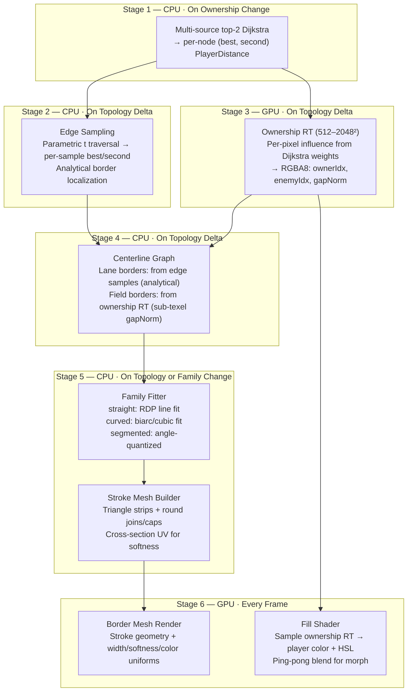

# Territory Rendering Architecture v3 — Final Hybrid

**Date**: 2026-03-07 · **Version**: 3.0 — Supersedes all previous plans  
**Synthesizes**: C+ ownership RT analysis · Geometry border pipeline proposal · Graph-native strip-extrusion research

---

## 1. Design Goals

| # | Goal | Metric |
|---|------|--------|
| G1 | **Graph-truthful ownership** | Territory divisions match star–lane graph shortest paths, not Euclidean distance |
| G2 | **Full-field fills** | Every pixel inside the world bounds has a player color; no voids |
| G3 | **Even-width crisp borders** | Geometry-rendered strokes; no texture staircase at any zoom |
| G4 | **Smooth conquest morph** | Borders drift continuously over 300–700ms on ownership change |
| G5 | **Three border families** | straight / curved / segmented, sharing a centerline graph |
| G6 | **Style changes are free** | Width, softness, alpha, color blend — uniforms only, no rebuild |
| G7 | **60fps steady-state** | Per-frame GPU cost < 0.5ms; delta cost < 15ms |
| G8 | **Intrinsic disconnects** | No special-case code; graph metric handles separation by construction |

---

## 2. Architecture



---

## 3. Stage Details

### Stage 1: Multi-Source Top-2 Dijkstra

**Purpose**: For every star node, compute the two nearest players by graph distance.

**Algorithm**: Multi-source Dijkstra with player labels. Each queue item is `(nodeId, playerId, dist)`. At each node, store only the best and second-best `PlayerDistance` (must be different players). This runs on the star–lane graph, not on pixels.

**Key interfaces**:
```typescript
interface PlayerDistance {
    playerId: string;
    dist: number;
}
interface NodeTerritoryInfo {
    nodeId: string;
    best: PlayerDistance;     // nearest player
    second: PlayerDistance;   // nearest enemy
}
```

**What this replaces**: The current `computeDistToPlayer()` at [L1059-1097](file:///c:/Users/mikep/Desktop/WebDev/PRISM-Atlas-DART%20v1/pax-fluxia/src/lib/renderers/DistanceFieldTerritoryRenderer.ts#L1059-L1097) computes distance to each player separately. The new solver does it in one pass with a proper min-heap PQ.

**What this eliminates**:
- `computeDisconnectVirtuals()` (171 lines) — disconnects are free by construction
- `DISCONNECT_OWNER_ID` and owner-254 shader handling
- Union-Find component detection — graph metric inherently separates disconnected holdings
- Virtual corridor sites — lane coverage handled by edge sampling

**MSR (minimum star radius)**: Implemented as seed distance bias. Each star's initial queue distance = `-msrBoost` instead of `0`, pushing its boundaries outward.

**Trigger**: Ownership change, star add/remove, connection change.

---

### Stage 2: Edge Sampling

**Purpose**: Extend node-level ownership to points along lanes. Locate exact border positions analytically.

**Algorithm**: For each lane edge `(u, v)` with weight `w`, sample `t in [0, 1]` at `SAMPLES_PER_EDGE` (default 8) positions. At each sample, compute distance to each candidate player via:

```
D_p(t) = min(d_p(u) + t * w, d_p(v) + (1-t) * w)
```

Candidates come from `best` and `second` at both endpoints (4 candidates, deduplicated by player, keep min dist per player). Sort by dist → assign `best` and `second`.

**Border localization**: When `best.playerId` changes between adjacent samples `s[i]` and `s[i+1]`, the exact border position is found by solving a linear equation in `t` or a quick bisection. This gives sub-sample precision with zero staircase.

**Output**: `EdgeSamples` — per-edge array of `{ t, worldX, worldY, bestPlayer, secondPlayer, bestDist, secondDist }`.

**Trigger**: Same as Stage 1 (consumes its output).

---

### Stage 3: Ownership RT (GPU)

**Purpose**: Full-field 2D ownership for territory fills. The edge sampling (Stage 2) only covers lane corridors; this RT covers the entire world rectangle.

**What exists today**: [ownershipPassBitGl](file:///c:/Users/mikep/Desktop/WebDev/PRISM-Atlas-DART%20v1/pax-fluxia/src/lib/renderers/DistanceFieldTerritoryRenderer.ts#L519-L665) + [renderOwnershipPass()](file:///c:/Users/mikep/Desktop/WebDev/PRISM-Atlas-DART%20v1/pax-fluxia/src/lib/renderers/DistanceFieldTerritoryRenderer.ts#L2630-L2700).

**Changes**:
1. **Feed Dijkstra distances from Stage 1** into the data texture (same `buildStarDataTexture()` call, just with the new solver's distances instead of the old per-player arrays).
2. **Gate execution**: Only run when `topologyChanged || geometryChanged`. Currently runs every frame.
3. **Ping-pong**: Maintain `prevOwnershipRT` and `currOwnershipRT`. Before re-rendering, swap them.
4. **Zoom-adaptive resolution**: `res = clamp(512 * cameraZoom, 512, 2048)`. Re-render on significant resolution change.

**Output**: RGBA8 render texture — R: ownerIdx, G: enemyIdx, B: gapNorm, A: 1.0.

**Trigger**: Same as Stage 1.

---

### Stage 4: Centerline Graph

**Purpose**: Build a single graph of border centerlines from two sources.

**Source A — Lane borders (from Stage 2, analytical)**:
- Where edge samples show ownership transitions → exact border position on the lane
- These are the highest-quality border points (analytically precise)

**Source B — Interstitial borders (from Stage 3, field-derived)**:
- Read ownership RT pixels via `renderer.extract.pixels()` (async in PIXI v8)
- Scan for adjacent texels with different owners
- Sub-texel refinement using gapNorm (blue channel): `t = gapA / (gapA + gapB)` between texel centers
- These fill the gaps where no lane passes through

**Output**: `CenterlineGraph` — nodes (world-space position) + edges (owner-pair labels, source tag `lane` | `field`).

**The two sources join naturally**: Lane border points anchor the graph at precise positions; field border arcs connect them through interstitial space.

**Trigger**: Same as Stage 1.

---

### Stage 5: Family Fitter + Stroke Mesh

**Family Fitter** — converts raw centerline graph to styled paths:

| Family | Method | Error Bound | Visual |
|--------|--------|-------------|--------|
| `straight` | RDP simplification with collinearity penalty | ≤ 0.5 × borderWidth | Clean piecewise-linear |
| `curved` | Biarc or cubic Bezier fitting under error threshold | ≤ 0.5 × borderWidth | Smooth organic curves |
| `segmented` | Angle-quantize to 15 degree increments | ≤ 1.0 × borderWidth | Faceted, stylized |

All fitters share the same `CenterlineGraph` input and produce `FittedPath[]` — arrays of world-space points with ownerPair metadata.

**Stroke Mesh Builder** — converts fitted paths to GPU geometry:
```typescript
interface StrokeMesh {
    positions: Float32Array;    // triangle strip vertices
    crossUVs: Float32Array;     // 0=left edge, 0.5=center, 1=right edge
    ownerPairs: Uint8Array;     // per-vertex (bestOwner, secondOwner) for color lookup
    indices: Uint32Array;
}
```
- Round joins at multi-path junctions
- Round caps at path endpoints
- Center-stroke: width expands symmetrically from centerline

**Fragment shader for stroke mesh**:
```glsl
// Cross-section UV drives softness falloff
float crossDist = abs(vCrossUV - 0.5) * 2.0;     // 0 at center, 1 at edge
float coreMask = 1.0 - smoothstep(1.0 - uSoftness, 1.0, crossDist);

// Two-color blend from owner-pair
vec3 colorA = getPlayerColor(vOwnerA);
vec3 colorB = getPlayerColor(vOwnerB);
vec3 borderColor = (colorA + colorB) * 0.5 + vec3(uBrighten);

outColor = vec4(borderColor * coreMask * uAlpha, coreMask * uAlpha);
```

**Trigger**: Topology delta rebuilds everything. Family change rebuilds fitter + mesh only (reuses centerline). Style change (width/softness/alpha/color) updates uniforms only.

---

### Stage 6: Per-Frame Rendering (GPU)

**Fill shader** ([ownershipFillPassBitGl](file:///c:/Users/mikep/Desktop/WebDev/PRISM-Atlas-DART%20v1/pax-fluxia/src/lib/renderers/DistanceFieldTerritoryRenderer.ts#L913-L1027)):
```glsl
vec4 prevFill = computeFill(uPrevOwnershipTex, uv);
vec4 currFill = computeFill(uCurrOwnershipTex, uv);
outColor = mix(prevFill, currFill, uMorphFactor);
```
- Zero CPU cost per frame
- `uMorphFactor` driven by `(now - morphStart) / transitionMs`

**Stroke mesh render**: Upload once, render each frame. Uniforms only change for style updates.

**Morph for borders**: During conquest transition:
1. Compute `displayedDist[node] = lerp(prev.dist, next.dist, morphFactor)` for each node
2. Recompute edge samples from interpolated distances
3. Rebuild centerline → fitter → stroke mesh
4. At 100 edges x 8 samples = 800 vertices, this takes ~0.5ms per frame — acceptable for a 500ms animation

---

## 4. Dirty-Bucket Change Classification

| Bucket | Trigger | Rebuilds |
|--------|---------|----------|
| `topology` | Star ownership, star add/remove, connection change | All stages (1→2→3→4→5→6) |
| `geometry-style` | Border family switch, fit tolerance, zoom-adapted RT resolution | Stages 5→6 (reuses centerline) |
| `visual-style` | Width, softness, alpha, color, HSL, blend mode, brighten | Uniforms only. No rebuild. |
| `morph-frame` | Every frame during conquest animation | Edge samples → centerline → fitter → mesh (border only; fills are GPU-blend) |

---

## 5. Performance Budget

| Stage | When | 64 stars, 100 edges | 128 stars, 200 edges |
|-------|------|---------------------|----------------------|
| Dijkstra (min-heap) | On delta | ~0.1ms | ~0.3ms |
| Edge sampling | On delta | ~0.1ms | ~0.2ms |
| Ownership RT (512 sq) | On delta | ~0.5ms | ~0.5ms |
| Ownership RT (2048 sq) | On zoom delta | ~8ms | ~8ms |
| readPixels() | On delta | ~1ms | ~1ms |
| Centerline extraction | On delta | ~0.5ms | ~1ms |
| Family fitter | On delta | ~0.3ms | ~0.5ms |
| Stroke mesh build | On delta | ~0.1ms | ~0.2ms |
| **Fill render** | **Every frame** | **~0.1ms** | **~0.1ms** |
| **Stroke render** | **Every frame** | **~0.05ms** | **~0.1ms** |
| **Morph frame** (border only) | **Every frame during animation** | **~0.5ms** | **~1ms** |

**Steady-state per frame**: **~0.15ms** — well within 60fps  
**On ownership change**: **~2.5ms** one-shot — invisible  
**During morph animation**: **~0.7ms** per frame — comfortable

---

## 6. Execution Phases

### Phase 1: Gate Pass 1 — Instant Performance Win

**What**: Stop calling `renderOwnershipPass()` every frame. Gate behind topology delta check.

**File**: [DistanceFieldTerritoryRenderer.ts:L3439-3442](file:///c:/Users/mikep/Desktop/WebDev/PRISM-Atlas-DART%20v1/pax-fluxia/src/lib/renderers/DistanceFieldTerritoryRenderer.ts#L3439-L3442)

**Change**: Wrap in `if (changeClassification.topologyChanged || changeClassification.geometryChanged)`.

**Acceptance**: Zero visible lag during steady-state gameplay. Territory still updates on ownership change.

---

### Phase 2: Top-2 Dijkstra Solver

**What**: Replace `computeDistToPlayer()` with the graph-native multi-source top-2 Dijkstra using a proper min-heap PQ.

**File**: Replace [L1059-1097](file:///c:/Users/mikep/Desktop/WebDev/PRISM-Atlas-DART%20v1/pax-fluxia/src/lib/renderers/DistanceFieldTerritoryRenderer.ts#L1059-L1097)

**Output feeds**: `buildStarDataTexture()` — encode `best.dist` and `second.dist` per node.

**Acceptance**: Same territory shapes as before (graph distances are compatible). `computeDisconnectVirtuals()` can be removed if disconnect behavior is confirmed equivalent.

---

### Phase 3: Ping-Pong Ownership RTs + Fill Morph

**What**: Maintain two ownership RTs. On ownership change, swap prev/curr and re-render. Add `uMorphFactor` to fill shader.

**Files**:
- New cached var: `cachedPrevOwnershipTexture` at [L1036](file:///c:/Users/mikep/Desktop/WebDev/PRISM-Atlas-DART%20v1/pax-fluxia/src/lib/renderers/DistanceFieldTerritoryRenderer.ts#L1036)
- Swap logic in `ensureTwoPassBorderResources()` at [L2858](file:///c:/Users/mikep/Desktop/WebDev/PRISM-Atlas-DART%20v1/pax-fluxia/src/lib/renderers/DistanceFieldTerritoryRenderer.ts#L2858)
- Add `uPrevOwnershipTex` + `uMorphFactor` to [ownershipFillPassBitGl](file:///c:/Users/mikep/Desktop/WebDev/PRISM-Atlas-DART%20v1/pax-fluxia/src/lib/renderers/DistanceFieldTerritoryRenderer.ts#L913-L1027)

**Acceptance**: Triggering an ownership change shows smooth fill color cross-fade over 500ms.

---

### Phase 4: Edge Sampling + Analytical Borders

**What**: New module `centerlineGraph.ts`. Parametric edge traversal from node distances, with analytical border localization at ownership transitions.

**New file**: `pax-fluxia/src/lib/renderers/centerlineGraph.ts`

**Acceptance**: Debug render of analytical border positions matches ownership RT boundaries visually.

---

### Phase 5: `straight` Fitter + Stroke Mesh

**What**: RDP line fit → triangle strip stroke mesh with round joins/caps → PIXI.Mesh with border shader.

**New code in**: `centerlineGraph.ts`

**Acceptance**: Geometry borders are visually even-width, centered on ownership interfaces, no staircase at normal zoom.

---

### Phase 6: Wire Into Render Path + Remove Dead Code

**What**: Gate geometry borders behind `DF_GEOMETRY_BORDERS_ENABLED`. Remove disabled vector overlay (~500 lines), dead UI controls, `DISCONNECT_OWNER_ID` handling.

**Files**:
- [DistanceFieldTerritoryRenderer.ts](file:///c:/Users/mikep/Desktop/WebDev/PRISM-Atlas-DART%20v1/pax-fluxia/src/lib/renderers/DistanceFieldTerritoryRenderer.ts) — main integration
- [game.config.ts](file:///c:/Users/mikep/Desktop/WebDev/PRISM-Atlas-DART%20v1/pax-fluxia/src/lib/config/game.config.ts) — new config keys
- [ControlsSection-Territory.svelte](file:///c:/Users/mikep/Desktop/WebDev/PRISM-Atlas-DART%20v1/pax-fluxia/src/lib/components/ui/settings/ControlsSection-Territory.svelte) — clean up dead controls

**Acceptance**: Geometry borders render in-game. Style controls work. Dead code removed.

---

### Phase 7: Border Morph (Distance-Lerp)

**What**: During conquest animation, interpolate per-node distances → recompute edge samples → rebuild stroke mesh each frame.

**Acceptance**: Borders visibly drift during conquest. No popping.

---

### Phase 8: `curved` + `segmented` Families

**What**: Add biarc/cubic fitter and angle-quantized simplifier.

**Acceptance**: Border family dropdown produces visibly distinct styles.

---

## 7. Fallback Ladder

| Risk | Detection | Fallback |
|------|-----------|----------|
| **Interstitial borders look bad** (field-derived arcs don't join smoothly with lane-derived borders) | Visual seam at lane/field junction | Increase ownership RT resolution at junctions; or use field-only borders (remove analytical lane borders) |
| **Distance-lerp morph causes jitter** | Floating-point noise at border positions during animation | Snap distances to half-integer steps during morph; or fall back to texture-blend morph for borders too |
| **readPixels() stall** exceeds 3ms | Performance profiling | Use async `PIXI.extract.pixels()` with one-frame delay; or render centerline from edge samples only (no field contribution) |
| **Per-frame stroke rebuild too expensive** during morph at >200 edges | Frame time exceeds 2ms | Pre-compute prev+curr stroke meshes at morph start; GPU vertex-lerp between them via `uMorphFactor` attribute instead of CPU rebuild |
| **Graph Dijkstra too slow** at >500 stars | Delta rebuild exceeds 16ms | Incremental re-relaxation: only re-expand nodes within hop distance of changed star; or bound to a maximum frontier radius |

---

## 8. Files Summary

| File | Action | What |
|------|--------|------|
| [DistanceFieldTerritoryRenderer.ts](file:///c:/Users/mikep/Desktop/WebDev/PRISM-Atlas-DART%20v1/pax-fluxia/src/lib/renderers/DistanceFieldTerritoryRenderer.ts) | MODIFY | Gate Pass 1, ping-pong RTs, morph uniforms, new Dijkstra, geometry border integration, dead code removal |
| [territoryFeatures.ts](file:///c:/Users/mikep/Desktop/WebDev/PRISM-Atlas-DART%20v1/pax-fluxia/src/lib/renderers/territoryFeatures.ts) | MODIFY | Remove `computeDisconnectVirtuals` and `DISCONNECT_OWNER_ID` after Phase 2 verification |
| **centerlineGraph.ts** | NEW | Centerline extraction, edge sampling, family fitters, stroke mesh builder |
| [game.config.ts](file:///c:/Users/mikep/Desktop/WebDev/PRISM-Atlas-DART%20v1/pax-fluxia/src/lib/config/game.config.ts) | MODIFY | `DF_GEOMETRY_BORDERS_ENABLED`, `TERRITORY_TRANSITION_MS`, family config |
| [settingsDefs.ts](file:///c:/Users/mikep/Desktop/WebDev/PRISM-Atlas-DART%20v1/pax-fluxia/src/lib/components/ui/settingsDefs.ts) | MODIFY | Map new config keys |
| [ControlsSection-Territory.svelte](file:///c:/Users/mikep/Desktop/WebDev/PRISM-Atlas-DART%20v1/pax-fluxia/src/lib/components/ui/settings/ControlsSection-Territory.svelte) | MODIFY | Remove dead controls, wire new ones |
