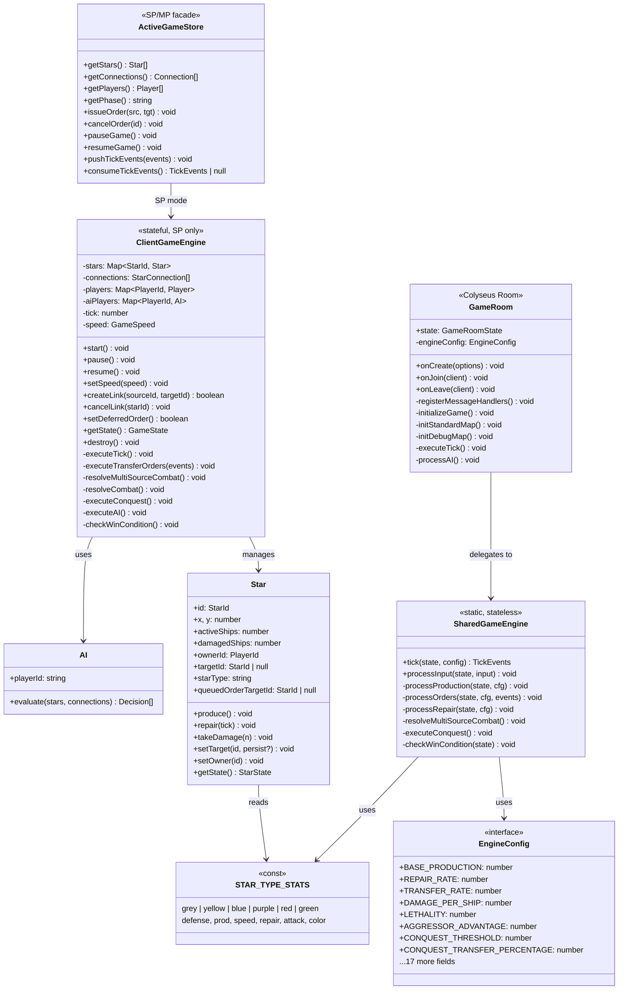

# VIEW B: THE ASSET INVENTORY (Matter)

**Last Updated:** 2026-02-12  
**Project:** Pax Fluxia

---

## Class Diagram — Current Architecture

---

## Types & Interfaces

### Shared Types (`common/src/types.ts`)

| Type | Purpose |
|------|---------|
| `StarType` | `'grey' \| 'yellow' \| 'blue' \| 'purple' \| 'red' \| 'green'` |
| `EngineConfig` | Tunable game parameters (production, combat, conquest, etc.) |
| `TickEvents` | `{ transfers, combats, conquests }` — events emitted per tick |
| `TransferEvent` | Ship movement between friendly stars |
| `CombatEvent` | Per-tick combat damage exchange |
| `ConquestEvent` | Star ownership change with scatter/retreat details |
| `ConquestContext` | Interface for neighbor lookups during conquest |

### Client Types (`pax-fluxia/src/lib/types/`)

| Type | Purpose |
|------|---------|
| `GameState` | Full snapshot for UI binding (stars, connections, players, tick, winner) |
| `GameSpeed` | `0 \| 1 \| 2 \| 4 \| 10 \| 50` |
| `GameView` | `'menu' \| 'lobby' \| 'game' \| 'results'` |
| `StarState` | Serializable star state for UI rendering |
| `PlayerState` | Player stats snapshot (ships, stars, production) |
| `GameHistoryEntry` | Per-tick snapshot for graphs (ship counts, combat events) |

---

## Exported Functions

### Shared Functions (`@pax/common`)

| Function | File | Purpose |
|----------|------|---------|
| `GameEngine.tick(state, config)` | `engine/GameEngine.ts` | Stateless tick processor |
| `calculateCombat(forceA, forceB, ...)` | `combat.ts` | Symmetric damage with lethality split |
| `applyConquest(attacker, defender, ctx, cfg)` | `conquest.ts` | Ownership transfer + scatter/retreat |
| `applyProduction(star, cfg)` | `production.ts` | Overflow-based integer ship production |
| `applyRepair(star, cfg)` | `repair.ts` | Overflow-based integer ship repair |
| `calculateTransfer(activeShips)` | `orders.ts` | Transfer amount calculation |
| `validateOrder(source, target, ...)` | `orders.ts` | Order validation |

### Client Functions

| Function | File | Purpose |
|----------|------|---------|
| `createEngine(config)` | `engine/GameEngine.ts` | Factory for SP engine |
| `calculateCombatV4(...)` | `engine/Combat.ts` | **Client combat formula (duplicates shared)** |
| `getOrbitSlot(index, ...)` | `utils/render.utils.ts` | Ship orbit packing |

---

## Stores

| Store | File | Purpose |
|-------|------|---------|
| `activeGameStore` | `activeGameStore.svelte.ts` | SP/MP facade — single API for both modes |
| `gameStore` | `gameStore.svelte.ts` | SP game state (engine instance, snapshot) |
| `multiplayerStore` | `multiplayerStore.svelte.ts` | MP Colyseus connection state |
| `combatLog` | `combatLog.ts` | Rolling combat log for UI display |

---

## Configuration Sources

| Source | File | Mutable? | Persistence | Purpose |
|--------|------|----------|-------------|---------|
| `GAME_CONFIG` | `pax-fluxia/src/lib/config/game.config.ts` | ✅ Yes | localStorage | Client-side runtime config (all tunable params) |
| `DEFAULT_ENGINE_CONFIG` | `common/src/config.ts` | ❌ No | None | Default values for server & fallback |
| `ORDER_CONFIG` | `common/src/orders.ts` | ❌ No | None | **Stale — TRANSFER_RATE=0.25 (conflicts)** |
| `STAR_TYPE_STATS` | `common/src/config.ts` | ❌ No | None | Star type multipliers (single source of truth) |

---

## Constants

| Constant | File | Value | Purpose |
|----------|------|-------|---------|
| `BASE_TICK_MS` | `game.config.ts` | `1200` | Tick interval at 1x speed |
| `SHIP_BASE_SIZE` | `game.config.ts` | `4` | Ship circle radius (px) |
| `ORBIT_RING_MULT` | `game.config.ts` | `1.4` | Ring spacing multiplier |
| `WOBBLE_AMP` | `game.config.ts` | `12` | Travel wobble amplitude (px) |
| `SETTLE_DURATION_MS` | `game.config.ts` | `150` | Ship settle-into-orbit time |

---

*Update this file when: Exporting new functions, classes, or types; changing signatures.*
