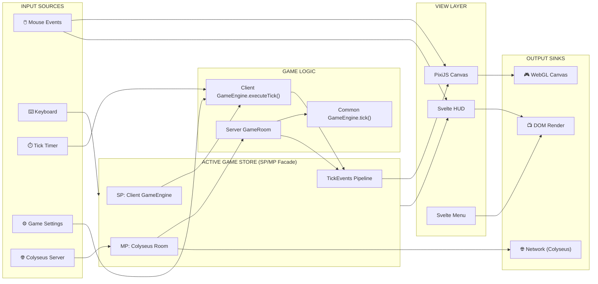

# VIEW C: THE I/O REGISTRY (Boundaries)

**Last Updated:** 2026-02-12  
**Project:** Pax Fluxia

---

## System Data Flow



---

## Data Sources

| Source | Type | Location | Data Shape | Frequency |
|--------|------|----------|------------|-----------|
| Mouse Click | PixiJS Event | `GameCanvas.svelte` | `{x, y, button, starId?}` | On demand |
| Mouse Drag | PixiJS Event | `GameCanvas.svelte` | `{sourceStarId, targetStarId}` | On demand |
| Right Click | PixiJS Event | `GameCanvas.svelte` | `{starId}` | On demand |
| Tick Timer | setInterval | Client `GameEngine.ts` | `tickNumber: number` | 120-1200ms |
| Settings Form | Rune | `MainMenu.svelte` | `GameSettings` | On change |
| Speed Button | Click | `SpeedControls.svelte` | `GameSpeed` | On demand |
| Debug Panel | Sliders | `CombatDebugPanel.svelte` | `GAME_CONFIG` fields | Real-time |
| Colyseus Messages | WebSocket | `multiplayerStore.svelte.ts` | `StarSchema[], ...` | Per tick |

---

## Data Sinks

| Sink | Type | Location | Update Trigger |
|------|------|----------|----------------|
| Star Sprites | PixiJS Particles | `GameCanvas.svelte` | Every frame |
| Ship Animations | PixiJS Particles | `GameCanvas.svelte` | Every frame |
| Connection Lines | PixiJS Graphics | `GameCanvas.svelte` | Every tick |
| Leaderboard | DOM | `Leaderboard.svelte` | Every tick |
| Tick Metronome | DOM | `TickOrb.svelte` | Every frame |
| Combat Log | DOM | `CombatLogDrawer.svelte` | Per combat event |
| Stars Panel | DOM | `StarsPanel.svelte` | Every tick |

---

## Contract: activeGameStore (SP/MP Facade)

```typescript
// ═══════════════════════════════════════════════════════════════
// READ — State Accessors (route to SP engine or MP Colyseus)
// ═══════════════════════════════════════════════════════════════

getPhase(): 'menu' | 'lobby' | 'playing' | 'results'
getStars(): Star[]
getConnections(): Connection[]
getPlayers(): Player[]
getLocalPlayerId(): string | null
getIsPaused(): boolean
getSpeed(): GameSpeed
getIsHost(): boolean
getTickProgress(): number
getSessionId(): number

// ═══════════════════════════════════════════════════════════════
// WRITE — Actions (route to SP engine or MP Colyseus message)
// ═══════════════════════════════════════════════════════════════

issueOrder(sourceId: string, targetId: string, persist?: boolean): void
cancelOrder(starId: string): void
setDeferredOrder(starId: string, targetId: string, persist?: boolean): void
pauseGame(): void
resumeGame(): void
setSpeed(speed: GameSpeed): void
startGame(): void
playAgain(): void
returnToMenu(): void

// ═══════════════════════════════════════════════════════════════
// EVENTS — TickEvents Pipeline (SP & MP both feed this)
// ═══════════════════════════════════════════════════════════════

pushTickEvents(events: TickEvents): void     // SP engine or MP handler
consumeTickEvents(): TickEvents | null       // Canvas reads & clears
```

---

## Contract: TickEvents (Engine → Animation)

```typescript
interface TickEvents {
    transfers: TransferEvent[];    // Ship movement (friendly → friendly)
    combats: CombatEvent[];        // Per-tick combat damage exchange
    conquests: ConquestEvent[];    // Star ownership change
}

interface TransferEvent {
    tick: number;
    sourceId: string;
    targetId: string;
    shipsTransferred: number;
    playerId: string;
}

interface CombatEvent {
    tick: number;
    attackerStarId: string;
    defenderStarId: string;
    damageToDefender: number;
    damageToAttacker: number;
    attackerShips: number;
    defenderShips: number;
}

interface ConquestEvent {
    tick: number;
    starId: string;
    attackerStarId: string;
    previousOwner: string;
    newOwner: string;
    shipsCaptured: number;
    shipsEscaped: number;
    shipsDestroyed: number;
    shipsTransferred: number;
    retreatTargetId: string;
    scatterTargetIds: string[];
    scatterShipCounts: number[];
}
```

---

## Contract: Colyseus Messages (Client ↔ Server)

```typescript
// Client → Server
"set_target"    { starId, targetId }       // Issue order
"clear_target"  { starId }                 // Cancel order
"set_speed"     { speed }                  // Change game speed (host)
"pause"         { }                        // Pause (host)
"resume"        { }                        // Resume (host)
"start_game"    { }                        // Start match (host)

// Server → Client (via Colyseus schema sync)
// All game state syncs automatically via @colyseus/schema
// TickEvents broadcast via room.broadcast("tick_events", events)
```

---

## Boundary Rules

> [!IMPORTANT]
> **The Common Engine knows nothing about Svelte, PixiJS, or Colyseus.** It only operates on plain objects.

> [!IMPORTANT]
> **`activeGameStore` is the ONLY facade.** Views never import from engine directly. All actions route through the store.

> [!IMPORTANT]
> **PixiJS runs in requestAnimationFrame.** Engine runs in setInterval. They sync via TickEvents (push/consume pattern).

> [!IMPORTANT]
> **SP and MP use the same view layer.** `activeGameStore` abstracts the source — views don't know which mode is active.

---

*Update this file when: Adding API calls, storage operations, new stores, or changing data contracts.*
