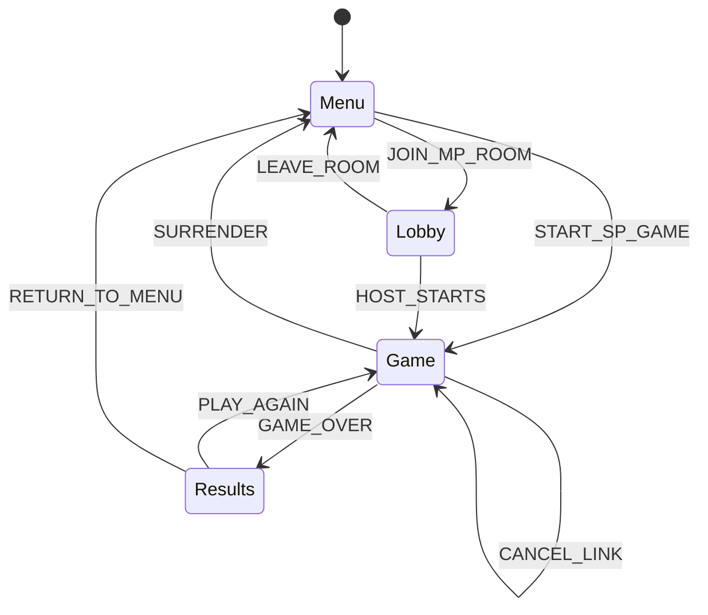
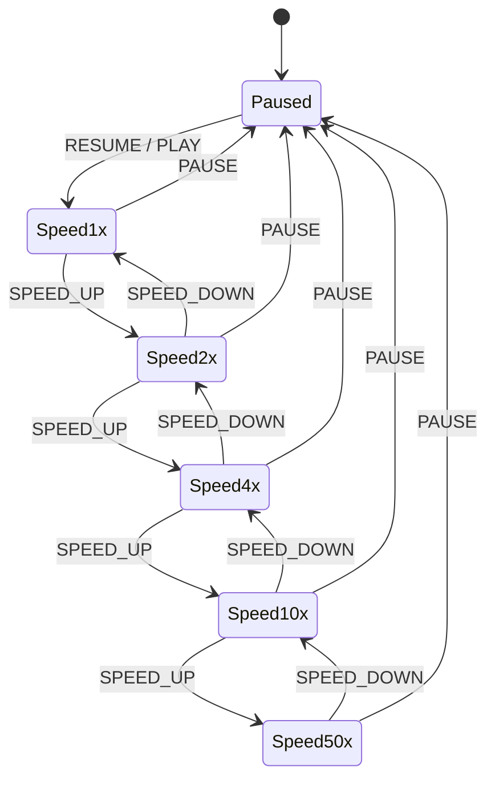
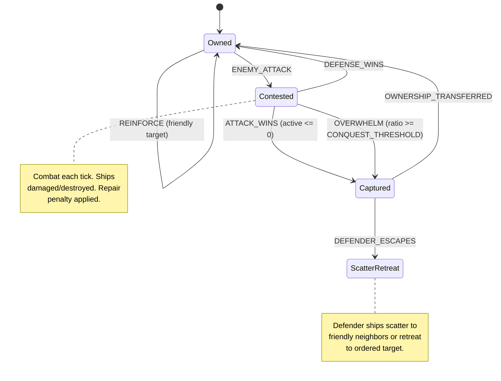
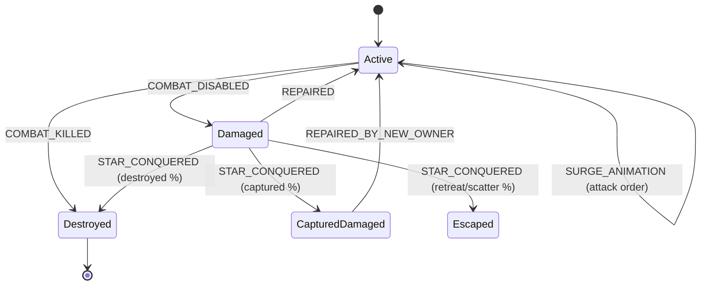

# VIEW D: THE EVENT MATRIX (Time/Causality)

**Last Updated:** 2026-02-12  
**Project:** Pax Fluxia

---

## State Machines

### Application View FSM



### Game Speed FSM



### Star Ownership FSM



### Ship State FSM



---

## Event → Handler Mapping

### User Input Events

| Trigger | Source | Handler | State Change |
|---------|--------|---------|--------------|
| `click:start_sp` | MainMenu | `gameStore.startSPGame()` | Menu → Game |
| `click:join_mp` | MainMenu | `multiplayerStore.joinRoom()` | Menu → Lobby |
| `click:start_mp` | Lobby | `activeGameStore.startGame()` | Lobby → Game |
| `click:pause` | SpeedControls | `activeGameStore.pauseGame()` | Speed → Paused |
| `click:speed` | SpeedControls | `activeGameStore.setSpeed(n)` | Speed FSM |
| `drag:end` | GameCanvas | `activeGameStore.issueOrder(src, tgt)` | Create order |
| `rightclick:star` | GameCanvas | `activeGameStore.cancelOrder(id)` | Cancel order |
| `click:surrender` | GameHUD | `gameStore.surrender()` | Game → Results |
| `click:playAgain` | ResultsModal | `activeGameStore.playAgain()` | Results → Game |
| `click:menu` | ResultsModal | `gameStore.returnToMenu()` | Results → Menu |
| `slider:change` | CombatDebugPanel | writes to `GAME_CONFIG` | Config update |

### Engine Events (TickEvents Pipeline)

| Event | Source | Consumer | Effect |
|-------|--------|----------|--------|
| `TransferEvent` | Engine tick | `GameCanvas.svelte` | Animate ship departure → travel → arrival |
| `CombatEvent` | Engine tick | `GameCanvas.svelte` + `combatLog` | Combat surge animation + log entry |
| `ConquestEvent` | Engine tick | `GameCanvas.svelte` + `combatLog` | Ownership transfer + scatter/retreat animation |

### Animation Events

| Trigger | Source | Handler | Visual Effect | Frequency |
|---------|--------|---------|---------------|-----------|
| `frame` | rAF | `renderLoop()` | All animations | 60 FPS |
| `orbit` | Frame | Ship position calc | Ships circle star | Every frame |
| `surge` | Tick Progress | Ship position calc | Attack ships pulse outward | Every frame |
| `depart` | TransferEvent | Ship lifecycle | Ship detaches from orbit | Per transfer |
| `travel` | TransferEvent | Ship lifecycle | Ship follows lane | Per transfer |
| `arrive` | TransferEvent | Ship lifecycle | Ship lerps into orbit | Per transfer |

---

## Event Chains

### Chain 1: Issue Order (SP)

```
User drags from Star A to Star B
    ↓
GameCanvas detects drag end, calls activeGameStore.issueOrder(A, B)
    ↓
activeGameStore routes to SP engine: engine.createLink(A, B)
    ↓
Engine validates: Is Star A owned by local player?
    ↓
    YES → star.targetId = B, old target replaced
    NO  → Command ignored
    ↓
On next tick: engine.executeTick()
    ↓
If B is friendly → TransferEvent emitted → ships animate along lane
If B is enemy → CombatEvent emitted → surge animation + damage
```

### Chain 2: Issue Order (MP)

```
User drags from Star A to Star B
    ↓
GameCanvas detects drag end, calls activeGameStore.issueOrder(A, B)
    ↓
activeGameStore routes to MP: room.send("set_target", {starId: A, targetId: B})
    ↓
Server validates ownership, sets star.targetId = B
    ↓
On next server tick: GameRoom.executeTick()
    ↓
GameEngine.tick(state, config) → produces TickEvents
    ↓
Server broadcasts: room.broadcast("tick_events", events)
    ↓
Client receives, pushes to activeGameStore.pushTickEvents(events)
    ↓
Canvas consumes events → animations play
```

### Chain 3: Combat Resolution (Per Tick)

```
Timer fires TICK event
    ↓
Engine processes all stars with targetId → enemy star
    ↓
Group attackers by target, then by player
    ↓
For each contested star:
    Calculate effective defender force:
        active + floor(damaged × DAMAGED_SHIP_EFFECTIVENESS)
    Apply star type defense/attack multipliers (STAR_TYPE_STATS)
    ↓
    calculateCombat(defenderForce, attackerForce, false, true, configOverrides)
        Step 1: Base damage = ships × DAMAGE_PER_SHIP
        Step 2: Apply AGGRESSOR_ADVANTAGE (0.7 = defender advantage)
        Step 3: Apply FORCE_RATIO_EFFECT (0 = disabled)
        Step 4: Ensure MINIMUM_DAMAGE (1)
        Step 5: Split by LETHALITY (25% kills, 75% disabled)
    ↓
    Apply damage symmetrically:
        Attacker: active ships reduced, excess → damaged
        Defender: active ships reduced, excess → damaged
    ↓
    Check conquest:
        If defender.activeShips ≤ 0 → ConquestEvent emitted
        If ratio ≥ CONQUEST_THRESHOLD → ConquestEvent emitted
```

### Chain 4: Win Condition

```
After each tick
    ↓
checkWinCondition():
    For each player: count stars and total ships
    If stars == 0 && ships == 0: eliminate player
    ↓
    If one player remains → winner
    If one player has ≥99% of all ships → dominant victory (SP only)
```

---

## Lifecycle Hooks

| Hook | Component | Purpose | Cleanup |
|------|-----------|---------|---------|
| `onMount` | `GameCanvas.svelte` | Initialize PixiJS Application | `app.destroy()` |
| `$effect` | `GameCanvas.svelte` | Consume TickEvents → animations | - |
| `$effect` | `Leaderboard.svelte` | Update player stats display | - |
| `$effect` | `StarsPanel.svelte` | Update star list | - |

---

## Timers & Intervals

| Timer | Location | Interval | Purpose | Cleanup |
|-------|----------|----------|---------|---------|
| `tickInterval` | Client `GameEngine.ts` | 24-1200ms (speed-dependent) | SP game loop | `clearInterval` on destroy |
| `tickInterval` | Server `GameRoom.ts` | 1200ms (hardcoded) | MP game loop | `clearInterval` on room dispose |
| `requestAnimationFrame` | `GameCanvas.svelte` | ~16ms | Render loop | Cancel on unmount |
| `progressLoop` | Client `GameEngine.ts` | ~16ms (rAF) | Tick progress 0→1 | Cancel on pause |

---

## Guards & Conditions

| Guard | Condition | Effect if False |
|-------|-----------|-----------------|
| `canIssueOrder` | Source star owned by local player | Command ignored |
| `canIssueOrder` | Source ≠ Target | Command ignored |
| `canIssueOrder` | Stars are connected | Command ignored |
| `canCancelOrder` | Star owned by local player | Command ignored |
| `canStart` | Settings valid, players ≥ 2 | Button disabled |
| `canPause` | Game is playing | Button hidden |
| `isHost` | Local player is room host (MP) | Speed/pause controls hidden |

---

*Update this file when: Adding event listeners, lifecycle hooks, timers, state machines, or subscriptions.*
