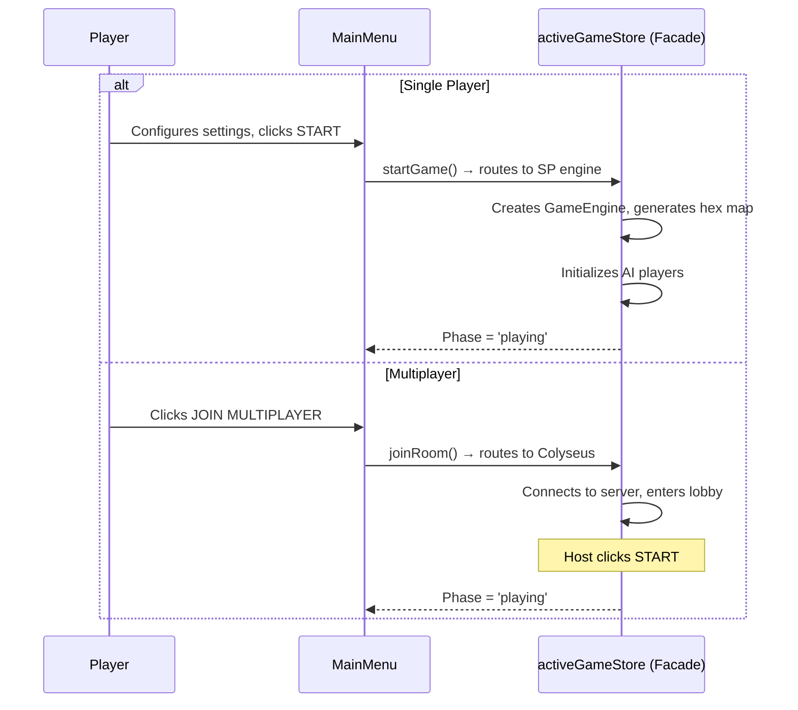
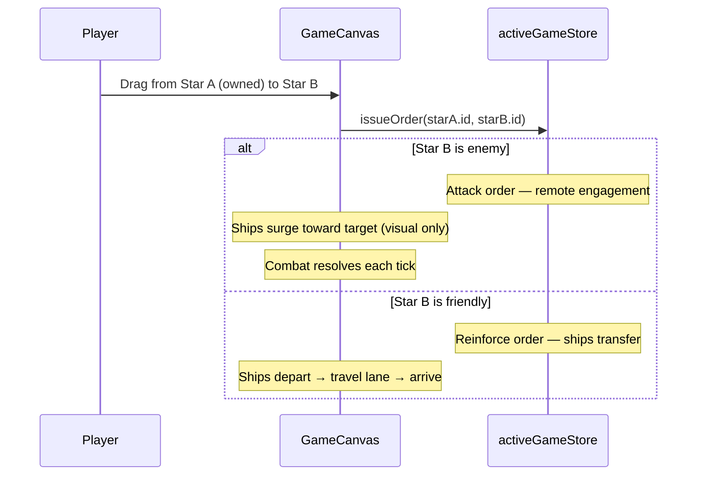
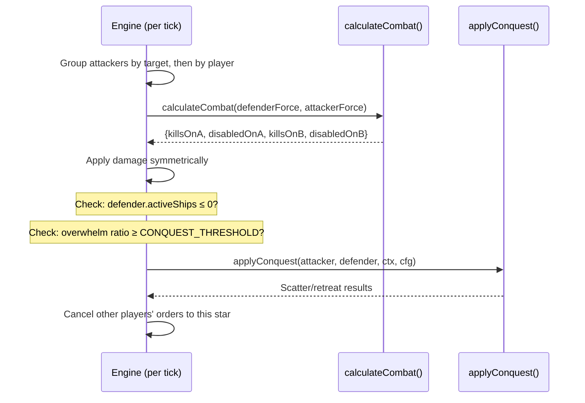

# VIEW E: FUNCTIONAL STORIES (Narratives)

**Last Updated:** 2026-02-12  
**Project:** Pax Fluxia

---

## Story Index

| ID | Title | Priority | Status |
|----|-------|----------|--------|
| US-001 | Start a Game (SP or MP) | P0 | `[x] COMPLETED` |
| US-002 | Issue Attack/Reinforce Order | P0 | `[x] COMPLETED` |
| US-003 | Cancel Order | P0 | `[x] COMPLETED` |
| US-004 | Control Game Speed | P0 | `[x] COMPLETED` |
| US-005 | Conquer Enemy Stars | P0 | `[x] COMPLETED` |
| US-006 | Win or Lose | P0 | `[x] COMPLETED` |
| US-007 | Replay or Return to Menu | P1 | `[x] COMPLETED` |
| US-008 | Visual Feedback (Surge + Travel) | P1 | `[x] COMPLETED` |
| US-009 | Set Deferred Order | P1 | `[x] COMPLETED` |
| US-010 | Tune Game Variables | P1 | `[x] COMPLETED` |

---

## [US-001] Start a Game (SP or MP)

**Narrative:** As a **Player**, I want to **start a single-player or multiplayer game**, so that I can **play against AI or human opponents**.

**Status:** `[x] COMPLETED`

### Validation Criteria
- [x] SP starts with configured settings (stars/player, AI count, difficulty)
- [x] MP connects to Colyseus room, enters lobby
- [x] Hex grid + Delaunay map generation
- [x] AI players initialize with configurable thresholds
- [x] Same UI flow for both SP and MP (activeGameStore facade)

---

## [US-002] Issue Attack/Reinforce Order

**Narrative:** As a **Player**, I want to **drag from my star to another star**, so that I can **attack enemies or reinforce allies**.

**Status:** `[x] COMPLETED`

### Validation Criteria
- [x] Drag gesture creates connection line
- [x] Orders persist until explicitly cancelled
- [x] Attack = remote engagement (ships stay at source, deal damage across lane)
- [x] Reinforce = physical ship transfer with depart → travel → arrive animation
- [x] Previous order from same star is replaced
- [x] Connection lines render between stars

---

## [US-003] Cancel Order

**Narrative:** As a **Player**, I want to **right-click on my star**, so that I can **cancel its order and keep ships defending**.

**Status:** `[x] COMPLETED`

### Validation Criteria
- [x] Right-click cancels order on owned star
- [x] Context menu prevented
- [x] Connection line disappears immediately
- [x] Ships return to idle orbit
- [x] Right-click also clears active selection

---

## [US-004] Control Game Speed

**Narrative:** As a **Player**, I want to **pause and change game speed**, so that I can **think strategically or speed up**.

**Status:** `[x] COMPLETED`

### Validation Criteria
- [x] Pause/Resume toggle
- [x] Speed buttons: 1x, 2x, 4x, 10x, 50x
- [x] Tick interval adjusts (1200ms at 1x → 24ms at 50x)
- [x] Metronome orb pulses at correct rate
- [x] Animations freeze cleanly on pause (delta-based, pause-safe)
- [x] MP: only host can change speed

---

## [US-005] Conquer Enemy Stars

**Narrative:** As a **Player**, I want my **attacks to wear down and capture enemy stars**, so that I can **expand my territory**.

**Status:** `[x] COMPLETED`

### Validation Criteria
- [x] Symmetric damage model (both sides take damage per tick)
- [x] Damaged ships contribute at 14% effectiveness to defense
- [x] Conquest when defender.activeShips ≤ 0 or overwhelm ratio
- [x] 50% of victor's ships transfer to conquered star
- [x] Scatter/retreat to friendly neighbors
- [x] Multi-star per-player aggregation for combined attacks

---

## [US-006] Win or Lose

**Narrative:** As a **Player**, I want the **game to end when victory conditions are met**.

**Status:** `[x] COMPLETED`

### Validation Criteria
- [x] Player eliminated when 0 stars and 0 ships
- [x] Last player standing wins
- [x] 99% dominance → dominant victory (SP)
- [x] Results modal with VICTORY/DEFEAT and stats
- [x] Game history graph available

---

## [US-007] Replay or Return to Menu

**Status:** `[x] COMPLETED`

### Validation Criteria
- [x] PLAY AGAIN resets with same settings
- [x] MAIN MENU returns to menu view
- [x] Engine properly cleaned up on menu return
- [x] New game starts fresh (no lingering state)

---

## [US-008] Visual Feedback (Surge + Travel)

**Narrative:** As a **Player**, I want to **see ships pulse when attacking and travel along lanes when reinforcing**, so I can **understand the battle flow**.

**Status:** `[x] COMPLETED`

### Validation Criteria
- [x] Attack: ships surge toward target (configurable ramp, shape power)
- [x] Surge only during actual combat ticks (tick-synced via `starsInCombat`)
- [x] Reinforce: ships depart orbit → travel lane → arrive at destination
- [x] Unified ship lifecycle (same entity through all phases)
- [x] Crowd rush departure with random jitter
- [x] Orbit bias toward target direction
- [x] Pause-safe (delta-based elapsed, freezes naturally)

---

## [US-009] Set Deferred Order

**Narrative:** As a **Player**, I want to **pre-set an order on an enemy star**, so that when I **capture it, the order activates automatically**.

**Status:** `[x] COMPLETED`

### Validation Criteria
- [x] Drag to set `queuedOrderTargetId` on enemy star
- [x] Deferred order activates on conquest
- [x] Visual indicator for deferred orders
- [x] Enables chain-through strategies

---

## [US-010] Tune Game Variables

**Narrative:** As a **Player**, I want to **adjust game parameters via sliders**, so I can **customize gameplay feel**.

**Status:** `[x] COMPLETED`

### Validation Criteria
- [x] CombatDebugPanel with categorized sections (Battle, Timing, Animation, etc.)
- [x] All combat/production/repair variables tunable in real-time
- [x] Values persist via localStorage
- [x] Reset All button restores defaults
- [x] Plain-English descriptions for all variables

---

*Update this file when: Starting new features, refactoring user-facing flows, marking stories complete.*
