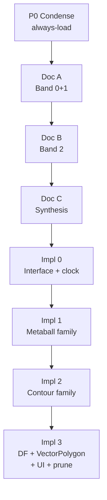

# Territory Render Family — Unified Master Plan

**Versioned repo copy (edit here):**  
`.agent/docs/project/implementation-plans/2026-04-08/TERRITORY_RENDER_FAMILY_UNIFIED_PLAN.md`

**Navigation (three roles):**

1. **Hub** — [territory-rendering-jumpstart.md](./territory-rendering-jumpstart.md) **Section 0** only: assignable path, phase table (0.B), companion index (0.C), suggested load order, ingestion roots (0.1). Long-form territory prose is **not** in the jumpstart anymore.
2. **Engineering context** — [territory-rendering-overview.md](./territory-rendering-overview.md): legacy `renderers/` inventory, config keys, Render Family strategy, tech stack, non-negotiables. **d3 / Voronoi** deep dive: [territory-d3-voronoi-family-analysis.md](./territory-d3-voronoi-family-analysis.md). **`territory/` tree:** [territory-clean-architecture-map.md](./territory-clean-architecture-map.md).
3. **This file** — **Impl spine**: execution checklist, Parts I–II, handoffs, `RenderFamily` sketch. **Doc ingestion epic** (§6, §9–13): [territory-documentation-epic.md](./territory-documentation-epic.md).

`AGENT_ENTRYPOINT.md` redirects to the jumpstart hub.

**Related topical docs:** [RENDER_FAMILY_SPIKE_ORDER_METABALL_FIRST.md](./RENDER_FAMILY_SPIKE_ORDER_METABALL_FIRST.md); [2026-04-09-voronoi-territory-modes-comparison.md](../../decisions/2026-04-09-voronoi-territory-modes-comparison.md) (catalog-oriented; canonical prose for d3 modes is [territory-d3-voronoi-family-analysis.md](./territory-d3-voronoi-family-analysis.md)).

If a Cursor “Plans” UI copy exists (`full_phased_plan_34174ddf.plan.md`), treat it as **optional**; refresh it from **this file** after edits.

### Ordering principle (ideas → plans → implementation)

1. **Ideas** — Doc phases A–B–C and their artifacts exist primarily to **surface** rendering, geometry, transition, VFX, feature, architecture, UX, diagnostic, and process **ideas** from the corpus (especially `BRAINSTORMING_IDEAS_INDEX*`, ledgers, scorecards). No implementation plan “closes” the idea space.
2. **Plans** — The human architect commits direction (which ideas to pursue, which to park). Parts I–II of this document are **proposed** engineering plans and resolved decisions as of 2026-04-08; **Doc C** (`RECOMMENDATIONS_FOR_ARCHITECT.md`, final index) may **revise** them.
3. **Implementation** — Impl 0–3 execute **after** idea synthesis is far enough along to avoid coding blind; gated or parallel spikes are fine if reversible. **This file is canonical for Impl sequencing, handoffs, and the `RenderFamily` sketch** once direction is locked — **not** canonical for “all ideas that matter.”

**Ideas-principle deliverables (living):** [TERRITORY_IDEA_CORPUS_NARRATIVE.md](./doc-audit/TERRITORY_IDEA_CORPUS_NARRATIVE.md) — narrative digest across rendering → process axes; [MARKDOWN_MASTER_INDEX.csv](./doc-audit/MARKDOWN_MASTER_INDEX.csv) — tracked `.md` **queue** (`processing_status` / `notes`); [BRAINSTORMING_IDEAS_INDEX_FINAL.md](./BRAINSTORMING_IDEAS_INDEX_FINAL.md) — row ledger + §C path/commit map. None of these “close” the idea space.

---

## Execution checklist (track in repo or your tracker)

- [x] **P0** — Condense: `condensed/CONTEXT|THINKING|PLAN_CONDENSED.md` + `handoff_p0.md`
- [x] **Doc A** — Band 2026-03-23 … 2026-04-08 + PVV2 / `.atlas` / `.gemini` + artifacts v1 + `BRAINSTORMING_IDEAS_INDEX` v1 + `handoff_doc_a.md`
- [x] **Doc B** — Band 2026-03-08 … 2026-03-22 + research sampling + artifacts v2 + index v2 + `handoff_doc_b.md`
- [x] **Doc C** — FINAL artifacts + `BRAINSTORMING_IDEAS_INDEX_FINAL.md` + `RECOMMENDATIONS_FOR_ARCHITECT.md` + `handoff_doc_c.md`
- [ ] **Impl 0** — `RenderFamily`, registry, `DiagnosticProvider`, runtime clock, gated dispatch + `handoff_i0.md`
- [ ] **Impl 1** — `MetaballFamily` (first adapter — thinnest wedge) + `handoff_i1.md`
- [ ] **Impl 2** — `ContourFamily` + `handoff_i2.md`
- [ ] **Impl 3** — `DistanceFieldFamily` + `VectorPolygonFamily` facade + family UI + prune + `RENDER_FAMILY_COMPLETE.md`

**Ordering note (2026-04-09):** **Supersedes** the 2026-04-08 **DF-first** Impl 1 choice. Rationale: prove the family shell on the smallest legacy adapter first; see [RENDER_FAMILY_SPIKE_ORDER_METABALL_FIRST.md](./RENDER_FAMILY_SPIKE_ORDER_METABALL_FIRST.md).

---

This document merges:

- **Idea epic** (extended corpus, exhaustive bucket lists, `BRAINSTORMING_IDEAS_INDEX*`, ledgers, scorecards — **primary** doc output is **ideas** and evidence, not a single narrative).
- **Proposed architecture & decisions** (Render Family model, diagnosis, Parts I–II — **plan layer**; revisable after synthesis).
- **Implementation spine** (P0 condense optional, Impl 0–3 — **code layer**; runs **after** ideas → architect plans, unless explicitly gated/experimental).

---

## Part I — Why: diagnosis and target architecture

### I.1 Core problem

The **4-layer** pipeline (Ownership → Geometry → Transition → Presentation) was intended as a **universal** contract. In practice it matches **one** paradigm: **vector polygons → polyline morph → draw commands**. Other paradigms (GPU distance fields, metaball grids, shader-native transitions) **do not** share that native shape.

Evidence (abbreviated): single-valued `GeometryModeId` / `OwnershipModeId`; `CanonicalGeometrySnapshot` as polyline-centric; transition contracts as snapshot interpolation vs DF `uMorphFactor`; `TerritoryTunables` as a kitchen-sink struct; `GeometryLayerCoordinator` threading `styleMode`; `TransitionLayerCoordinator` carrying special-case topology branching.

**Verdict:** DistanceField in particular cannot be “folded in” without destroying what makes it good unless it stays **family-internal**, not forced through vector transition contracts.

### I.2 Render Family model (target)

**Tier 1 (shared):** ownership (+ runtime clock, VFX from ownership diffs — see Part II).

**Tier 2 (one active):** a **Render Family** owns its own geometry / transition / presentation story and returns a **`PIXI.Container`**.

The existing 4-layer stack becomes **`VectorPolygonFamily`** internals (scoping, not throwing away contracts/coordinators).

Shared geometry/frontier helpers become **libraries**, not mandatory global pipeline stages.

**UI:** one primary **family** selector + **family-specific** sub-options (replacing misleading independent dropdown combos).

### I.3 Minimal `RenderFamily` sketch (normative for Impl 0)

```typescript
interface RenderFamily {
  readonly id: string;
  readonly label: string;
  readonly tunableKeys: readonly string[];
  update(input: RenderFamilyInput): RenderFamilyOutput;
  dispose(): void;
}

interface RenderFamilyInput {
  ownership: OwnershipSnapshot;
  nowMs: number;
  stars: ReadonlyArray<StarState>;
  lanes: ReadonlyArray<StarConnection>;
  world: { width: number; height: number };
  tunables: ReadonlyMap<string, number>;
  renderer?: PIXI.Renderer;
  activeTransition?: {
    conquestEvents: ReadonlyArray<TerritoryConquestEvent>;
    startedAtMs: number;
    durationMs: number;
    progress: number;
    rawProgress: number;
  } | null;
}

interface RenderFamilyOutput {
  container: PIXI.Container;
  diagnostics?: TerritoryRuntimeDiagnostics;
  debugGeometry?: { regions?: unknown; frontiers?: unknown };
  events?: ReadonlyArray<{ type: string; payload: unknown }>;
}
```

### I.4 Evaluation (short)

**Correctness:** Families match real renderer paradigms. **Simplicity:** thin runtime dispatch; complexity lives inside families. **Cost:** adapters first, facade for VectorPolygon, then UI/prune. **Risk:** VectorPolygon extraction — mitigate with facade before physical moves. **Reversibility:** high until deep UI cutover.

### I.5 What stays sacrosanct

- Ownership layer as shared truth.
- `FrontierTopologyContracts` as a useful graph shape (library / vector family).
- 4-layer **idea** inside VectorPolygonFamily only.
- PIXI at the edge; visual requirements enforced by verification, not by pretending one geometry DTO fits all families.

---

## Part II — Resolved decisions (2026-04-08) — **plan layer**

These are **committed engineering decisions for the current hypothesis**. Doc C and new evidence may **reopen** them; they do **not** limit which **ideas** you must still extract from older docs.

### II.1 PVV

**Inside `VectorPolygonFamily`**, not its own family. Virtual stars = ownership; weight-lerp ≈ continuous recompute; transition can be `'off'` with geometry as the animation.

### II.2 Diagnostics

Incremental **D1–D13** menu; optional **`DiagnosticProvider`** + shared overlay consumer. No standalone diagnostics epic — ship with renderer work.

### II.3 VFX

**Runtime** emits conquests from ownership diff → `VFXBus`. Families optional `events[]` on output for future fine-grained sync only.

### II.4 Clock

**Runtime-owned** transition clock; per-family duration/easing via tunables; `activeTransition` on input (see sketch above).

### II.5 Implementation priority (hypothesis; revisable after idea synthesis)

**MetaballFamily first** after Impl 0 — thinnest adapter (~`MetaballRenderer.ts`), lowest risk to prove registry + gated dispatch. **Then** `ContourFamily`, **then** `DistanceFieldFamily`, **then** `VectorPolygonFamily` facade (largest blast radius). **Supersedes** the 2026-04-08 “DF-first” ordering; see [RENDER_FAMILY_SPIKE_ORDER_METABALL_FIRST.md](./RENDER_FAMILY_SPIKE_ORDER_METABALL_FIRST.md).

---

## Part III — Documentation epic (primary): **surface ideas**

The doc phases are **not** a preamble to “the real work” of coding. Their main job is to **extract and record ideas** (explicit and latent) across **rendering, geometry, transitions, VFX, features, architecture, UX, diagnostics, tooling, and process** — then tie evidence to those ideas. Implementation phases consume **summaries** of that work; they do not replace it.

### III.0 Planning-doc audit stack (2026-03-25 + 2026-04-08)

Use these together so **idea coverage** stays aligned with repo-wide inventory:

| Artifact | Use |
|----------|-----|
| [PLANNING_DOCS_AUDIT.md](../../process/PLANNING_DOCS_AUDIT.md) | Hub: **ideas first**, then plans, then Impl; jumpstart = **single** territory entry file; dated audit, manifest, recovery, this file. |
| [2026-03-25__1018 PLANNING_DOCS_AUDIT.md](../../process/2026-03-25__1018%20PLANNING_DOCS_AUDIT.md) | **Treasure map** — where large, idea-rich clusters live + token sizing for read order; **§2026-04-08** reframes it as input to **idea mining**, not as superseded by any code plan. |
| [MARKDOWN_FULL_MANIFEST_VS_HEAD.md](./doc-audit/MARKDOWN_FULL_MANIFEST_VS_HEAD.md) | Exhaustive tracked `.md` inventory vs path (regenerate via `doc-audit/_generate_markdown_manifest_index.ps1`). |
| [MARKDOWN_MASTER_INDEX.md](./doc-audit/MARKDOWN_MASTER_INDEX.md) + `.csv` | Per-file **queue**: category, git dates, Mar22/Mar24 tree flags, `processing_status` (regenerate via `doc-audit/_generate_markdown_master_index.ps1`). |
| [TERRITORY_IDEA_CORPUS_NARRATIVE.md](./doc-audit/TERRITORY_IDEA_CORPUS_NARRATIVE.md) | **Narrative digest** — prose + sourced bullets across all Ideas axes (living snapshot). |
| [RECOVERED_LEGACY_DOC_LIST.md](../../../_archive/pre-ontology-md-recovery-2026-03-22-24/RECOVERED_LEGACY_DOC_LIST.md) | 25 pre-Ontology-E bodies (legacy framework paths excluded); includes Codex `RENDERING_*` when SHA differed from HEAD — **mine for ideas**. |
| [`_INDEX.md`](../../../_INDEX.md) | *Major documentation audit (2026-04)* — single map of the above. |

**Rule:** Jumpstart §6 defines *how* to ingest; this subsection defines *which baselines* prevent gaps in **idea enumeration**.

### III.1 Goals (aligned with jumpstart + audit lenses)

Ingestion should produce **idea- and evidence-backed** outputs for:

1. Per-renderer / per-approach human-grounded track record (what was **tried**, what **worked** or **failed** in observation — not agent claims alone).
2. Transition **techniques** and **paradigms** (GPU vs vector vs grid vs field vs hybrid) as **ideas**, not only as “current pipeline.”
3. **Hidden, untried, or abandoned ideas** → **`BRAINSTORMING_IDEAS_INDEX`** (rendering, geometry, borders, fills, animation, UX, settings, performance, **VFX**, **features**, **architecture**).
4. **Tunable / control** ideas per approach → later `tunableKeys` **only after** ideas are catalogued.
5. **Failure and success patterns** by paradigm and by transition style.
6. **Diagnostics and VFX** ideas (what would we want to see, trigger, or sync?) → D-menu and bus priorities.

### III.2 Extended corpus (outside `.agent/docs` only)

| Location | Rule |
|----------|------|
| `.agent/docs/plans/PVV2_REFERENCE_COMMIT.md` | **Doc A mandatory** — timeline + claims; Impl 2 excavation anchor |
| `.gemini/MEMORY/` | Skim; log factual claims in registry if they touch repo/process |
| `.atlas/`, `pax-fluxia/.atlas/` | Cross-check vs `.agent/docs/atlas/` and `.agent/docs/game/`; dedupe |
| `.agent-harness/logs/*.jsonl` | **Default exclude**; single-file only if cited incident |
| `.agent/docs/agentic/atlas-harness/`, `.agent/AGENT-GUIDE_MCP_atlas-harness.md` | Doc A/B or condense into `CONTEXT_CONDENSED` if load-bearing |

### III.3 Brainstorming index

**Buckets + keyword search** to produce an **exhaustive file list** (every candidate `.md` under each bucket that matches territory/rendering relevance, after applying the exclusion list in Part VII). Do not rely on memory of filenames or dates: **enumerate first** (e.g. repo search/glob per bucket + keyword filter), **then** read in date bands.

Buckets (same as jumpstart + extended corpus): `.agent/docs/research/permanent-references/territory/` (including `modes/`, `epics/`, `tasks/`, `backends/`, and dated subfolders except excluded trees); `.agent/docs/plans/` (root and dated subfolders, `frontier-topology/`, `geometry-refactor/`); `.agent/docs/_review-reconcile/`; `.agent/docs/game/territory/geometry-atlas/` and `_archive/`; `.agent/docs/_archive/` (territory-related); `.agent/docs/engineering/architecture/` (e.g. `RENDERER_WIRING_PLAN.md`); `.agent/docs/plans/PVV2_REFERENCE_COMMIT.md`; `.atlas/` and `pax-fluxia/.atlas/` (territory-adjacent); optional `.agent/docs/agentic/context/` if process gaps remain.

**Mandatory artifacts:** (1) a **file list** or manifest section inside the index (paths only, grouped by bucket), (2) **`BRAINSTORMING_IDEAS_INDEX.md`** (v1 → v2 → **`BRAINSTORMING_IDEAS_INDEX_FINAL.md`**) with one **idea row per substantive document** (or per distinct idea if one doc contains several).

**Row shape:** `idea_id | one_line_idea | suggested_family | H/M/L | source_path | date? | tried/untried/partial | notes`

### III.4 Core ingestion artifacts (all doc phases)

1. `INGESTION_LEDGER_*`
2. `CLAIMS_REGISTRY_*`
3. `CONTRADICTION_REGISTER_*`
4. `TIMELINE_CANON_*`
5. `APPROACH_EVIDENCE_SCORECARD_*` (family column + transition technique)
6. `BRAINSTORMING_IDEAS_INDEX*` (above)
7. `RECOMMENDATIONS_FOR_ARCHITECT.md` (final in Doc C)

Handoff bundle for Impl: **compact summaries** of scorecard + **brainstorming index** + plan headlines — for **engineering execution**, not a substitute for the full idea record. New ideas discovered in code should still **flow back** into the index or a dated addendum.

---

## Part IV — Working in passes (no budget arithmetic)

Work is split so each **pass** has a clear scope and a **handoff** artifact for the next session. That keeps each round tractable; **do not** optimize around numeric context limits inside this plan (that is for human scheduling only and can induce unhelpful “rationing” behavior in models).

Optional **P0 condense** step produces short always-load files so later passes can skip re-reading long sources; sources of truth remain the full originals.

### P0 Condense — `condensed/` (this folder)

- `CONTEXT_CONDENSED.md` — from `AGENT.md` + harness guide if needed
- `THINKING_CONDENSED.md` — from mental-model docs (executable grammar only)
- `PLAN_CONDENSED.md` — from **this unified plan**: Parts I–II headline + phase table + interface sketch + link to this file

Sources always win over condensations.

---

## Part V — Phase map (eight phases)



Handoffs live in **this directory** (same as jumpstart): `handoff_p0.md`, `handoff_doc_a.md`, … `handoff_i2.md`.

---

## Part VI — Phase execution (detail)

### P0 — Condense and accelerate

Read: `AGENT.md`, mental-model docs, **this plan** (for `PLAN_CONDENSED`), tranche findings, optional `AGENT-GUIDE_MCP_atlas-harness.md`.

Write: `condensed/*`, `handoff_p0.md`.

### Doc A — Band 2026-03-23 … 2026-04-08

Tier 0/1 in band: sessions, chats, post-mortems, decisions slice, `TERRITORY_ARCHITECTURE`, conquest spec, 04-04 plan, 03-31 plans, 03-23 plans, frontier-topology + geometry-refactor plans, recent implementation plans.

**Plus:** `PVV2_REFERENCE_COMMIT.md`, `.atlas` territory trio + dedupe, `.gemini` skim.

**Out:** artifacts v1 + `BRAINSTORMING_IDEAS_INDEX` v1 + `handoff_doc_a.md`.

### Doc B — Band 2026-03-08 … 2026-03-22

Sessions/chats/post-mortems/decisions remainder; transition research 03-20; review/reconcile; **targeted** reads from research corpus per unanswered questions; `.atlas/post-mortems` if not duped. Expand **exhaustive file list** coverage for brainstorming buckets.

**Out:** artifacts v2 + brainstorming index v2 + `handoff_doc_b.md`.

### Doc C — Band 2026-02-17 … 2026-03-07 + gaps

Older sessions/chats; targeted research; `TERRITORY_TRANSITION_INVENTORY`; agentic `context/` if needed.

**Out:** `*_FINAL.md` set + `BRAINSTORMING_IDEAS_INDEX_FINAL.md` + `RECOMMENDATIONS_FOR_ARCHITECT.md` + `handoff_doc_c.md`.

### Impl 0

Contracts, `TerritoryRuntimeCoordinator`, integration touchpoints, **Doc C handoff** + scorecard summary.

**Out:** `RenderFamily` types, registry, `DiagnosticProvider`, runtime `TransitionClock`, **gated** family dispatch (`USE_RENDER_FAMILIES` false by default), `handoff_i0.md`.

### Impl 1 — Metaball

`MetaballRenderer.ts` + `GAME_CONFIG` metaball keys + thin `RenderFamily` adapter.

**Out:** `MetaballFamily`, tunables, tests, `handoff_i1.md`.

### Impl 2 — Contour

`ContourTerritoryRenderer` + worker + `GAME_CONFIG` contour keys.

**Out:** `ContourFamily`, tunables, tests, `handoff_i2.md`.

### Impl 3 — DistanceField + VectorPolygon + UI

`DistanceFieldTerritoryRenderer` (targeted reads); coordinators/registries/contracts facade for `VectorPolygonFamily`; `settingsDefs` / `panelSync` / `game.config` parity; UI prune.

**Out:** `DistanceFieldFamily`, `VectorPolygonFamily` facade (**PVV2_REFERENCE_COMMIT + `BRAINSTORMING_IDEAS_INDEX_FINAL`** as excavation refs), UI simplification, prune, `RENDER_FAMILY_COMPLETE.md`.

---

## Part VII — Ingestion exclusions (low-signal / oversized)

- `research/.../territory/pipeline-snapshot-2026-03-16/` (and similar code dumps)
- `.agent-harness/logs/*.jsonl` (default)
- Images, console log dumps, `.svelte-kit/`, `node_modules/`
- Duplicate Perplexity rounds (prefer latest unless contradicting)
- `agentic/archive-memory/`, `agentic/archive-rules/` unless investigating history

---

## Part VIII — Summary table

| Phase | Type | Primary output |
| ----- | ---- | -------------- |
| P0 | Setup | Condensed always-load + `handoff_p0.md` |
| Doc A | **Idea + evidence ingestion** | Artifacts v1 + brainstorming index v1 + `handoff_doc_a.md` |
| Doc B | **Idea + evidence ingestion** | Artifacts v2 + brainstorming index v2 + `handoff_doc_b.md` |
| Doc C | **Idea synthesis** | FINAL artifacts + `BRAINSTORMING_IDEAS_INDEX_FINAL` + `RECOMMENDATIONS` + `handoff_doc_c.md` |
| Impl 0 | Code | Interface + registry + clock + gated dispatch + `handoff_i0.md` |
| Impl 1 | Code | `MetaballFamily` + `handoff_i1.md` |
| Impl 2 | Code | `ContourFamily` + `handoff_i2.md` |
| Impl 3 | Code | `DistanceFieldFamily` + `VectorPolygonFamily` + UI + prune + `RENDER_FAMILY_COMPLETE.md` |

**Eight phases.** Doc A–C **precede** Impl in intent: they **surface and reconcile ideas** (and evidence) first; **architect-owned plans** sit between Doc C and heavy Impl. Parts I–II are **plan hypotheses** informed by — and subordinate to — that idea work. Impl phases use condensed handoffs but **do not** exhaust the idea space.
