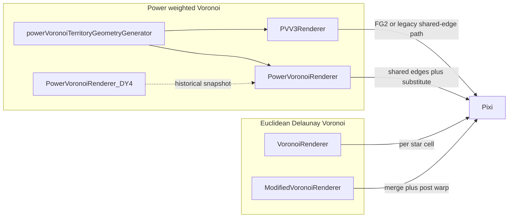

# Territory d3 family: Voronoi modes (analysis)

**Scope:** Planar Voronoi-class territory renderers using **d3-delaunay** (Euclidean) and **d3-weighted-voronoi** (power diagram) in pax-fluxia.

**Catalog / dispatch:** [territoryRenderModeCatalog.ts](../../../../../pax-fluxia/src/lib/territory/ui/territoryRenderModeCatalog.ts) and GameCanvas.svelte territory style switch.

**Related:** [territory-rendering-overview.md](./territory-rendering-overview.md) (full renderer list), [territory-rendering-jumpstart.md](./territory-rendering-jumpstart.md) (hub).

---

## Voronoi-based territory modes: comparison and craftsmanship (2026-04-09)

**Purpose:** Single reconciled view of every **planar Voronoi-class** territory mode (Delaunay / Euclidean or power diagram), how they differ in **intent** and **implementation**, and a short **craftsmanship** read. Use this when choosing where to invest (e.g. Modified Voronoi vs PVV3) or when debugging seam gaps.

**Catalog and dispatch:** Mode ids and labels live in `pax-fluxia/src/lib/territory/ui/territoryRenderModeCatalog.ts`; `pax-fluxia/src/lib/components/game/GameCanvas.svelte` switches the active renderer.

**In scope (Voronoi-class):**

| Mode id | Label (UI) | Primary implementation |
|---------|--------------|-------------------------|
| `voronoi` | Voronoi | `VoronoiRenderer.ts` |
| `modified_voronoi` | Modified Voronoi | `ModifiedVoronoiRenderer.ts` |
| `power_voronoi` | PVV2 weighted | `PowerVoronoiRenderer.ts` + `territory/compiler/powerVoronoiTerritoryGeometryGenerator.ts` |
| `vs_pvv3` | PVV3 | `PVV3Renderer.ts` |
| `pvv2_dy4` | PVV2 DY4 ref | `PowerVoronoiRenderer_DY4.ts` (reference / investigation snapshot) |

**Out of scope here** (not Voronoi diagrams): `metaball`, `pixel`, `contour`, `distance_field`, `graph`, and canonical/engine layered paths (`territory_canonical`, `territory_engine`).

#### Per-mode: technical shape and product intent

- **`voronoi` (basic)**  
  - **Diagram:** Unweighted `d3-delaunay` Voronoi on **real star sites only** (no corridor/disconnect virtuals in this path).  
  - **Topology:** **One fill polygon per star** (no same-owner merge). Cluster split affects **border** drawing only.  
  - **Borders:** Edge walk + midpoint **neighbor probe**; strokes per segment (not a global shared-edge graph).  
  - **Intent:** Baseline “honest” Voronoi; lightest mental model; no F-138 lane semantics in geometry.

- **`modified_voronoi` (F-138)**  
  - **Diagram:** Euclidean Voronoi from `d3-delaunay` with **augmented sites** (corridor / virtual stars), similar spirit to power modes.  
  - **Topology:** Merge same-owner cells into one outline per cluster, then **post-process:** disconnect buffer, Bézier-style arc substitution at sharp corners, post-hoc star margin, weld contested vertices (shared utility), Chaikin, then fill plus contested/hull border split via `splitMergedOwnerOutlineEdges` + `drawBorderPolylines`.  
  - **Intent:** Richer shapes than plain Voronoi **without** full power diagram; explicit disconnect buffer behavior; star clearance via **vertex push** after merge, not weights.  
  - **Structural tension:** Most warps are **per merged polygon** until late repair; **true** shared-boundary semantics need either a **shared seam graph** (like PVV) or accepting heuristic seams.

- **`power_voronoi` (PVV2 weighted)**  
  - **Diagram:** `d3-weighted-voronoi` power diagram; star margin encoded as **site weight**.  
  - **Topology:** `TerritoryCell[]` → merge → contested `SharedBorderEdge[]` → chained polylines → **`substituteSmoothedEdges`** splices smoothed contested geometry **into** merged fill rings (`renderers/geometry/borderPipeline.ts`).  
  - **Extras:** Corridor / disconnect virtual sites; large transition stack in one module.  
  - **Intent:** Gap-free feel with **one source of truth** for contested seams before final fill; best match to “modifications move shared edges” narrative in code comments.

- **`vs_pvv3` (PVV3 frontier-first)**  
  - **Diagram / sites:** Same weighted Voronoi + virtuals story as PVV2.  
  - **Rendering:** **Dual path** — preferred **FG2 canonical shells** when snapshot supports it; **legacy** path uses shared edges + merge + `substituteSmoothedEdges`. Frontier loop morph state (`FrontierLoop`, `assembleFrontierLoops`, …).  
  - **Intent:** Move identity toward **frontier-first** rendering and transitions; align with canonical territory layers over time.

- **`pvv2_dy4` (DY4 reference)**  
  - **Role:** Older-commit-style reference + investigation toggles; not a separate product vision.  
  - **Craft cost:** Duplicate surface area vs current PVV2.

#### Intended differences (axis summary)

| Axis | Basic `voronoi` | `modified_voronoi` | PVV2 / PVV3 power |
|------|-----------------|--------------------|-------------------|
| Diagram | Euclidean, raw sites | Euclidean + virtuals | Power + virtuals |
| Same-owner shape | Per star | Merged | Merged |
| Star margin (geometry) | None | Post polygon push | Weighted sites |
| Disconnect / corridor | No / N/A | Zone push-pull | Virtual sites (+ config) |
| Contested seam truth | Probe-drawn edges | Late repair (weld + border split) | Shared edges + substitute into fills |
| Transitions | Minimal | Minimal | Heavy (PVV2); + frontier (PVV3) |

#### Craftsmanship (efficiency, modularity, semantics, readability)

- **Modularity (strong):** `pax-fluxia/src/lib/renderers/geometry/*` (merge, borders, Chaikin, morph, weld) is the right shared layer; PVV3 consumes it cleanly.  
- **Modularity (fragmented):** Two geometry/type homes — `territory/compiler/powerVoronoiTerritoryGeometryGenerator.ts` vs `renderers/geometry` (re-export shim in `renderers/geometry/types.ts`). PVV2 imports morph helpers from `territory/geometry/morphUtils.ts` while PVV3 uses `renderers/geometry/morphUtils.ts` (drift risk). Modified Voronoi still embeds **local** disconnect / arc / margin logic parallel to `geometryModifiers.ts` (weak single source of truth).  
- **Semantics:** PVV2/compiler path best matches “contested seam is explicit before fill.” PVV3 is strong on FG2; legacy branch is PVV2-like. Modified Voronoi: **arc smoothing subdivides boundaries per owner** with **independent** tessellation; `edgeKey` pairing then sees **misaligned segment chains**, so **micro-gaps and double-line artifacts** can persist even when weld is fast — a **representation** problem, not only tuning.  
- **Efficiency:** Basic Voronoi is lightest CPU. Power family: one weighted solve + merge; PVV2 transition code dominates when animating. Modified Voronoi: large **vertex blow-up** from arc replacement (e.g. 160→489 vertices in logs) and multiple full-polygon passes.  
- **Readability:** PVV2 monolith (~1.7k+ lines, mixed geometry/transitions/render) is hard to review. PVV3 is clearer via FG2 vs legacy split but carries dual-path load. MV reads as a **partial** adoption of shared geometry utilities.

#### Strategic takeaway (when to stop “hammering” MV)

Incremental weld / border dedup **mitigates** symptoms; it does not remove **asymmetric subdivision + independent polygon warps** breaking a shared combinatorial edge graph. The power pipeline (shared edges **before** asymmetric smoothing, then **substitute** into both sides) is the architecture the codebase already describes for spec-faithful seams.

**Reasonable directions for a later implementation phase:**

1. Converge MV onto a **compiler-style seam graph** (recover `TerritoryCell` / shared edges from MV, run `substituteSmoothedEdges`), or  
2. Apply arc / disconnect / margin only on **shared polylines**, then rebuild rings, or  
3. Label MV explicitly as **approximate** in UI/docs and prioritize PVV3 / canonical path for spec fidelity.

