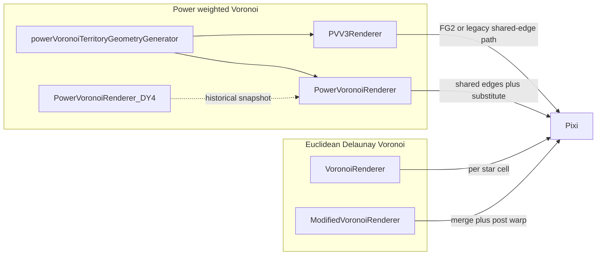

# Territory documentation epic (ingestion and ideas)

**Entry hub:** [territory-rendering-jumpstart.md](./territory-rendering-jumpstart.md) — Section 0 (phase table, companion index, **§0.1 ingestion roots**).

---

## 1. Mission Brief

You are entering a project with 2+ months of partial, conflicting agentic work on territory rendering. Multiple agents across multiple sessions have attempted various approaches, often contradicting each other, often claiming things work when they do not.

**Your job this session (ordering: ideas → plans → implementation):**
1. Follow the **ingestion roots checklist** (Section 0.1) and strategy (Section 6): enumerate candidate files per bucket (exhaustive lists for brainstorming), then read in **date bands** — not a single undifferentiated “read everything” pass. **Prioritize capturing ideas** (including wild, abandoned, or contradictory ones) in the brainstorming index and registries; implementation plans come **after** the architect synthesizes those.
2. Organize findings by theme and date
3. Identify contradictions and redundancies across documents
4. Tally mentions of what worked vs. what failed (see Section 9)
5. Produce a reconciled summary for the human architect
6. Do NOT implement any code until explicitly directed

**Critical warnings:**
- Do NOT trust agentic commit messages about "what was fixed" -- agents have constantly assumed working states when they were broken
- The human architect's observations ARE ground truth -- they see the running app
- Absence of feedback is NOT confirmation
- Weight user feedback and session notes more heavily than agent-authored status docs

---

## 2. Thinking Models (Read FIRST, then think independently)

These documents define how you should reason about problems in this project. They are short and essential.
Use them as lenses, not cages: absorb them, then challenge them.

- [`.agent/docs/agentic/mental-models/2026-04-07 master_debug_prompt.md`](.agent/docs/agentic/mental-models/2026-04-07%20master_debug_prompt.md) (216 lines) -- Full systems debugging mental model. Covers: first-principles, system boundaries, dataflow, state transitions, invariants, root cause analysis, implementation review checklist.
- [`.agent/docs/agentic/mental-models/2026-04-07 innovative_thinking.md`](.agent/docs/agentic/mental-models/2026-04-07%20innovative_thinking.md) (17 lines) -- Bias toward non-incremental solutions. Generate obvious/robust/elegant/weird solutions, then evaluate.
- [`.agent/docs/agentic/mental-models/AI_mental_models_article.md`](.agent/docs/agentic/mental-models/AI_mental_models_article.md) (359 lines) -- Extended reference on mental models for AI agents.
- [`.agent/AGENT.md`](.agent/AGENT.md) (208 lines) -- Master project context. Non-negotiable agent behaviors, code standards, architecture overview, debugging rules. READ THIS.

**Mental-model operating rule:**
1. Load model
2. Apply model
3. Try one counter-model that could falsify your first interpretation
4. Record both in artifacts

---

## 3. Core Specs (understand requirements before reviewing implementations)

- [`.agent/docs/game/territory/CONQUEST_ANIMATION_SPEC.md`](.agent/docs/game/territory/CONQUEST_ANIMATION_SPEC.md) -- Hard constraints: fills derive from frontier truth, unchanged borders must not jitter, timing is tick-bound, borders should feel rope-like/organic - or crystalline/chemistry (more angular, crystalline-chemical in how they would grow/shrink/change).
- [`.agent/docs/game/territory/TERRITORY_ARCHITECTURE.md`](.agent/docs/game/territory/TERRITORY_ARCHITECTURE.md) -- 4-layer pipeline: Ownership > Geometry > Transition > Presentation. NOTE: This doc may be stale in its transition-layer details. Contracts as specified, implemented, or speculated, may be more hindrance than benefit. Greenfield thinking, nothing is sacrosanct.
- [`.agent/docs/game/territory/2026-04-04 Perplexity GPT-5.4 design plan for territory render.md`](.agent/docs/game/territory/2026-04-04%20Perplexity%20GPT-5.4%20design%20plan%20for%20territory%20render.md) -- Most recent design thinking (as of 2026-04-04). Considered more up-to-date than TERRITORY_ARCHITECTURE.md. But nothing is sacrosanct except the requirements - and even there, don't get stuck in descriptive language but rather the core desired behavior and effect.

---

## 4. All Legacy Renderer Implementations

These are the actual runnable renderers in `pax-fluxia/src/lib/renderers/`. Each represents a distinct approach to territory rendering. ALL are still in the codebase. **40 files total.**

### Renderers (root)

| File | Approach |
|------|----------|
| `DistanceFieldTerritoryRenderer.ts` | GPU Dijkstra + fragment shader + temporal blend + stroke mesh (~5100 lines) |
| `MetaballRenderer.ts` | CPU influence grid, PIXI rectangles, blur filter (~390 lines) |
| `ContourTerritoryRenderer.ts` | Host for contour worker (~200 lines) |
| `contourTerritory.worker.ts` | Marching squares > vector polygons, Chaikin, corner rounding (~700 lines) |
| `GraphTerritoryRenderer.ts` | Graph/lane influence renderer |
| `graphTerritory.worker.ts` | Graph distance worker |
| `PowerVoronoiRenderer.ts` | Power Voronoi diagram |
| `ModifiedVoronoiRenderer.ts` | Modified Voronoi |
| `PVV3Renderer.ts` | Power Voronoi V3 |
| `RefactoredPVV2Renderer.ts` | Refactored PVV2 |
| `PowerVoronoiRenderer_DY4.ts` | PVV with DY4 OT border transitions |
| `VoronoiRenderer.ts` | Basic Voronoi |
| `PixelTerritoryRenderer.ts` | Pixel ownership grid |
| `pixelTerritory.worker.ts` | Pixel territory worker |
| `LaneTerritoryRenderer.ts` | Lane-based territory |
| `LaneRenderer.ts` | Lane renderer |
| `laneTerritory.worker.ts` | Lane territory worker |
| `strokeMeshBorders.ts` | Custom GL programs for stroke mesh borders (SDF) |
| `frontierGraph.ts` | Canonical frontier polyline extraction |
| `centerlineGraph.ts` | Centerline graph module |
| `territoryFeatures.ts` | Corridor virtuals, disconnect virtuals |
| `territoryUtils.ts` | Connected cluster detection, shared utilities |
| `colorUtils.ts` | Color utilities |
| `containerFactory.ts` | PIXI container factory |
| `RenderContext.ts` | Render context |
| `ShipRenderer.ts` | Ship rendering |
| `StarRenderer.ts` | Star rendering |
| `StarPowerRenderer.ts` | Star power rendering |
| `orbModes.ts` | Orb mode configuration |
| `index.ts` | Barrel export |

### Geometry Pipeline (`renderers/geometry/` — 10 files)

`borderPipeline.ts`, `borderTransition.ts`, `chaikin.ts`, `frontierLoops.ts`, `geometryModifiers.ts`, `mergeUtils.ts`, `morphUtils.ts`, `polyUtils.ts`, `types.ts`, `index.ts`

### 4.A Voronoi-based territory modes: comparison and craftsmanship (2026-04-09)

**Purpose:** Single reconciled view of every **planar Voronoi-class** territory mode (Delaunay / Euclidean or power diagram), how they differ in **intent** and **implementation**, and a short **craftsmanship** read. Use this when choosing where to invest (e.g. Modified Voronoi vs PVV3) or when debugging seam gaps.

**Catalog and dispatch:** Mode ids and labels live in `pax-fluxia/src/lib/territory/ui/territoryRenderModeCatalog.ts`; `pax-fluxia/src/lib/components/game/GameCanvas.svelte` switches the active renderer.

**In scope (Voronoi-class):**

| Mode id | Label (UI) | Primary implementation |
|---------|--------------|-------------------------|
| `voronoi` | Voronoi | `VoronoiRenderer.ts` |
| `modified_voronoi` | Modified Voronoi | `ModifiedVoronoiRenderer.ts` |
| `power_voronoi` | PVV2 weighted | `PowerVoronoiRenderer.ts` + `territory/compiler/powerVoronoiTerritoryGeometryGenerator.ts` |
| `vs_pvv3` | PVV3 | `PVV3Renderer.ts` |
| `pvv2_dy4` | PVV2 DY4 ref | `PowerVoronoiRenderer_DY4.ts` (reference / investigation snapshot) |

**Out of scope here** (not Voronoi diagrams): `metaball`, `pixel`, `contour`, `distance_field`, `graph`, and canonical/engine layered paths (`territory_canonical`, `territory_engine`).

#### Per-mode: technical shape and product intent

- **`voronoi` (basic)**  
  - **Diagram:** Unweighted `d3-delaunay` Voronoi on **real star sites only** (no corridor/disconnect virtuals in this path).  
  - **Topology:** **One fill polygon per star** (no same-owner merge). Cluster split affects **border** drawing only.  
  - **Borders:** Edge walk + midpoint **neighbor probe**; strokes per segment (not a global shared-edge graph).  
  - **Intent:** Baseline “honest” Voronoi; lightest mental model; no F-138 lane semantics in geometry.

- **`modified_voronoi` (F-138)**  
  - **Diagram:** Euclidean Voronoi from `d3-delaunay` with **augmented sites** (corridor / virtual stars), similar spirit to power modes.  
  - **Topology:** Merge same-owner cells into one outline per cluster, then **post-process:** disconnect buffer, Bézier-style arc substitution at sharp corners, post-hoc star margin, weld contested vertices (shared utility), Chaikin, then fill plus contested/hull border split via `splitMergedOwnerOutlineEdges` + `drawBorderPolylines`.  
  - **Intent:** Richer shapes than plain Voronoi **without** full power diagram; explicit disconnect buffer behavior; star clearance via **vertex push** after merge, not weights.  
  - **Structural tension:** Most warps are **per merged polygon** until late repair; **true** shared-boundary semantics need either a **shared seam graph** (like PVV) or accepting heuristic seams.

- **`power_voronoi` (PVV2 weighted)**  
  - **Diagram:** `d3-weighted-voronoi` power diagram; star margin encoded as **site weight**.  
  - **Topology:** `TerritoryCell[]` → merge → contested `SharedBorderEdge[]` → chained polylines → **`substituteSmoothedEdges`** splices smoothed contested geometry **into** merged fill rings (`renderers/geometry/borderPipeline.ts`).  
  - **Extras:** Corridor / disconnect virtual sites; large transition stack in one module.  
  - **Intent:** Gap-free feel with **one source of truth** for contested seams before final fill; best match to “modifications move shared edges” narrative in code comments.

- **`vs_pvv3` (PVV3 frontier-first)**  
  - **Diagram / sites:** Same weighted Voronoi + virtuals story as PVV2.  
  - **Rendering:** **Dual path** — preferred **FG2 canonical shells** when snapshot supports it; **legacy** path uses shared edges + merge + `substituteSmoothedEdges`. Frontier loop morph state (`FrontierLoop`, `assembleFrontierLoops`, …).  
  - **Intent:** Move identity toward **frontier-first** rendering and transitions; align with canonical territory layers over time.

- **`pvv2_dy4` (DY4 reference)**  
  - **Role:** Older-commit-style reference + investigation toggles; not a separate product vision.  
  - **Craft cost:** Duplicate surface area vs current PVV2.

#### Intended differences (axis summary)

| Axis | Basic `voronoi` | `modified_voronoi` | PVV2 / PVV3 power |
|------|-----------------|--------------------|-------------------|
| Diagram | Euclidean, raw sites | Euclidean + virtuals | Power + virtuals |
| Same-owner shape | Per star | Merged | Merged |
| Star margin (geometry) | None | Post polygon push | Weighted sites |
| Disconnect / corridor | No / N/A | Zone push-pull | Virtual sites (+ config) |
| Contested seam truth | Probe-drawn edges | Late repair (weld + border split) | Shared edges + substitute into fills |
| Transitions | Minimal | Minimal | Heavy (PVV2); + frontier (PVV3) |

#### Craftsmanship (efficiency, modularity, semantics, readability)

- **Modularity (strong):** `pax-fluxia/src/lib/renderers/geometry/*` (merge, borders, Chaikin, morph, weld) is the right shared layer; PVV3 consumes it cleanly.  
- **Modularity (fragmented):** Two geometry/type homes — `territory/compiler/powerVoronoiTerritoryGeometryGenerator.ts` vs `renderers/geometry` (re-export shim in `renderers/geometry/types.ts`). PVV2 imports morph helpers from `territory/geometry/morphUtils.ts` while PVV3 uses `renderers/geometry/morphUtils.ts` (drift risk). Modified Voronoi still embeds **local** disconnect / arc / margin logic parallel to `geometryModifiers.ts` (weak single source of truth).  
- **Semantics:** PVV2/compiler path best matches “contested seam is explicit before fill.” PVV3 is strong on FG2; legacy branch is PVV2-like. Modified Voronoi: **arc smoothing subdivides boundaries per owner** with **independent** tessellation; `edgeKey` pairing then sees **misaligned segment chains**, so **micro-gaps and double-line artifacts** can persist even when weld is fast — a **representation** problem, not only tuning.  
- **Efficiency:** Basic Voronoi is lightest CPU. Power family: one weighted solve + merge; PVV2 transition code dominates when animating. Modified Voronoi: large **vertex blow-up** from arc replacement (e.g. 160→489 vertices in logs) and multiple full-polygon passes.  
- **Readability:** PVV2 monolith (~1.7k+ lines, mixed geometry/transitions/render) is hard to review. PVV3 is clearer via FG2 vs legacy split but carries dual-path load. MV reads as a **partial** adoption of shared geometry utilities.

#### Strategic takeaway (when to stop “hammering” MV)

Incremental weld / border dedup **mitigates** symptoms; it does not remove **asymmetric subdivision + independent polygon warps** breaking a shared combinatorial edge graph. The power pipeline (shared edges **before** asymmetric smoothing, then **substitute** into both sides) is the architecture the codebase already describes for spec-faithful seams.

**Reasonable directions for a later implementation phase:**

1. Converge MV onto a **compiler-style seam graph** (recover `TerritoryCell` / shared edges from MV, run `substituteSmoothedEdges`), or  
2. Apply arc / disconnect / margin only on **shared polylines**, then rebuild rings, or  
3. Label MV explicitly as **approximate** in UI/docs and prioritize PVV3 / canonical path for spec fidelity.

---

## 5. Clean-Architecture Territory System

The "new" architecture at `pax-fluxia/src/lib/territory/` (~159 `.ts` files). This is the 4-layer pipeline that has been the focus of recent work. The transition layer is what has been failing persistently.

### `territory/contracts/` (9 files)
`OwnershipContracts.ts`, `GeometryContracts.ts`, `TransitionContracts.ts`, `PresentationContracts.ts`, `FrontierTopologyContracts.ts`, `TerritoryFrameInput.ts`, `TerritoryModeSelection.ts`, `TerritoryModeCatalog.ts`, `DiagnosticsContracts.ts`

### `territory/compiler/` (13 files)
`TerritoryCompiler.ts`, `TerritoryTransitionPlanner.ts`, `buildFrontierTopology.ts`, `buildFrontierMap.ts`, `chainWalkCore.ts`, `canonicalTypes.ts`, `Geometry_0319.ts`, `frontierStage.ts`, `frontierFitter.ts`, `metricStage.ts`, `regionStage.ts`, `powerVoronoiTerritoryGeometryGenerator.ts`, `types.ts`

### `territory/runtime/` (7 files)
`TerritoryRuntimeCoordinator.ts`, `TerritoryRuntimeState.ts`, `TerritoryWorker.ts`, `TerritoryWorkerProtocol.ts`, `TerritoryCompatibilityMatrix.ts`, `TerritoryConfigNormalizer.ts`, `LayerCache.ts`

### `territory/layers/ownership/` (5 files)
`OwnershipLayerCoordinator.ts`, `OwnershipMode.ts`, `registry.ts`, modes: `StarOwnershipSnapshotMode.ts`, `VirtualStarOwnershipMode.ts`

### `territory/layers/geometry/` (15 files)
`GeometryLayerCoordinator.ts`, `GeometryMode.ts`, `compiler_UnifiedVectorGeometry.ts`, `registry.ts`, modes: `UnifiedVectorGeometryMode.ts`, `PowerVoronoiGeometryMode.ts`, `WeightedPowerVoronoiGeometryMode.ts`, `SeedGraphGeometryMode.ts`, `SeedGraphClusterSplitGeometryMode.ts`, `BoundaryAwareFrontierGeometryMode.ts`, `BoundaryConstrainedFrontierGeometryMode.ts`, `BoundaryAwareFrontierMode.ts`, `geometryModeUtils.ts`, planners: `FrontierTopologyBuilder.ts`, `GeometryFingerprint.ts`

### `territory/layers/transition/` (21 files) ← THE PROBLEM AREA
Root: `TransitionLayerCoordinator.ts`, `ActiveFrontTransition.ts`, `TopologyFrameSampler.ts`, `interpolatePolylines.ts`, `SharedTransitionClock.ts`, `FillTransitionMode.ts`, `BorderTransitionMode.ts`, `registry.ts`
Fill modes: `FrontierMorphFillMode.ts`, `FrontierTopologyMorphFillMode.ts`, `ActiveFrontFillMode.ts`, `CrossfadeFillMode.ts`, `AlphaCrossfadeFillMode.ts`
Border modes: `OptimalTransportBorderMode.ts`, `OptimalTransportCorrespondenceBorderMode.ts`, `RopeMorphBorderMode.ts`, `RopeInterpolatedBorderMode.ts`
Planners: `TerritoryTransitionPlanner.ts`, `FrontierTopologyPlanner.ts`, `GeometryTopologyDiff.ts`, `CorrespondencePlanner.ts`

### `territory/layers/presentation/` (12 files)
`PresentationLayerCoordinator.ts`, `TerritoryStyleMode.ts`, `registry.ts`, builders: `FillDrawCommandBuilder.ts`, `BorderDrawCommandBuilder.ts`, modes: `CanonicalVectorStyle.ts`, `CanonicalTerritoryStyle.ts`, `DistanceFieldStyle.ts`, `SignedDistanceFieldMeshStyle.ts`, `PixelTerritoryStyle.ts`, `PixelQuantizedMeshStyle.ts`, `VectorPolygonMeshStyle.ts`

### `territory/adapters/` (9 files)
`pixi/PixiFillPresenter.ts`, `pixi/PixiBorderPresenter.ts`, `pixi/PixiTerritoryPresenter.ts`, `pixi/PixiTerritoryDebugOverlay.ts`, `legacy/DistanceFieldLegacyAdapter.ts`, `legacy/PowerVoronoiAdapter.ts`, `legacy/PowerVoronoiLegacyAdapter.ts`, `legacy/PVV3LegacyAdapter.ts`, `legacy/SeedGraphAdapter.ts`

### `territory/integration/` (8 files)
`TerritorySettingsBridge.ts`, `TerritorySettingsBridge.test.ts`, `TerritoryArchitectureRouter.ts`, `TerritoryArchitectureRouter.test.ts`, `GameCanvasBridge.ts`, `GameCanvasTerritoryBridge.ts`, `TerritoryFxBridge.ts`, `TerritoryVFXBridge.ts`

### `territory/devtools/` (10 files)
`TransitionSnapshotRecorder.ts`, `TransitionBundleSerializer.ts`, `TransitionFrontierFrameRenderer.ts`, `TransitionGeometryRenderer.ts`, `TransitionDebugOverlay.ts`, `overlayConfig.ts`, `snapshotExport.ts`, `TerritoryTraceStore.ts`, `TerritoryStepRunner.ts`, `PolygonValidator.ts`

### `territory/transitions/` (15 files) — older transition implementations
`buildPatchMorphPlan.ts`, `buildSnapshotsFromTMAP.ts`, `buildTerritoryBoundarySnapshots.ts`, `classifyRingTransitionKind.ts`, `computeTerritoryDeltaContext.ts`, `createCanonicalTransitionPlan.ts`, `createTerritoryTransitionPlan.ts`, `diffFrontierMaps.ts`, `drawTerritoryFrame.ts`, `findRingSpliceWindow.ts`, `findRingSpliceWindowTopological.ts`, `OptimalTransportBorderTransition.ts`, `refineSpliceWindowGeometrically.ts`, `sampleTransitionFrame.ts`, `types.ts`

### `territory/render/` (5 files)
`TerritoryRenderer.ts`, `OwnerFillLayerRenderer.ts`, `BorderLayerRenderer.ts`, `buildFillMeshCache.ts`, `buildBorderMeshCache.ts`

### `territory/orchestrator/` (9 files)
`engine.ts`, `renderMode.ts`, `registry.ts`, `traceStore.ts`, `types.ts`, `index.ts`, methods: `fg2SeedGraph.ts`, `index.ts`

### `territory/engine/` (1 file)
`TerritoryEngineController.ts`

### `territory/geometry/` (2 files)
`geometryUtils.ts`, `morphUtils.ts`

### `territory/vfx/` (3 files)
`VFXBus.ts`, `VFXContracts.ts`, `handlers/ConquestParticles.ts`

### `territory/legacy/` (1 file)
`TerritoryLegacyBridge.ts`

---

## 6. Document Ingestion Strategy (date-first, exhaustive lists where required)

This section mandates **structured** ingestion: **enumerate** relevant files per bucket (especially for the brainstorming index — exhaustive file list), then **prioritize** by date band and evidence tier. Comprehensive coverage does not mean reading low-signal artifacts (Section 6.4).

### 6.1 Prior Work to Reuse First (MANDATORY)

Before broad ingestion, read and extract from:
- `process/TRANCHE_A_FINDINGS.md`
- `process/TRANCHE_B_FINDINGS.md`
- `process/TRANCHE_C_FINDINGS.md`
- `process/TRANCHE_D_FINDINGS.md`
- `project/planning-docs-chronological-index.md`

Use tranche findings as acceleration artifacts:
1. Import their gold nuggets into your working ledger
2. Mark each as `verified`, `unverified`, or `contradicted`
3. Avoid rereading source docs unless tranche confidence is low or conflicting

### 6.2 Date Bands (work newest-to-oldest)

Process documents in strict date bands:
1. **Band 0 (2026-04-08 to 2026-04-01)**: current pivot and active architecture direction
2. **Band 1 (2026-03-31 to 2026-03-23)**: transition/topology redesign wave
3. **Band 2 (2026-03-22 to 2026-03-08)**: high-activity experimentation and failures
4. **Band 3 (2026-03-07 to 2026-02-17)**: foundational context and early assumptions
5. **Band 4 (pre-2026-02-17)**: read only when needed to resolve contradictions

Within each band, priority order:
1. Session notes/chats (human evidence)
2. Decisions/post-mortems/process findings
3. Architecture/spec docs
4. Plans/research
5. Archives

### 6.3 Tiered Corpus Categories (A/B/C/D + Overview aligned)

#### Tier 0: Ground Truth and Steering (always include)
- `project/sessions/notes/`
- `project/sessions/chats/`
- `project/decisions/DECISIONS.md`
- `project/post-mortems/`
- `project/process/TRANCHE_A_FINDINGS.md`, `TRANCHE_B_FINDINGS.md`, `TRANCHE_C_FINDINGS.md`, `TRANCHE_D_FINDINGS.md`
- `project/planning-docs-chronological-index.md`

#### Tier 1: Architecture and Implementation Truth (include after Tier 0)
- `game/territory/CONQUEST_ANIMATION_SPEC.md`
- `game/territory/TERRITORY_ARCHITECTURE.md`
- `game/territory/TERRITORY_TRANSITION_INVENTORY.md`
- Active plans in `project/implementation-plans/2026-04-08/` and `2026-04-07/`
- `plans/frontier-topology/` and `plans/geometry-refactor/`

#### Tier 2: Contextual Supporting Corpus (read selectively after Tier 0+1; **do** exhaustively **enumerate** for brainstorming index, then read by priority)
- `_review-reconcile/` (dedupe-heavy)
- `research/permanent-references/territory/` (high volume)
- `game/territory/geometry-atlas/_archive/`

#### Tier 3: Background/Low Leverage (defer by default)
- Older archive clusters unrelated to territory transition
- Generic agentic memory/rules archives that duplicate `AGENT.md`
- UI-only docs unless directly tied to territory settings reactivity

### 6.4 Low-signal and exclusion policy

Exclude from routine ingestion unless a specific question requires them:
1. Console log dumps and raw diagnostics transcripts (example: `console logs*.md`)
2. Generated/build outputs (`.svelte-kit/`, `node_modules/`, tool cache files)
3. Duplicate variants of the same external research round unless latest supersedes are unclear
4. Archived prompts/persona docs that do not contain factual project evidence
5. Large image folders and binary artifacts without accompanying textual analysis
6. **`.agent-harness/logs/*.jsonl`** — raw session transcripts; only open a **single** file if a specific incident is cited
7. **`research/.../territory/pipeline-snapshot-*`** (and similar) — huge code dumps; exclude from default passes

If excluded docs are needed later, rehydrate on demand and record why.

### 6.5 Artifact protocol (multi-session / handoff resilience)

At the end of every substantial ingestion block, produce/update these artifacts:

1. `project/process/INGESTION_LEDGER_YYYY-MM-DD.md`
   - Fields: doc, date, category, confidence, key claims, contradictions, action

2. `project/process/CLAIMS_REGISTRY_YYYY-MM-DD.md`
   - One claim per row with source type (`human`, `agent`, `spec`, `code`) and verification status

3. `project/process/CONTRADICTION_REGISTER_YYYY-MM-DD.md`
   - Pairwise contradictions with adjudication and confidence

4. `project/process/TIMELINE_CANON_YYYY-MM-DD.md`
   - Chronological event stream of attempts, decisions, and outcomes

5. `project/process/APPROACH_EVIDENCE_SCORECARD_YYYY-MM-DD.md`
   - Approach-level evidence, weighted by source reliability

6. `project/process/BRAINSTORMING_IDEAS_INDEX.md` (evolve to `BRAINSTORMING_IDEAS_INDEX_FINAL.md` by end of doc epic)
   - **Exhaustive file list** per bucket (Section 0.1) + one row per substantive idea/document; aligns with unified plan Part III.3

### 6.6 Operating Loop (repeat until complete)

1. Load next date band
2. Ingest only Tier 0+1 docs in that band
3. Update the **five core** artifacts + **brainstorming index** (expand file list / rows as buckets are enumerated)
4. Run contradiction and missing-evidence checks
5. Decide whether Tier 2 docs are needed for unresolved questions
6. Continue to older band only when current band is reconciled

### 6.7 Stop Conditions and Escalation

Stop ingestion and escalate to architect when:
- A decision requires product intent not derivable from evidence
- Two high-confidence human-grounded sources conflict
- Evidence remains inconclusive after Tier 0+1 and targeted Tier 2 sampling

Escalation packet must include:
- precise question
- top 2 interpretations
- implications of each
- recommended default if no response

---
## 9. REQUIRED OUTPUT: Approach Tally and Family Mapping

**Methodology**: Using the date-band ingestion strategy (Section 6), produce a section that tallies mentions of each rendering approach with explicit counts. Use the tiered corpus (Section 6.3) to weight sources appropriately. Do NOT attempt to read all 706 files -- use tranche findings as acceleration and only dive into source docs when tranche confidence is low.

**Source weighting**: User feedback (session notes, chats) > post-mortems > planning docs > agent-authored status docs. Do NOT count agent claims of "fixed" as "worked" unless corroborated by user feedback.

**Family mapping**: For each approach, additionally record which Render Family it maps to, and what transition technique it uses. This directly feeds the migration plan.

**Fuzzy matching guide for tallying**:
- "distance field", "DF", "SDF", "signed distance field", "Dijkstra distance" → **Distance Field**
- "metaball", "influence field", "field-based", "influence grid" → **Metaball/Influence**
- "marching squares", "contour", "iso-contour", "isoline" → **Marching Squares/Contour**
- "power voronoi", "PVV", "PVV2", "PVV3", "weighted voronoi" → **Power Voronoi**
- "modified voronoi", "F-138" → **Modified Voronoi**
- "optimal transport", "OT", "earth mover", "Wasserstein" → **Optimal Transport**
- "active front", "topology match", "anchor", "change anchor", "walk-and-compare" → **Active Front/Topology**
- "frontier morph", "polyline morph", "arc-length", "lerp aligned" → **Frontier Morph**
- "crossfade", "alpha blend", "opacity transition" → **Crossfade**
- "rope morph", "rope interpolat" → **Rope Morph**
- "pixel", "raster grid", "ownership grid" → **Pixel/Raster**
- "graph", "lane", "seed graph", "FG2" → **Graph/Lane**
- "shader", "fragment shader", "GPU", "WebGL", "GL program" → **GPU Shader**
- "stroke mesh", "SDF border", "stroke border" → **Stroke Mesh**
- "chaikin", "smoothing", "corner rounding" → **Smoothing (Chaikin)**

### Template (fill in after document review):

| Approach | Render Family | Transition Technique | Positive | Negative | Worked (user) | Failed (user) | Net | Key docs |
|----------|--------------|---------------------|----------|----------|---------------|---------------|-----|----------|
| Distance Field (DF/SDF) | DistanceField | GPU uMorphFactor | | | | | | |
| Metaball / Influence Field | Metaball | Grid snap / lerp | | | | | | |
| Marching Squares / Contour | Contour | Async swap | | | | | | |
| Power Voronoi (PVV2/PVV3) | VectorPolygon | Weight-lerp / splice | | | | | | |
| Modified Voronoi | VectorPolygon | ? | | | | | | |
| Optimal Transport (OT) | VectorPolygon | Per-polyline OT | | | | | | |
| Active Front / Topology Match | VectorPolygon | Topology interpolation | | | | | | |
| Frontier Morph (per-polyline) | VectorPolygon | Arc-length lerp | | | | | | |
| Per-Region Polygon Morph | VectorPolygon | Polygon vertex morph | | | | | | |
| Crossfade / Alpha Blend | Any (fallback) | Alpha fade | | | | | | |
| Rope Morph / Interpolated | VectorPolygon | Rope interpolation | | | | | | |
| Pixel / Raster Grid | Pixel (new?) | Grid snap | | | | | | |
| Graph / Lane Influence | VectorPolygon | ? | | | | | | |
| GPU Shader (fragment) | DistanceField | Shader uniform | | | | | | |
| Stroke Mesh Borders | Shared utility | Vertex morph mix | | | | | | |
| Smoothing (Chaikin) | Shared utility | N/A | | | | | | |

Also tally by specific CONCERN:
| Concern | Total mentions | Positive | Negative | Key docs |
|---------|---------------|----------|----------|----------|
| Border-fill mismatch | | | | |
| Jittery/unstable borders | | | | |
| Clean vector borders | | | | |
| Smooth conquest animation | | | | |
| Performance | | | | |
| Tunability (sliders) | | | | |
| Corner/junction quality | | | | |
| Topology matching fragility | | | | |
| Birth/death effects | | | | |
| Visual appeal / aesthetics | | | | |
| Stroke effects / rounding | | | | |
| State overwrite bugs | | | | |
| Orientation/winding issues | | | | |
| Lines criss-crossing | | | | |
| Vertices jumping to (0,0) or top-left | | | | |

---

## 10. REQUIRED OUTPUT: Reconciled Timeline

Produce a chronological timeline of major events, decisions, and pivots. Include:
- Date
- What was decided/attempted
- Who decided it (human or agent)
- What happened (outcome)
- Source document

---

## 11. REQUIRED OUTPUT: Contradiction Register

List every pair of documents that contradict each other, with:
- Document A path and claim
- Document B path and claim
- Which is more likely correct and why

---

## 12. REQUIRED OUTPUT: Recommendations for the Architect

After completing the review, present:
1. **Family priority ranking** -- which Render Families have the strongest evidence of working, ranked by human-observed evidence (not agent claims)
2. **Failure patterns by family** -- do failures cluster by rendering paradigm or by transition approach? Does this validate the "family owns its transition" decision?
3. **Untried combinations** -- what combinations of geometry + transition + presentation have never been attempted? Are any of these promising under the Render Family model?
4. **DistanceField assessment** -- specific evidence for/against DF as the Phase 1 priority. What tunables does it use? What diagnostics exist? What's its transition story?
5. **Per-family tunable inventory** -- for each legacy renderer, what `GAME_CONFIG` keys does it actually read? This feeds the per-family `tunableKeys` declaration.
6. **Code salvageability by family** -- which existing code is directly wrappable (thin adapter) vs. needs refactoring vs. reference-only?
7. **Hidden render ideas** -- approaches discussed in older documents that were never implemented and might map to a new family or improve an existing one
8. **Open questions** that only the human architect can answer

---

## 13. Additional Context: Current Chat Transcript

The agent transcript from the 2026-04-07/08 session is available at:
`agent-transcripts/75b7f546-92b0-4e88-9e92-3b0bd60056c8/75b7f546-92b0-4e88-9e92-3b0bd60056c8.jsonl`

This transcript contains the most recent dialogue where the "active front topology matching" approach was finally abandoned after weeks of failure. It documents:
- The specific bugs encountered (vertices jumping to top-left, orientation mismatches, state overwrite)
- The pivot to considering influence-field boundaries
- The human architect's explicit frustration with repeated failures
- Identification of `DistanceFieldTerritoryRenderer.ts` and `contourTerritory.worker.ts` as promising existing implementations

Search this transcript for: "greenfield", "influence field", "distance field", "going around in circles", "DF", "metaball", "marching squares", "contour"

