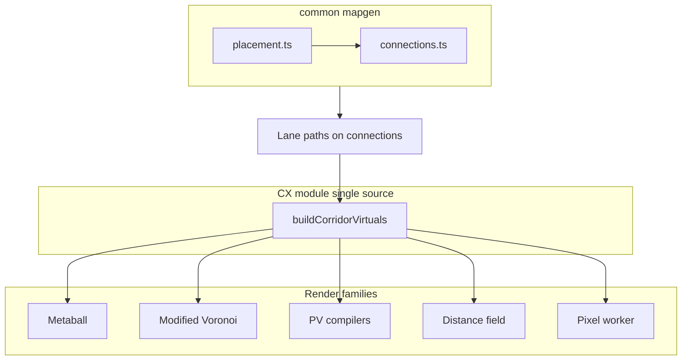

# Map lanes (MSR + buffer) and cross-player CX — planning artifact

## Progress (rolling)

| Phase | Status (2026-04-09) |
|-------|---------------------|
| **P0** | Tunable clearance in `generateConnections`; **Phase 5 connectivity repair** after prune (single component, **G-1**); CX builder `buildCorridorVirtualSites` + `computeCorridorVirtuals`; cross-owner sampling. |
| **P1** | Curved adaptive solver (chord-if-ok, **aesthetic bulge** on long chords when straight is valid, else Bézier/kink); **D_clear** on **drawn** lanes only; **Delaunay Phase 4 prune uses MSR-only** so topology is not over-tightened before lanes run. **`lanePathKind`**; motion via `lanePolylineCache`. Map & Grid / Main Menu **segmented** lane-mode control. **Remaining:** `validateLaneClearance` (P4). |
| **P2** | MV still calls `buildCorridorVirtualSites` directly (same math as `computeCorridorVirtuals`); optional switch to `computeCorridorVirtuals` for one import path. |
| **P3–P4** | Validator + FEATURE_STATUS row — not started. |

## Purpose (user goal)

- **Lane clearance:** No **laneway** may pass within **MSR + laneBuffer** of any star **except** the two **endpoint** stars of that edge. **laneBuffer** default **30px**, **always tunable** (the historical fixed `35` in mapgen should never have been hardcoded).
- **Routing:** **Straight** vs **curved** (curved default). Prefer **one** curved segment when possible; allow **2–3 interior vertices** only when required for feasibility. Solver must have **hard iteration/time limits**—no endless loops, predictable perf.
- **CX:** Corridor virtuals for **all** qualifying map connections—including **different owners**—so borders **meet** along the lane. The **same-owner guard must be removed**, not “narrowed”: cross-owner CX is an explicit requirement.
- **Architecture:** **Single-source CX module** used by every territory/render path; **Metaball first** for development and confirmation, then **systematic verification** in each other mode.
- **Live editing:** **Map & Grid** controls to adjust map-geometry parameters (**MSR**, **lane buffer**, lane mode, etc.) with **reactive updates while the game is paused** (re-solve or regen paths, bump caches).
- **Motion:** Lane geometry must **interface with ship travel and conquest animations** via a shared **lane path** contract (waypoints / polyline), not ad hoc chords.
- **Per-family tuning (conditional):** If different render families need different weights to reach acceptable geometry, plan for **separate exposed tunables per family**; if not observed in QA, keep one global set and document.

---

## Implementation checklist (from plan todos)

| ID | Task |
|----|------|
| p0-arch-mapgen-msr | Fix architecture drift: thread MSR + laneBuffer into `common` mapgen; replace `connections.ts` CLEARANCE=35 with tunable `D_clear=msr+buffer`; `MapGenConfig` + client/server |
| p0-cx-module-extract | Extract CX to single module (pure inputs → virtual sites / samples API); Metaball delegates first; remove duplicate inline CX in Modified Voronoi once unified |
| p1-curved-lanes | Curved solver—prefer single Bézier; add 2–3 verts only if needed; max iterations/time budget; no unbounded loops; waypoints on `MapConnection` / `MapGenResult` |
| p1-lane-path-animations | Define `LanePath` contract consumed by ship transfer/conquest paths; wire movement/FX to polylines (not only chords) |
| p2-cross-owner-cx | Remove same-owner guard entirely; all qualifying edges get CX (split-ownership model for cross-owner); parity via single CX module |
| p2-family-rollout | After Metaball sign-off—verify CX module in Modified Voronoi, PV compilers, DF, Pixel (and any worker paths)—one family per test pass |
| p3-map-grid-live | ControlsSection Map & Grid—MSR, laneBuffer, lane mode; reactive regen/re-solve while paused + territory cache bump |
| p3-per-family-cx-tuning | If QA shows family-specific geometry needs—add optional per-family CX weights/params in `GAME_CONFIG` + UI; else document single global set |
| p4-custom-map-validator | Shared `validateLaneClearance`; territory doc + FEATURE_STATUS |

---

## Architecture note: MSR, mapgen, and clearance

Today **MSR** (`MODIFIED_VORONOI_STAR_MARGIN`) drives **render-time** territory geometry while **mapgen** uses an unrelated fixed **35px** “pass-through” prune. That split is a **real architecture violation**: gameplay territory assumptions and generated lane/star layout are not derived from the same parameters.

**Remediation (plan):**

- Mapgen and runtime **read the same logical values** at the moment of map creation (room options / snapshot). For **live Map & Grid edits**, re-apply lane solving / validation against **current** slider values while paused.
- Persist **gen-time** values on the map/session for reproducibility, but **allow** the user to override from Map & Grid and see results immediately when paused.

---

## Single-source CX corridor module

**Goal:** One **modular utility/library** (not scattered `if (sameOwner)` copies) that computes corridor virtual sites (or equivalent samples) from:

- Stars (positions, owners, ids),
- Graph connections,
- **Lane polylines** (chord or waypoints—must match mapgen output),
- Config (spacing, counts, weights—see per-family section below).

**Suggested placement (implementation decision):**

- Prefer **`common`** only if the API can stay free of Pixi/Svelte (pure geometry + ids). If not, use **`pax-fluxia/src/lib/territory/corridor/`** (or similar) with a thin adapter so server/mapgen can share types later.
- **Public API sketch:** `buildCorridorVirtuals(input: CorridorCxInput): VirtualSiteDescriptor[]` (name TBD), stable ordering, documented invariants (no graph edges for virtual ids, cluster rules).

**Integration rule:** [ModifiedVoronoiRenderer](../../../../../pax-fluxia/src/lib/renderers/ModifiedVoronoiRenderer.ts) **must delegate** to this module—**no** parallel inline CX loop long-term. [territoryFeatures.ts](../../../../../pax-fluxia/src/lib/renderers/territoryFeatures.ts) either becomes the module or re-exports it; [MetaballRenderer](../../../../../pax-fluxia/src/lib/renderers/MetaballRenderer.ts) calls the same builder.

**Rollout checklist (after Metaball confirmed):**

1. Metaball + CX module (reference implementation).
2. Modified Voronoi.
3. Power Voronoi / compiler paths ([powerVoronoiTerritoryGeometryGenerator.ts](../../../../../pax-fluxia/src/lib/territory/compiler/powerVoronoiTerritoryGeometryGenerator.ts), [Geometry_0319.ts](../../../../../pax-fluxia/src/lib/territory/compiler/Geometry_0319.ts)).
4. Distance field renderer.
5. Pixel territory + worker if it duplicates corridor logic.

Each step: visual regression + perf smoke before moving on.

---

## Current codebase (facts)

| Area | Location | Behavior today |
|------|----------|----------------|
| Map pipeline | [common/src/mapgen/index.ts](../../../../../common/src/mapgen/index.ts) | `generateStarPositions` → `generateConnections(..., passThroughClearancePx)` → `attachLaneWaypointsToConnections(..., D_clear)`. |
| Connection geometry | [common/src/mapgen/connections.ts](../../../../../common/src/mapgen/connections.ts) | Delaunay + prune; Phase 4 pass-through uses caller **`passThroughClearancePx`** (typically MSR + lane buffer). |
| MSR + buffer | [game.config.ts](../../../../../pax-fluxia/src/lib/config/game.config.ts), [gameStore](../../../../../pax-fluxia/src/lib/stores/gameStore.svelte.ts), `MapGenConfig` | Mapgen and live lane rebuild use **`MODIFIED_VORONOI_STAR_MARGIN`** + **`MAPGEN_LANE_BUFFER_PX`** for `D_clear`. |
| Lane waypoints | [lanePolylines.ts](../../../../../common/src/mapgen/lanePolylines.ts), [types.ts](../../../../../common/src/mapgen/types.ts) | `laneWaypoints` + **`lanePathKind`** (`straight` \| `curved`). |
| CX virtuals | [buildCorridorVirtualSites.ts](../../../../../pax-fluxia/src/lib/territory/corridor/buildCorridorVirtualSites.ts), [territoryFeatures.ts](../../../../../pax-fluxia/src/lib/renderers/territoryFeatures.ts) | Cross-owner + polyline arc-length split; `computeCorridorVirtuals` canonicalizes. |
| CX in MV | [ModifiedVoronoiRenderer](../../../../../pax-fluxia/src/lib/renderers/ModifiedVoronoiRenderer.ts) | Uses **`buildCorridorVirtualSites`** + `getLanePolyline` (same geometry as module; optional dedupe to `computeCorridorVirtuals` only). |
| Other consumers | Metaball, PV, DF, compilers | Corridor via `computeCorridorVirtuals` or direct builder + lane resolver. |

---

## 1) Lane clearance: MSR + laneBuffer

### 1.1 Definitions

- **Endpoint stars** of connection `(A,B)`: **exempt** from clearance for that lane’s path.
- **Constraint stars**: all other stars.
- **Clearance:** `D_clear = MSR_px + laneBuffer_px`.

### 1.2 Straight-lane mode

- Path = segment `A–B`; use [pointToSegmentDistance](../../../../../common/src/mapgen/connections.ts) (or shared geom util).
- Replace fixed **35** with **`D_clear`** from config.

### 1.3 Curved-lane mode (default)

- **Prefer a single curve** (e.g. one quadratic or cubic Bézier) from A to B.
- **Escalation:** If infeasible, introduce **2–3 interior polyline vertices** (or equivalent control points), still bounded.
- **Constraints:** Minimum distance from **sampled** path to constraint stars ≥ `D_clear`.
- **Solver safety (mandatory):**
  - **Maximum iteration count** and/or **wall-clock budget** (deterministic exit).
  - **No** `while (true)` without a proven decrementing measure.
  - Coarse sampling step count capped (function of map size or edge length).
- **Fallback:** If budget exceeded, **prune edge** or **regenerate placement** (same policy as straight mode).

### 1.4 Persistence and motion

- Extend [MapConnection](../../../../../common/src/mapgen/types.ts) / `MapGenResult` with **`pathKind`**, **`waypoints`** (or control points) so consumers do not re-solve.
- **Ship travel / conquest animations** must consume the **same** lane path:
  - Identify current code paths that assume a **straight chord** between stars.
  - Introduce a small **`LanePath`** (or extend `StarConnection`) type used by **mapgen output**, **CX module**, and **movement/FX** (parameterize position along polyline by arc length or `t`).

### 1.5 API / config

- [MapGenConfig](../../../../../common/src/mapgen/types.ts): `laneMode`, `laneBufferPx`, `msrPx`; thread [generateMap](../../../../../common/src/mapgen/index.ts), [gameStore](../../../../../pax-fluxia/src/lib/stores/gameStore.svelte.ts), [GameRoom](../../../../../pax-server/src/rooms/GameRoom.ts).

### 1.6 UI — Map and Grid (live, paused)

- Expose **MSR**, **lane buffer**, **lane geometry mode** (and related map knobs) in **ControlsSection Map & Grid** (not only one-shot game setup).
- **Reactive behavior:** While **paused**, changing these controls triggers **recomputation** of lane paths (and any dependent territory caches—e.g. metaball reset, orchestrator bump) so the user sees **immediate** layout feedback without starting a new match.
- Still store **gen-time snapshot** on the map for reproducibility/debug; live edits overlay **current** slider state until a new game is started if product requires that distinction.

---

## 2) CX corridors: cross-owner connections

### 2.1 Problem

Same-owner-only CX leaves **cross-player** chords weak; **third-party** influence can intrude between two players who share an edge.

### 2.2 Spec — guard removal (unambiguous)

- **Remove** the `starA.ownerId === starB.ownerId` **eligibility** check. CX applies to **every connection** that meets **ownership rules** (e.g. both endpoints **owned**; neutral policy in open questions).
- **Same-owner** edges become a **degenerate case** of the general rule (all virtuals share one `ownerId`), not a separate code path that excludes enemies.

### 2.3 Virtual-site ownership model

- **Recommendation:** **Split ownership** by midpoint (straight: geometric midpoint; curved: **half arc-length** along the path) — P1-side sites → P1, P2-side → P2.
- Alternatives (neutral corridor, weight bisector) remain documented if split model fails QA.

### 2.4 Implementation

- Implement in **CX module only**; Metaball, Modified Voronoi, PV, DF, Pixel **import** it.
- **Curved lanes:** Sample virtuals along **polyline/Bézier**, not chord.

### 2.5 Per-render-family tuning (optional)

- **Hypothesis:** Metaball vs Voronoi vs DF may need **different CX weights/spacing** for the same visual intent.
- **Plan:** Start with **one** global `TERRITORY_CX_*` set. If QA shows systematic mismatch, add **namespaced** keys (e.g. `METABALL_CX_WEIGHT`, `MV_CX_WEIGHT`) and expose in **Territory** (or Map & Grid) per family.
- Document in FEATURE_STATUS / decision log when split.

---

## 3) Phased delivery (reordered)

| Phase | Scope |
|-------|--------|
| **P0** | Tunable `D_clear` in mapgen; MSR + laneBuffer threaded from shared config; **CX module** scaffold + Metaball switched to it; **remove same-owner guard** in module for qualifying edges. |
| **P1** | Curved solver (single curve first; bounded multi-vertex); **LanePath** contract + **animation/movement** integration; Map & Grid **live paused** updates. |
| **P2** | Modified Voronoi + compilers + DF + Pixel migrated to CX module; **per-family tuning** only if validated need. |
| **P3** | Custom map validator; [TERRITORY_ARCHITECTURE.md](../../../game/territory/TERRITORY_ARCHITECTURE.md) / `.agent` decision; FEATURE_STATUS. |

---

## 4) Risks and open questions

- **Neutral stars:** CX eligibility when one or both endpoints are neutral—default: **both non-neutral owners** unless design extends.
- **Clusters:** Virtual sites must **not** create false connectivity between enemy clusters.
- **Perf:** More CX sites on all edges—**spacing** / **max sites** caps; module should be O(edges × samples) with fixed caps.
- **Per-family keys:** Avoid premature proliferation; add only after evidence.

---

## 5) Process

- On **P0 complete:** append `.agent/docs/project/sessions/notes/SESSION_YYYY-MM-DD.md` and add a **FEATURE_STATUS** row.
- Keep this file updated if the Cursor plan diverges; note revision date in frontmatter when edited.
