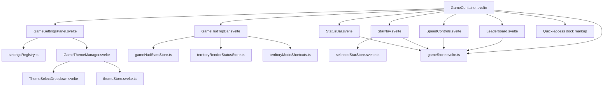

# UI Code Guide - Worktree 4b02 - 2026-05-13

## Purpose

This guide replaces the older HUD orientation notes with a map of the current in-game UI implementation in this worktree. It is written for manual UI editing: where the shell lives, which component owns which surface, how the pieces relate, and where to start when you want to change layout, styling, icons, or behavior.

This guide is desktop-first, because the current redesign work is desktop-first.

Primary file references below use:

- a repo-relative path in backticks
- a second line that is only `filename:line`

That second line is intended for quick copy/paste into VS Code `Go to File`.

## Read This First

- The master in-game layout owner is `pax-fluxia/src/lib/components/game/GameContainer.svelte`
  `GameContainer.svelte:629`
- The shared visual token layer now starts in `pax-fluxia/src/app.css`
  `app.css:40`
- The HUD icon system is centralized in `pax-fluxia/src/lib/components/ui/hud/HudIcon.svelte`
  `HudIcon.svelte:15`
- The topbar, settings ribbon, leaderboard, gamespeed, star view, and quick-access dock are now intended to behave as one HUD system.
- There are still some legacy branches and mixed old/new structures in the code. This guide calls those out explicitly so you do not edit the wrong surface.

## System Overview

## 1. Shared HUD Infrastructure

### 1.1 Global HUD tokens

File: `pax-fluxia/src/app.css`
`app.css:40`

Use this file for cross-HUD typography, color, shell, radius, shadow, and spacing tokens. If you want the entire HUD to become more premium, quieter, brighter, denser, or more restrained, this is the first place to inspect.

Relevant anchors:

- `:root` starts at line `8`
- HUD token block begins at line `40`
- `--hud-topbar-height` line `40`
- `--hud-font-ui` line `41`
- `--hud-font-data` line `42`
- `--hud-panel-bg` line `52`
- `body.game-active` line `149`
- `.font-hud-ui` line `187`
- `.font-hud-data` line `193`

What belongs here:

- shared font family decisions
- base HUD colors
- shared panel background/border/glow values
- globally reused HUD utility classes

What should not live here:

- one-off component fixes
- special-case panel sizing
- local component icon spacing

### 1.2 Shared HUD icon registry

File: `pax-fluxia/src/lib/components/ui/hud/HudIcon.svelte`
`HudIcon.svelte:15`

This is the icon source of truth for the redesigned in-game HUD. Use it when you need a consistent icon language across topbar, settings ribbon, leaderboard, Star View, gamespeed, or quick access.

Relevant anchors:

- props at lines `7-12`
- `const ICONS` registry starts at line `15`
- derived icon lookup lines `221-222`

Edit this file when:

- adding a new HUD icon
- replacing a temporary or ugly icon treatment
- normalizing stroke language across surfaces

Avoid:

- embedding ad hoc emoji
- mixing text glyphs with SVG icons
- redefining icons locally in individual HUD components unless absolutely necessary

### 1.3 HUD barrel exports

File: `pax-fluxia/src/lib/components/ui/hud/index.ts`
`index.ts:1`

This re-exports HUD leaf components. If a new HUD component should be part of the shared surface family, add it here.

## 2. Master Shell and Layout Owner

### 2.1 Primary file

File: `pax-fluxia/src/lib/components/game/GameContainer.svelte`
`GameContainer.svelte:629`

This file is the root owner for the in-game HUD composition. It decides where the topbar, canvas, settings, leaderboard, tactical widgets, and quick-access icons are mounted. If the overall composition feels wrong, start here before editing leaf components.

Important script/state anchors:

- dock and collapse state block: lines `85-186`
- `toggleSettingsPanel`: line `150`
- `toggleSidebarSide`: line `154`
- `toggleControlsSide`: line `161`
- `toggleLeaderboardCollapsed`: line `178`
- `openThemeShortcuts()`: lines `534-542`

Important render anchors:

- `.game-layout` root: line `629`
- `GameHudTopBar`: line `635`
- `StatusBar`: line `649`
- mobile `SpeedControls`: line `696`
- mobile `StarNav`: line `706`
- `GameSettingsPanel`: line `734`
- desktop `Leaderboard`: line `763`
- desktop `SpeedControls`: line `776`
- desktop `StarNav`: line `789`
- quick-access dock markup: line `1066`

Important style anchors:

- `<style>` start: line `1297`
- `.game-layout`: line `1309`
- `.area-topbar`: line `1377`
- mobile `.game-layout` override: line `1435`
- mobile `.area-controls`: line `1455`
- landscape mobile `.game-layout`: line `1497`
- desktop `.area-controls`: line `1822`
- desktop `.area-right`: line `1856`
- `.area-quick-access`: line `1912`
- `.sidebar-menu`: line `1939`
- `.sidebar-tool-btn`: line `2019`
- `.speed-card`: line `2261`

### 2.2 What this file owns

- master grid areas
- left/right docking for controls and right rail
- collapse state for settings and leaderboard
- composition order of all major HUD surfaces
- quick-access dock placement
- integration points between HUD shell and the live game screen

### 2.3 What this file does not fully own

- detailed settings section logic
- theme library behavior
- leaderboard row rendering
- gamespeed button visuals
- star detail card internals

### 2.4 Legacy warning

There is still a hidden legacy branch in this file:

- `.sidebar-global-actions`: line `2009`
- `.sidebar-global-actions__row`: line `2013`

Treat that branch as dead/legacy unless you are explicitly cleaning it up. Do not use it as the starting point for new quick-access or sidebar work.

## 3. Topbar Cluster

### 3.1 Topbar component

File: `pax-fluxia/src/lib/components/ui/GameHudTopBar.svelte`
`GameHudTopBar.svelte:61`

This is the current desktop HUD spine. It is mounted inside the master grid and is intended to host structural controls, collapse handles, and compact session/status context.

Relevant anchors:

- props: lines `8-19`
- `activeModeId`: line `34`
- `statsLabel`: line `41`
- `featuredPlayer`: line `49`
- render root: line `61`
- style root `.game-hud-topbar`: line `159`

Edit this file when:

- changing the topbar composition
- changing collapse button placement or wording
- changing how territory mode shortcuts display in the topbar
- changing compact player summary presentation

### 3.2 Topbar dependency: HUD stats store

File: `pax-fluxia/src/lib/stores/gameHudStatsStore.ts`
`gameHudStatsStore.ts:13`

Relevant anchors:

- stats shape: lines `3-6`
- store API: lines `13-27`

Use this when changing small runtime telemetry shown in the topbar.

### 3.3 Topbar dependency: territory render status

File: `pax-fluxia/src/lib/stores/territoryRenderStatusStore.ts`
`territoryRenderStatusStore.ts:41`

Relevant anchors:

- status shape: lines `9-23`
- writable export: line `41`
- setters: lines `45-54`

Use this when topbar mode or territory rendering state should change.

### 3.4 Topbar dependency: territory mode shortcut definitions

File: `pax-fluxia/src/lib/territory/ui/territoryModeShortcuts.ts`
`territoryModeShortcuts.ts:30`

Relevant anchors:

- `TOPBAR_MODE_DEFS`: line `30`
- `getTopbarTerritoryModeOptions()`: line `93`
- `applyTopbarTerritoryModeShortcut(modeId)`: line `123`

Use this file if you want to change topbar mode labels, short labels, or which mode shortcuts appear.

## 4. Settings Ribbon, Search, and Theme Shell

### 4.1 Primary settings shell owner

File: `pax-fluxia/src/lib/components/ui/GameSettingsPanel.svelte`
`GameSettingsPanel.svelte:1110`

This is both a presentation component and a large behavior owner. It handles the ribbon shell, the icon rail, active section state, search results, theme anchor placement, and the content region for all settings sections.

Relevant anchors:

- props: lines `763-779`
- `ACTIVE_SECTION_KEY`: line `781`
- `openSection`: line `811`
- `toggleSection`: lines `816-826`
- section visibility and filtering: lines `828-887`
- `SEARCH_TARGET_SELECTOR`: line `911`
- `settingsSearchResults`: lines `939-946`
- `navigateToSearchResult`: lines `1019-1042`
- `handleSearchSubmit`: lines `1044-1048`
- `clearSettingsSearch`: lines `1050-1052`

Render anchors:

- root `.controls-panel`: lines `1110-1114`
- header tools: line `1131`
- ribbon action pills: line `1136`
- search input: line `1160`
- utility action row: lines `1230-1265`
- theme anchor + mount: lines `1302-1303`
- icon toolbar: lines `1307-1354`
- empty state: lines `1357-1365`
- stacked section panels: line `1369` onward

Style anchors:

- width/collapse system begins near line `1600`
- `.controls-panel--ribbon-expanded`: line `1610`
- `.settings-shell`: line `1614`
- `.icon-toolbar`: line `1681`
- `.icon-btn`: line `1727`
- header/search styling begins at line `2139`
- `.settings-ribbon-actions`: line `2168`

### 4.2 What belongs in `GameSettingsPanel`

- section open/close behavior
- search behavior and result navigation
- ribbon collapse/expanded visuals
- shell-level header composition
- shell placement of theme controls
- scroll anchor destinations for major settings zones

### 4.3 What to change elsewhere instead

- if changing the list of sections, start in `settingsRegistry.ts`
- if changing theme library internals, use `GameThemeManager.svelte`
- if changing a deep settings section body, edit that section component rather than this shell

### 4.4 Settings registry

File: `pax-fluxia/src/lib/components/ui/settings/settingsRegistry.ts`
`settingsRegistry.ts:41`

Relevant anchors:

- `SETTINGS_SECTIONS`: line `41`
- `normalizeSettingsSectionId`: line `237`

This file defines the section metadata used by the settings ribbon. Edit it when:

- adding/removing a section
- changing labels or icon names for a section
- changing category ordering in the ribbon

### 4.5 Theme scroll target

`GameContainer.openThemeShortcuts()` scrolls to `#settings-theme-anchor`, which is mounted in `GameSettingsPanel` at lines `1302-1303`.

If the theme entry point stops working, check both:

- `pax-fluxia/src/lib/components/game/GameContainer.svelte`
  `GameContainer.svelte:534`
- `pax-fluxia/src/lib/components/ui/GameSettingsPanel.svelte`
  `GameSettingsPanel.svelte:1302`

## 5. Theme System

### 5.1 Theme management surface

File: `pax-fluxia/src/lib/components/ui/GameThemeManager.svelte`
`GameThemeManager.svelte:169`

This is the full theme management surface embedded into the settings shell. It owns the compact library UI, apply/save/update/delete actions, and import/export behavior for themes.

Relevant anchors:

- props `variant`: lines `12-16`
- selection state: lines `24-42`
- `libraryThemes` newest-first sort: lines `33-41`
- `handleApplyTheme`: line `98`
- `handleSaveTheme`: line `106`
- `handleUpdateTheme`: line `117`
- `handleDeleteTheme`: line `129`
- `handleExportTheme`: line `134`
- `handleImportTheme`: line `143`

Render anchors:

- root: line `169`
- header: lines `173-189`
- dropdown/actions: lines `193-231`
- utility row: lines `266-280`
- library list: lines `289-324`

Style anchors:

- `.game-theme-manager`: line `330`
- `.game-theme-manager__header`: line `358`
- `.theme-library-list`: line `516`

Edit this file when:

- changing theme manager layout
- changing the visual relationship between selector and library
- changing save/import/export affordances
- changing list density or card styling

### 5.2 Theme dropdown

File: `pax-fluxia/src/lib/components/ui/settings/ThemeSelectDropdown.svelte`
`ThemeSelectDropdown.svelte:233`

This is the fast theme selector used inside the theme manager.

Relevant anchors:

- props: lines `6-16`
- `showGroupLabels` default: line `35`
- grouped/flat option building: lines `49-76`
- open/close/select behavior: lines `87-136`
- keyboard logic: lines `138-212`
- render root: lines `233-302`
- style block: lines `304-484`

Edit this file when:

- changing dropdown mechanics
- changing option grouping/truncation/presentation
- changing keyboard behavior

### 5.3 Theme persistence store

File: `pax-fluxia/src/lib/stores/themeStore.svelte.ts`
`themeStore.svelte.ts:247`

Relevant anchors:

- normalization and migration helpers: lines `45-178`
- user theme state: lines `225-236`
- `themeStore` export: line `247`
- `applyTheme`: lines `263-280`
- `saveTheme`: lines `282-298`
- `deleteTheme`: lines `300-305`

Use this file for data/persistence changes, not cosmetic layout work.

## 6. Leaderboard Cluster

### 6.1 Main leaderboard component

File: `pax-fluxia/src/lib/components/ui/hud/Leaderboard.svelte`
`Leaderboard.svelte:103`

This component owns the compact/expanded leaderboard surface, the player list rows, and the tactical summary header on desktop.

Relevant anchors:

- props: lines `7-21`
- persistence key: line `23`
- helper functions: lines `31-67`
- derived sorting, totals, and tick values: lines `69-100`
- render root: line `103`
- header and controls: lines `104-157`
- summary and tick area: lines `160-181`
- column row: lines `183-191`
- player list rows: lines `194-228`

Style anchors:

- style block start: line `231`
- `.leaderboard`: line `232`
- summary chip section: line `348` onward
- columns: line `420` onward
- list rows: line `465` onward

Edit this file when:

- changing collapsed badge vs expanded panel behavior
- changing row typography or column structure
- changing tactical summary composition
- changing player highlight logic

## 7. Tactical Widgets

### 7.1 Gamespeed control

File: `pax-fluxia/src/lib/components/ui/hud/SpeedControls.svelte`
`SpeedControls.svelte:55`

This is the compact gamespeed surface used in both mobile and desktop placements.

Relevant anchors:

- props: lines `5-16`
- speed options: lines `36-40`
- container root: line `55`
- `.speed-controls`: line `63`
- style block start: line `86`

Edit this file when:

- changing play/pause/fast-forward visuals
- changing button rhythm and spacing
- changing title/caption treatment

### 7.2 Star View / star navigation

File: `pax-fluxia/src/lib/components/ui/hud/StarNav.svelte`
`StarNav.svelte:143`

This is the current star detail/tactical card. In the current implementation it now prefers the selected star from the store, then falls back to owned-star cycling.

Relevant anchors:

- props: lines `8-13`
- `TYPE_INFO`: lines `21-29`
- `getAttackForce`: lines `42-51`
- `getDefenseForce`: lines `53-66`
- `ownedStars`: line `68`
- selected-star lookup: lines `74-78`
- `displayedStar`: lines `99-101`
- `displayedStarDetails`: lines `103-124`
- prev/next navigation: lines `126-140`
- render root: line `143`
- summary block: lines `209-223`
- metric cards: lines `224-249`
- style block start: line `257`

Important caution:

- This component still contains UI-side derived attack/defense values.
- Those values are not a safe source of truth for gameplay semantics.
- For layout or presentation edits, this file is the correct owner.
- For future combat-authoritative redesign, this file should be revisited with shared combat helpers.

### 7.3 Star selection dependency

File: `pax-fluxia/src/lib/stores/selectedStarStore.svelte.ts`
`selectedStarStore.svelte.ts:5`

Relevant anchors:

- file body: lines `5-13`

This store owns `selectedStarStore.id`, `select`, `deselect`, and `toggle`. If Star View does not react to map selection, inspect this store and the map click wiring before changing UI layout.

## 8. Mobile Status Surface

### 8.1 Mobile-only status bar

File: `pax-fluxia/src/lib/components/ui/hud/StatusBar.svelte`
`StatusBar.svelte:43`

This is the mobile status surface. On desktop, the topbar is the relevant shell; on mobile, `StatusBar` remains part of the active HUD layout.

Relevant anchors:

- props: lines `6-12`
- player sorting/totals/tick derivation: lines `22-40`
- render root: line `43`
- `.statusbar`: line `112`
- desktop-hide media query: line `129`
- landscape mobile variant: line `246`

Edit this file when:

- changing mobile-only player summary behavior
- changing mobile compact telemetry
- changing mobile status shell styling

## 9. Shared Runtime Game Data Entry Points

### 9.1 Active game store

File: `pax-fluxia/src/lib/stores/gameStore.svelte.ts`
`gameStore.svelte.ts:535`

This is the main game state bridge consumed by `GameContainer`, `Leaderboard`, `SpeedControls`, `StarNav`, and `StatusBar`.

Relevant anchors:

- `pauseGame`: line `346`
- `resumeGame`: line `357`
- `setSpeed`: line `368`
- `startGame`: line `379`
- `stars`: line `535`
- `mapDiagnostics`: line `537`
- `players`: line `538`
- `localPlayerId`: line `539`
- `speed`: line `541`
- `effectiveTickMs`: lines `542-545`
- `currentTick`: line `547`

Use this file when:

- the HUD is rendering stale or wrong game-state inputs
- speed controls do not affect gameplay
- player/star/tick data exposed to HUD components changes shape

## 10. Recommended Editing Paths

### 10.1 Change the whole in-game composition

Start in:

- `pax-fluxia/src/lib/components/game/GameContainer.svelte`
  `GameContainer.svelte:629`
- `pax-fluxia/src/app.css`
  `app.css:40`

Then inspect:

- `pax-fluxia/src/lib/components/ui/GameHudTopBar.svelte`
  `GameHudTopBar.svelte:61`
- `pax-fluxia/src/lib/components/ui/GameSettingsPanel.svelte`
  `GameSettingsPanel.svelte:1110`

### 10.2 Change settings ribbon width, collapse, or icon rail behavior

Start in:

- `pax-fluxia/src/lib/components/ui/GameSettingsPanel.svelte`
  `GameSettingsPanel.svelte:1110`

Then inspect:

- `pax-fluxia/src/lib/components/ui/settings/settingsRegistry.ts`
  `settingsRegistry.ts:41`
- `pax-fluxia/src/lib/components/game/GameContainer.svelte`
  `GameContainer.svelte:629`

### 10.3 Change theme selector or theme library behavior

Start in:

- `pax-fluxia/src/lib/components/ui/GameThemeManager.svelte`
  `GameThemeManager.svelte:169`
- `pax-fluxia/src/lib/components/ui/settings/ThemeSelectDropdown.svelte`
  `ThemeSelectDropdown.svelte:233`

Then inspect:

- `pax-fluxia/src/lib/stores/themeStore.svelte.ts`
  `themeStore.svelte.ts:247`

### 10.4 Change leaderboard visuals or collapsed badge behavior

Start in:

- `pax-fluxia/src/lib/components/ui/hud/Leaderboard.svelte`
  `Leaderboard.svelte:103`
- `pax-fluxia/src/lib/components/ui/GameHudTopBar.svelte`
  `GameHudTopBar.svelte:61`

### 10.5 Change gamespeed or Star View styling

Start in:

- `pax-fluxia/src/lib/components/ui/hud/SpeedControls.svelte`
  `SpeedControls.svelte:55`
- `pax-fluxia/src/lib/components/ui/hud/StarNav.svelte`
  `StarNav.svelte:143`

Then inspect:

- `pax-fluxia/src/lib/components/game/GameContainer.svelte`
  `GameContainer.svelte:629`
- `pax-fluxia/src/lib/stores/selectedStarStore.svelte.ts`
  `selectedStarStore.svelte.ts:5`

### 10.6 Change icons across the whole HUD

Start in:

- `pax-fluxia/src/lib/components/ui/hud/HudIcon.svelte`
  `HudIcon.svelte:15`

Then inspect:

- `pax-fluxia/src/lib/components/ui/settings/settingsRegistry.ts`
  `settingsRegistry.ts:41`
- `pax-fluxia/src/lib/components/ui/GameHudTopBar.svelte`
  `GameHudTopBar.svelte:61`
- `pax-fluxia/src/lib/components/game/GameContainer.svelte`
  `GameContainer.svelte:629`

## 11. Known Structural Risks

- `GameContainer.svelte` is still a very large owner with layout, composition, and some interaction logic mixed together.
- `GameSettingsPanel.svelte` is both a shell and a logic-heavy behavior owner; it is easy to make shell changes there that accidentally affect search or section behavior.
- `StarNav.svelte` currently mixes presentation and derived game-style values.
- The worktree contains ongoing redesign edits; inspect nearby changes carefully before moving code around.

## 12. Fast Orientation Checklist

If you are opening this code cold and need to make a safe UI change:

1. Open `pax-fluxia/src/lib/components/game/GameContainer.svelte` and confirm whether the issue is composition or leaf rendering.
   `GameContainer.svelte:629`
2. Open `pax-fluxia/src/app.css` if the problem feels systemic across multiple HUD surfaces.
   `app.css:40`
3. Open `pax-fluxia/src/lib/components/ui/hud/HudIcon.svelte` if the problem is icon consistency.
   `HudIcon.svelte:15`
4. Open the leaf component that visually owns the surface you want to change.
5. Check the store or registry file named in this guide before changing behavior or state assumptions.

## 13. File Index

- `pax-fluxia/src/app.css`
  `app.css:40`
- `pax-fluxia/src/lib/components/game/GameContainer.svelte`
  `GameContainer.svelte:629`
- `pax-fluxia/src/lib/components/ui/GameHudTopBar.svelte`
  `GameHudTopBar.svelte:61`
- `pax-fluxia/src/lib/components/ui/GameSettingsPanel.svelte`
  `GameSettingsPanel.svelte:1110`
- `pax-fluxia/src/lib/components/ui/GameThemeManager.svelte`
  `GameThemeManager.svelte:169`
- `pax-fluxia/src/lib/components/ui/hud/HudIcon.svelte`
  `HudIcon.svelte:15`
- `pax-fluxia/src/lib/components/ui/hud/Leaderboard.svelte`
  `Leaderboard.svelte:103`
- `pax-fluxia/src/lib/components/ui/hud/SpeedControls.svelte`
  `SpeedControls.svelte:55`
- `pax-fluxia/src/lib/components/ui/hud/StarNav.svelte`
  `StarNav.svelte:143`
- `pax-fluxia/src/lib/components/ui/hud/StatusBar.svelte`
  `StatusBar.svelte:43`
- `pax-fluxia/src/lib/components/ui/hud/index.ts`
  `index.ts:1`
- `pax-fluxia/src/lib/components/ui/settings/ThemeSelectDropdown.svelte`
  `ThemeSelectDropdown.svelte:233`
- `pax-fluxia/src/lib/components/ui/settings/settingsRegistry.ts`
  `settingsRegistry.ts:41`
- `pax-fluxia/src/lib/stores/gameHudStatsStore.ts`
  `gameHudStatsStore.ts:13`
- `pax-fluxia/src/lib/stores/gameStore.svelte.ts`
  `gameStore.svelte.ts:535`
- `pax-fluxia/src/lib/stores/selectedStarStore.svelte.ts`
  `selectedStarStore.svelte.ts:5`
- `pax-fluxia/src/lib/stores/themeStore.svelte.ts`
  `themeStore.svelte.ts:247`
- `pax-fluxia/src/lib/stores/territoryRenderStatusStore.ts`
  `territoryRenderStatusStore.ts:41`
- `pax-fluxia/src/lib/territory/ui/territoryModeShortcuts.ts`
  `territoryModeShortcuts.ts:30`

## 14. Superseded Guide

Older guide:

- `.agent/docs/sessions/2026-05-11/2026-05-11_UI_CODE_GUIDE_worktree-4b02.md`
  `2026-05-11_UI_CODE_GUIDE_worktree-4b02.md:1`

Use the 2026-05-11 guide only if you need historical context from the earlier HUD state. For current manual editing, prefer this 2026-05-13 guide.
