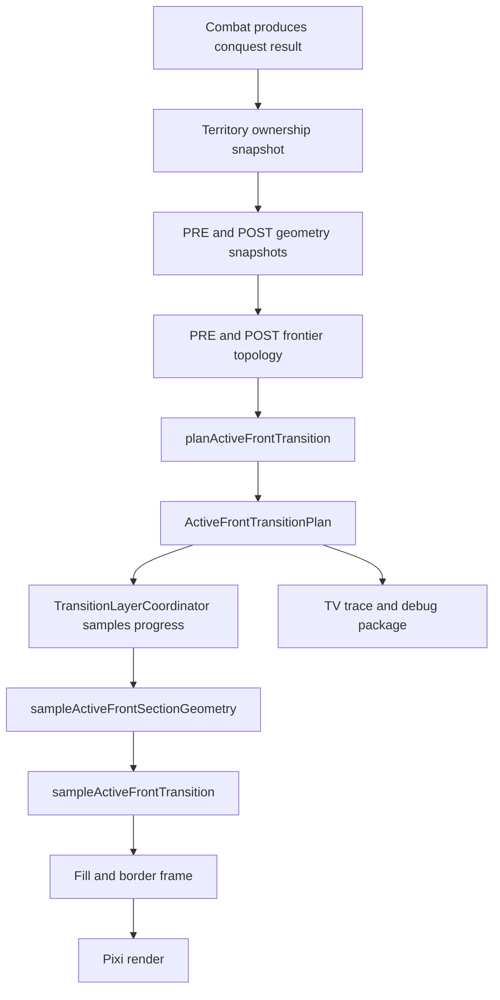
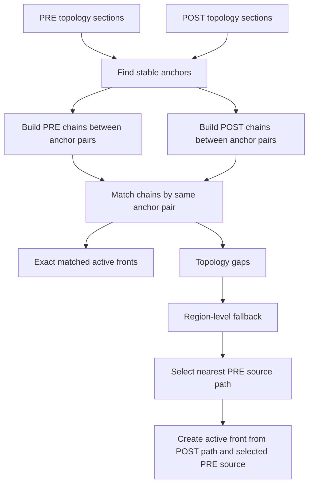
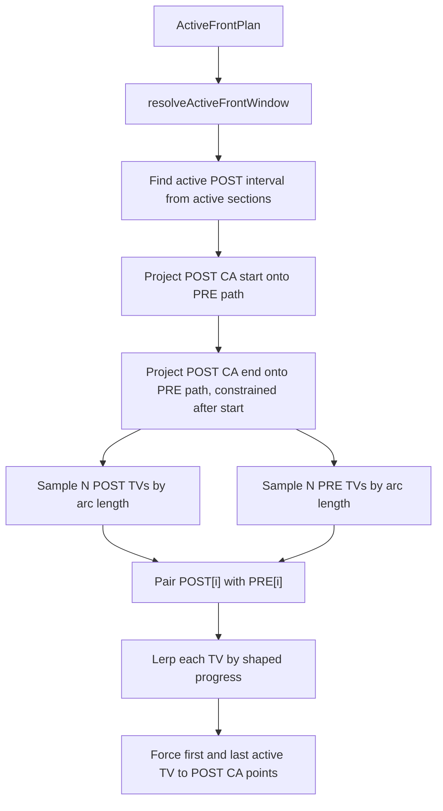
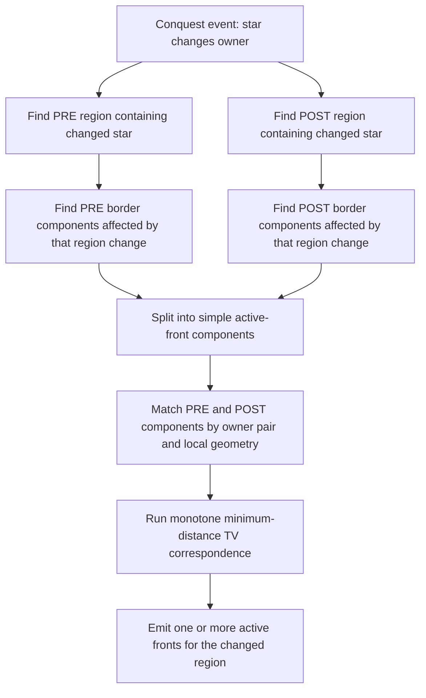

# Active Front TV Correspondence Reference

Date: 2026-05-13

Package inspected:

`C:/Users/mikep/Downloads/Pax Fluxia/DEBUG/13-44-15---788_cq_S7-to-S14_S28-to-S22_h0zcj7gx_tdp/13-44-15---788_cq_S7-to-S14_S28-to-S22_h0zcj7gx_tdp`

Related capture:

`13-44-15---788_cq_S7-to-S14_S28-to-S22_h0zcj7gx_front_reference.png`

Purpose: document exactly how the PVV4 active-front transition is currently mapped, what this package proves, why the Human-to-AI-5 transition has non-local TV paths, and where the next concrete fix belongs.

## Terms

Definition: A **Change Anchor** is a border vertex that bounds an active front.

Definition: An **active front** is the moving border portion for a conquest transition. It is the border interval that should move from its PRE position to its POST position.

Definition: A **Transition Vertex** is one of the equal-number moving points used to animate an active front. In code and notes, Transition Vertex may be abbreviated as **TV**.

Definition: A **TV path** is the straight motion path from a PRE Transition Vertex to its paired POST Transition Vertex.

Definition: **Correspondence** is the pairing rule that decides which PRE Transition Vertex maps to which POST Transition Vertex.

Definition: **Shortest-path local correspondence** means the pairing should minimize local TV travel while preserving the order of points along the active front. It does not mean every TV chooses its nearest point independently if that would cross paths or reverse order.

## Executive Finding

This capture is not failing because the classifier found no active front.

The plan says:

- `classification: animated_fronts`
- `frontCount: 3`
- `activeSectionCount: 7`
- `defectSectionCount: 0`
- `defectPairCount: 0`

The defect is correspondence quality. The Human-to-AI-5 front is being forced into one linear active front even though its POST border is not one simple border interval. It contains multiple owner-pair types and a duplicated reversed section. The current TV correspondence then pairs PRE and POST TVs by index, so several TVs travel long diagonal paths instead of local shortest paths.

## Deterministic Analyzer Added

Utility:

`pax-fluxia/scripts/diagnostics/analyze-active-front-package.mjs`

Command used:

```powershell
bun pax-fluxia/scripts/diagnostics/analyze-active-front-package.mjs "C:/Users/mikep/Downloads/Pax Fluxia/DEBUG/13-44-15---788_cq_S7-to-S14_S28-to-S22_h0zcj7gx_tdp/13-44-15---788_cq_S7-to-S14_S28-to-S22_h0zcj7gx_tdp"
```

Purpose: parse a transition package and report each front’s active sections, owner pairs, influence pairs, repeated reversed sections, PRE source, POST target, current TV travel lengths, and a nearest-local baseline.

The analyzer exists so future captures can be compared by data, not only by visual inspection.

## Package Facts

Conquests:

- `star-14`: `human-player -> ai-5`, attacker `star-7`
- `star-22`: `ai-3 -> human-player`, attacker `star-28`

Tunables recorded in the plan:

- `transitionVertexCount: 10`
- `stableAnchorEps: 3.5`
- `changeSpanEps: 4`
- `changeSpanPadPoints: 0`

Front summary from analyzer:

```text
front 0: CA 1029.77,473.03 -> 1029.77,473.03
  active sections=1 ownerPairs=ai-3|human-player
  TV paired travel avg=56.33 max=99.31

front 1: CA 1113.36,331.86 -> 1212.11,668.51
  active sections=2 ownerPairs=ai-3|human-player
  TV paired travel avg=76.34 max=164.07

front 2: CA 794.42,392.78 -> 971.5,690.96
  active sections=4 ownerPairs=ai-1|ai-5, ai-1|human-player, ai-5|human-player
  repeated section geometry=701.7,604.14<->758.35,596.62:ai-1|ai-5 x2
  TV paired travel avg=107.5 max=213.98
```

Front 2 is the Human-to-AI-5 defect front.

## The Human-To-AI-5 Defect

The POST target for front 2 is:

```text
794.42,392.78->758.35,596.62:ai-5|human-player
701.7,604.14->758.35,596.62:ai-1|ai-5
758.35,596.62->701.7,604.14:ai-1|ai-5
758.35,596.62->971.5,690.96:ai-1|human-player
```

This is the critical evidence.

The front contains three owner-pair types:

- `ai-5|human-player`
- `ai-1|ai-5`
- `ai-1|human-player`

It also contains the same `ai-1|ai-5` boundary twice, once in each direction:

```text
701.7,604.14->758.35,596.62:ai-1|ai-5
758.35,596.62->701.7,604.14:ai-1|ai-5
```

That means the planner has built a folded path and is treating it as one active front. A folded path cannot produce clean monotonic shortest-path TV motion by simple index pairing.

The PRE source for this entire POST front is only:

```text
591.37,636.22->971.5,690.96:ai-1|human-player
```

That PRE source is an old `ai-1|human-player` border. The POST target is a mixed front that includes a new `ai-5|human-player` border and both directions of an `ai-1|ai-5` border. The current planner selected the wrong unit of correspondence: one source border is being stretched over a branched, mixed target.

Measured current TV paths for front 2:

```text
TV 0: 213.98px (754.85,603.08) -> (794.42,392.78)
TV 1: 161.34px (779.86,615.3) -> (794.79,454.66)
TV 5: 140.01px (859.95,686.05) -> (750.26,599.04)
TV 4: 138.70px (837.5,673.72) -> (715.4,607.91)
TV 2: 116.87px (802.27,631.91) -> (782.12,516.79)
```

This matches the screenshot: the cyan TV paths form a fan. They are not local shortest paths.

The nearest-local baseline gives the same conclusion:

```text
front 2 current paired travel:      avg 107.50, max 213.98
front 2 nearest POST-to-PRE border: avg 48.95,  max 213.98
front 2 nearest PRE-to-POST border: avg 0.63,   max 5.19
```

Interpretation: much of the old PRE border is already near the POST target, but the current index pairing sends several TVs to distant POST positions. This is a correspondence defect, not a rendering defect.

## Current System Flow



Important code references:

- Planning is called in `pax-fluxia/src/lib/territory/layers/transition/TransitionLayerCoordinator.ts:176`.
- Runtime progress is shaped in `pax-fluxia/src/lib/territory/layers/transition/TransitionLayerCoordinator.ts:107`.
- Active-front sampling is called in `pax-fluxia/src/lib/territory/layers/transition/TransitionLayerCoordinator.ts:253`.
- Section geometry is rebuilt in `pax-fluxia/src/lib/territory/layers/transition/ActiveFrontTransition.ts:791`.
- TV trace is built in `pax-fluxia/src/lib/territory/layers/transition/ActiveFrontTransition.ts:1014`.
- TV correspondence is built in `pax-fluxia/src/lib/territory/layers/transition/ActiveFrontTransition.ts:1911`.

## Current Planning Flow



The main matched-anchor path is not the only source of fronts now. The region-level fallback added during the multi-front work handles cases where a changed region creates or removes local borders whose anchor pair does not exist on both PRE and POST.

Current fallback entry point:

`pax-fluxia/src/lib/territory/layers/transition/ActiveFrontTransition.ts:399`

The fallback selects a PRE source path with:

```ts
const score = pathCorrespondenceScore(source.path, nextPath);
```

Code reference:

`pax-fluxia/src/lib/territory/layers/transition/ActiveFrontTransition.ts:599`

Current score:

```ts
return distance(prevCentroid, nextCentroid) + endpointScore * 0.35;
```

Code reference:

`pax-fluxia/src/lib/territory/layers/transition/ActiveFrontTransition.ts:607`

Problem: centroid matching is present here and violates the PVV4 active-front premise. Region-level fallback currently ranks a PRE source path by polyline centroid plus endpoint distance before any game-world front decomposition or TV correspondence cost is evaluated. This must be removed entirely from the PVV4 path.

## Current TV Correspondence Flow



The decisive code:

```ts
const sampledPostFront = samplePolylineBetweenParams(
    postPath,
    activeFrontWindow.nextStartParam,
    activeFrontWindow.nextEndParam,
    sampledVertexCount,
);

const prevFront = samplePolylineBetweenParams(
    prevPath,
    activeFrontWindow.prevStartParam,
    activeFrontWindow.prevEndParam,
    sampledVertexCount,
);

const activeFront = prevFront.map((prevPoint, index) =>
    lerpPoint(prevPoint, sampledPostFront[index]!, t),
);
```

Code reference:

`pax-fluxia/src/lib/territory/layers/transition/ActiveFrontTransition.ts:1930`

The endpoint pin:

```ts
activeFront[0] = [sampledPostFront[0][0], sampledPostFront[0][1]];
activeFront[lastIndex] = [
    sampledPostFront[lastIndex][0],
    sampledPostFront[lastIndex][1],
];
```

Code reference:

`pax-fluxia/src/lib/territory/layers/transition/ActiveFrontTransition.ts:1950`

Problem: this guarantees equal-number TVs, but it does not guarantee local shortest-path correspondence. It assumes PRE and POST paths are already the same conceptual active front with the same orientation and no fold. Front 2 violates that assumption.

## Where Section Geometry Uses TVs

`sampleActiveFrontSectionGeometry` starts with the full POST topology as static geometry:

```ts
for (const [sectionId, section] of next.sections) {
    sectionGeometry.set(sectionId, section.points.map(...));
}
```

Then active sections are overwritten using the active front returned by correspondence.

Code reference:

`pax-fluxia/src/lib/territory/layers/transition/ActiveFrontTransition.ts:791`

The debug renderer draws the same correspondence:

```ts
drawPolyline(ctx, correspondence.prevFront, C.prevFront, 2.5, true);
drawPolyline(ctx, correspondence.postFront, C.postFront, 2.5);
drawPolyline(ctx, correspondence.activeFront, C.activeFront, 5);
for (const [tx, ty] of correspondence.activeFront) {
    drawCircle(ctx, tx, ty, 3.2, C.tv);
}
```

Code reference:

`pax-fluxia/src/lib/territory/devtools/TransitionFrontierFrameRenderer.ts:288`

This is good architecture for diagnostics: the render package and live overlay can expose the actual correspondence. The problem is the correspondence being fed into it.

## Why The Human-To-AI-5 Front Is Wrong

The root problem is not just "wrong number of points" or "not enough TVs."

The root problem is that front 2 is not a valid single active front for simple monotonic TV pairing.

It has these invalid properties:

- It mixes `ai-5|human-player`, `ai-1|ai-5`, and `ai-1|human-player` in one planned active front.
- It includes the same `ai-1|ai-5` section in both directions.
- Its PRE source is one `ai-1|human-player` border.
- Its POST target includes new `ai-5` territory borders and an unchanged or partially changed `ai-1|human-player` border.

The current algorithm then samples ten PRE TVs from the old `ai-1|human-player` border and ten POST TVs from the folded mixed target. Pairing by index creates long diagonal vectors.

This is why the transition visually looks like rotation or broad translation instead of a local border adjustment.

## Current Wrong Assumption

Wrong assumption: once an active front is selected, equal-count arc-length points on PRE and POST can be paired by index.

Correct rule: equal-count TVs are necessary but not sufficient. The PRE and POST active front must first be the same local moving border in game terms, and then the TV pairing must minimize local travel while preserving order.

## Centroid Audit

Active PVV4 path:

- `pax-fluxia/src/lib/territory/layers/transition/ActiveFrontTransition.ts:599` calls `pathCorrespondenceScore(source.path, nextPath)`.
- `pax-fluxia/src/lib/territory/layers/transition/ActiveFrontTransition.ts:607` defines `pathCorrespondenceScore`.
- `pax-fluxia/src/lib/territory/layers/transition/ActiveFrontTransition.ts:608` computes `prevCentroid = polylineCentroid(prevPath.points)`.
- `pax-fluxia/src/lib/territory/layers/transition/ActiveFrontTransition.ts:609` computes `nextCentroid = polylineCentroid(nextPath.points)`.
- `pax-fluxia/src/lib/territory/layers/transition/ActiveFrontTransition.ts:614` returns `distance(prevCentroid, nextCentroid) + endpointScore * 0.35`.

This is the active violation. It is not an incidental comment. It directly affects which PRE border is chosen as the source for a region-level active front.

Legacy path:

- `pax-fluxia/src/lib/territory/layers/transition/modes/ActiveFrontFillMode.ts:435` documents centroid matching in `legacy_fill_active_front`.
- `pax-fluxia/src/lib/territory/layers/transition/modes/ActiveFrontFillMode.ts:439` defines `computeCentroid`.
- `pax-fluxia/src/lib/territory/layers/transition/modes/ActiveFrontFillMode.ts:525` collapses a missing PRE frontier to a centroid point.

This is not the current PVV4 path when `pv_frontline` is selected, but it remains semantic debt. It should either be deleted if the mode is retired, or quarantined under explicit legacy naming so it cannot be mistaken for the current design.

Centroid excision plan:

1. Delete `polylineCentroid` from `ActiveFrontTransition.ts`.
2. Replace `pathCorrespondenceScore` with `frontCorrespondenceCost`.
3. `frontCorrespondenceCost` must use only:
   - conquest event star ownership data
   - PRE/POST region membership
   - owner-pair compatibility
   - local border component topology
   - monotone TV travel cost
4. Add a test that fails if `ActiveFrontTransition.ts` contains `centroid`.
5. Audit `legacy_fill_active_front`; retire it or mark it as non-PVV4 legacy in UI and docs.

## Correct Fix Direction

The next fix should not tune easing, smoothing, or TV count first. Those controls cannot fix a wrong correspondence.

Required fix sequence:

1. Build active fronts from region/star ownership changes first.
2. Allow one changed region to emit multiple active fronts.
3. Split a planned front if it mixes multiple valid local border transitions.
4. Treat a repeated reversed section as evidence that the candidate is not one simple active front; decompose it into valid local fronts rather than discarding the conquest.
5. Compute TV correspondence by local travel cost, not by raw array index.
6. Use the solved TV correspondence cost as part of PRE source selection.

## Proposed Correspondence Algorithm

Goal: preserve ordered motion without allowing long non-local TV paths.

Algorithm:

1. Build the POST active front as one simple border interval. If the candidate path branches, folds, repeats a section in reverse, or mixes incompatible owner pairs, split it before correspondence.
2. Build the PRE source border for the same game-world transition.
3. Place POST TVs by arc length from Change Anchor to Change Anchor.
4. Create a denser set of candidate points on the PRE source border, for example `max(4 * TV count, source point count)`.
5. Use monotone minimum-cost matching:
   - each POST TV maps to one PRE candidate point
   - PRE candidate indices must not go backward
   - endpoints are fixed only when the endpoint is a true Change Anchor on both PRE and POST source paths
   - cost is squared Euclidean distance plus a small spacing penalty
6. The resulting PRE points become `prevFront`.
7. The POST TVs remain `postFront`.
8. `activeFront[i] = lerp(prevFront[i], postFront[i], shapedProgress)`.

This is a dynamic-programming correspondence problem. A greedy nearest-point projection is not enough because independent nearest points can cross or collapse.

Minimal pseudocode:

```ts
postTvs = arcLengthPoints(postFront, tvCount);
preCandidates = arcLengthPoints(preSource, candidateCount);

dp[postIndex][candidateIndex] =
    min previous dp cost where previousCandidateIndex <= candidateIndex
    + distanceSquared(postTvs[postIndex], preCandidates[candidateIndex])
    + spacingPenalty(previousCandidateIndex, candidateIndex);

prevTvs = backtrackBestMonotonePath(dp);
activeTvs = lerpEach(prevTvs, postTvs, shapedProgress);
```

This keeps TVs in order while actively minimizing travel distance.

## Region-First Active Front Planning

The planner should start from conquest events:



For this package, the Human-to-AI-5 conquest should not be one mixed folded active front. It should be split into local components around the changed territory. The exact split should come from region membership and border components, not from a raw anchor-pair chain alone.

## Where The Fix Belongs

Primary code location:

`pax-fluxia/src/lib/territory/layers/transition/ActiveFrontTransition.ts`

Specific functions:

- `planRegionLevelActiveFrontFallbacks` at line 399: this is where region-derived fronts are currently created from topology gaps.
- `pathCorrespondenceScore` at line 607: this must be deleted or rewritten so no centroid distance participates in PVV4 active-front source selection.
- `resolveActiveFrontWindow` at line 1861: this currently projects POST Change Anchors onto the selected PRE path. It should stop inventing a PRE window that does not belong to the same local front.
- `getActiveFrontMonotonicCorrespondence` at line 1911: this is where index-paired TVs are currently built. This should become the minimum-distance monotone TV solver.

Diagnostic guard to add:

- If a front contains repeated reversed section geometry, classify it as a planner defect or split it.
- If a front contains incompatible owner-pair transitions, classify it as a planner defect or split it.
- If current paired TV cost is much larger than nearest-local baseline, emit a `correspondence_cost_defect`.

This would have caught front 2 immediately.

## Transition Smoothing And Rounding

Smoothing should not be applied before correspondence is correct.

Correct place after correspondence is fixed:

`getActiveFrontMonotonicCorrespondence`

Reason: the live overlay, debug renders, TV trace, and actual section geometry all read from this same active front. If smoothing is applied there, all diagnostics stay honest.

Implementation rule:

- Smooth only the active front’s interior TVs.
- Keep Change Anchors fixed.
- Do not smooth static POST sections globally.
- Do not apply a renderer-only smoothing pass that makes the visible border differ from the TV trace.

Proposed helper:

```ts
function smoothActiveFrontInterior(
    activeFront: Vec2[],
    passes: number,
    strength: number,
): Vec2[] {
    // Preserve first and last points as Change Anchors.
    // Apply a small Chaikin/Laplacian-style pass only to interior TVs.
}
```

Proposed controls should live in:

`pax-fluxia/src/lib/components/ui/settings/ControlsSection-PVV4Transition.svelte`

Suggested UI placement: a new `Bet C - Border Shape` section below current motion isolation controls.

Suggested config fields:

- `PVV4_TRANSITION_SMOOTHING_PASSES`
- `PVV4_TRANSITION_ROUNDING_STRENGTH`

Required wiring if implemented:

- `pax-fluxia/src/lib/config/game.config.ts`
- `pax-fluxia/src/lib/config/territory.config.ts`
- `pax-fluxia/src/lib/territory/contracts/TerritoryFrameInput.ts`
- `pax-fluxia/src/lib/territory/integration/TerritorySettingsBridge.ts`
- `pax-fluxia/src/lib/components/ui/settings/settingMetadata.ts`
- `pax-fluxia/src/lib/components/ui/settings/settingsDefs.ts`
- `pax-fluxia/src/lib/components/ui/settings/ControlsSection-PVV4Transition.svelte`

## Easing And Timing Controls

Existing timing controls already route correctly into the active-front runtime:

- `TERRITORY_TRANSITION_MS`
- `TERRITORY_TRANSITION_BIND_TO_TICK`
- `TERRITORY_MORPH_CONTROL_POINTS`
- `PVV4_PROGRESS_PROFILE`
- `PVV4_PROGRESS_BLEND`

Config to runtime bridge:

`pax-fluxia/src/lib/territory/integration/TerritorySettingsBridge.ts:103`

Runtime progress shaping:

`pax-fluxia/src/lib/territory/layers/transition/TransitionLayerCoordinator.ts:107`

Runtime sampling:

`pax-fluxia/src/lib/territory/layers/transition/TransitionLayerCoordinator.ts:248`

Current progress shaping:

```ts
const eased =
    profile === 'linear'
        ? clamped
        : profile === 'ease_in_out_quad'
          ? easeInOutQuad(clamped)
          : profile === 'ease_in_out_cubic'
            ? easeInOutCubic(clamped)
            : smoothstep(clamped);
return clamped + (eased - clamped) * blend;
```

Code reference:

`pax-fluxia/src/lib/territory/layers/transition/TransitionLayerCoordinator.ts:111`

If extra start/end smoothness is needed, add it here, not inside the correspondence solver.

Suggested additional controls:

- `PVV4_PROGRESS_START_HOLD`: fraction of transition spent holding at PRE before movement starts.
- `PVV4_PROGRESS_END_HOLD`: fraction of transition spent easing into POST and holding there.
- `PVV4_PROGRESS_OVERSAMPLE_FRAMES`: debug-render/export setting only, not runtime territory math.

Runtime start/end hold pseudocode:

```ts
function applyHoldWindow(t: number, startHold: number, endHold: number): number {
    if (t <= startHold) return 0;
    if (t >= 1 - endHold) return 1;
    return (t - startHold) / (1 - startHold - endHold);
}
```

Package frame export currently uses fixed values:

`pax-fluxia/src/lib/territory/devtools/TransitionFrontierFrameRenderer.ts:21`

Current values:

```ts
export const FRAME_PROGRESS_VALUES = [0.0, 0.17, 0.33, 0.5, 0.67, 0.83, 1.0] as const;
```

For better review packages, this can be expanded independently of runtime timing:

```ts
[0, 0.05, 0.10, 0.17, 0.25, 0.33, 0.5, 0.67, 0.75, 0.83, 0.90, 0.95, 1]
```

That would reveal start/end jerk without changing gameplay.

## Concrete Next Patch Target

The next code patch should do three things:

1. Add planner decomposition for complex active fronts:
   - split mixed owner-pair fronts into valid local active fronts
   - split fronts with repeated reversed sections before correspondence
   - emit a clear diagnostic only when decomposition cannot produce valid local fronts

2. Replace index TV pairing for region-level fronts with monotone minimum-distance correspondence:
   - keep equal-number TVs
   - keep order
   - minimize local TV travel
   - use the cost in source selection

3. Add tests around this package shape:
   - one changed region emits more than one active front when the POST target has multiple simple components
   - a front containing both directions of the same boundary is not accepted as one active front
   - TV path cost for the Human-to-AI-5 case is lower than current index-paired cost

## Current Status

The renderer and diagnostics are now good enough to expose the problem.

The actual defect is in active-front planning and TV correspondence:

- planning can create a folded mixed active front
- correspondence pairs TVs by index instead of local minimum travel
- the debug render correctly shows the resulting long paths

The fix is now concrete: split invalid fronts before correspondence, then solve TV correspondence by monotone local-distance matching.
