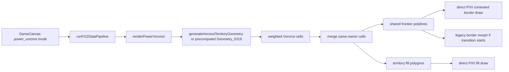
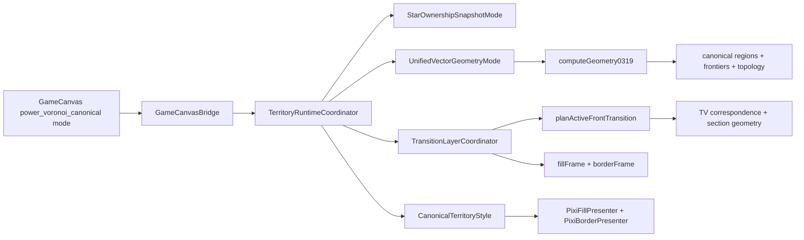

# Live PV vs Current PVV4 Geometry/Render Audit

Date: 2026-05-15

Current branch: `codex/render-infra/pvv4-transition-bets`

Current HEAD: `94b5f26073316cbb9f744a11054191f71b4de7ab`

Live reference: `origin/live` at `b6b621203a986b6aedb3b01d6749aa6c891842c2`

## Executive Conclusions

1. Current PVV4 is architecturally cleaner, but it is not yet a visibly superior geometry renderer. It wraps the same weighted Voronoi foundation in ownership, canonical geometry, topology, transition, presentation, and diagnostics layers.

2. The deployed `origin/live` PV path is direct and mature. It reads star ownership directly, computes power-Voronoi geometry, draws fills and contested borders immediately, and applies the older border transition machinery. It has fewer pipeline layers where a frontier can be reinterpreted incorrectly.

3. Current PVV4's strongest confirmed improvement is diagnostics. The geometry is not fundamentally different enough, under current effective settings, to look clearly superior. The main visible frontier is still generated by `computeGeometry0319` / weighted Voronoi.

4. Current PVV4 has additional tuning concepts: CX, LP, DX, MSR, topology snapshots, active fronts, Change Anchors, and TVs. These are real capabilities, but several are disabled, no-op in the power solve, or applied after the same base PV solve.

5. Live and current both still contain centroid-based transition utilities. Current PVV4 active-front correspondence does not use centroid matching for TV correspondence, but current legacy PV and shared border-transition code still do. These are separate paths and should not be conflated.

6. Current PVV4's visible parity or inferiority is explained by three practical facts: same PV base, weaker/disabled effective constraints, and a simpler current canonical presenter than the deployed direct renderer.

## Pipeline Comparison

### Deployed `origin/live` PV Path

Key references:

- `origin/live:pax-fluxia/src/lib/components/game/GameCanvas.svelte:1213-1233` dispatches `power_voronoi` to `renderPowerVoronoiModule`.
- `origin/live:pax-fluxia/src/lib/renderers/PowerVoronoiRenderer.ts:780-804` builds the stage config and computes PV geometry.
- `origin/live:pax-fluxia/src/lib/renderers/PowerVoronoiRenderer.ts:860-899` draws fills and contested borders directly.
- `origin/live:pax-fluxia/src/lib/renderers/PowerVoronoiRenderer.ts:930-948` starts the older border transition handler.

### Current PVV4 Canonical Path

Key references:

- `pax-fluxia/src/lib/components/game/GameCanvas.svelte:2759-2791` builds the canonical input.
- `pax-fluxia/src/lib/components/game/GameCanvas.svelte:6538-6562` dispatches `power_voronoi_canonical`.
- `pax-fluxia/src/lib/territory/runtime/TerritoryRuntimeCoordinator.ts:141-184` runs ownership, geometry, transition, and presentation.
- `pax-fluxia/src/lib/territory/integration/GameCanvasTerritoryBridge.ts:49-70` runs the runtime and presents the frame.
- `pax-fluxia/src/lib/territory/layers/geometry/compiler_UnifiedVectorGeometry.ts:150-188` calls `computeGeometry0319` and converts output into canonical frontier data.
- `pax-fluxia/src/lib/territory/layers/transition/TransitionLayerCoordinator.ts:176-192` plans active fronts on conquest.
- `pax-fluxia/src/lib/territory/layers/presentation/modes/CanonicalTerritoryStyle.ts:18-24` builds draw commands from the transition snapshot.

## Ownership Layer

### Live

Live PV does not have a separate ownership layer for this mode. The renderer reads `star.ownerId` directly and detects changed-owner stars from the prior rendered cell cache.

Reference:

- `origin/live:pax-fluxia/src/lib/renderers/PowerVoronoiRenderer.ts:826-842` compares current cells to `s.lastCells` and logs changed site ids.

Practical effect:

- Simpler and direct.
- No explicit conquest event identity inside the PV renderer.
- Multi-conquest semantics are implicit and inferred from changed cells.

### Current PVV4

PVV4 has an explicit ownership snapshot.

Reference:

- `pax-fluxia/src/lib/territory/layers/ownership/modes/StarOwnershipSnapshotMode.ts:18-38` builds `starOwners`, contested lanes, conquest events, and returns `virtualStars: []`.
- `pax-fluxia/src/lib/territory/layers/ownership/modes/StarOwnershipSnapshotMode.ts:41-118` prefers authoritative engine conquest events and uses ownership diffs as fallback.

Practical effect:

- Better for correctness and diagnostics.
- Conquest identity can include attacker data and engine combat details.
- Virtual stars are correctly absent from ownership. Geometry helper sites still exist in the geometry layer only.

Conclusion:

Current ownership is superior for the intended PVV4 design. It does not explain why live looks better; it explains why current has better diagnostics and can eventually handle multi-conquest transitions correctly.

## Geometry Layer

### Shared Foundation

Both live and current rely on weighted Voronoi generation.

Live reference:

- `origin/live:pax-fluxia/src/lib/territory/compiler/Geometry_0319.ts:130-181` builds weighted sites and runs `d3-weighted-voronoi`.

Current reference:

- `pax-fluxia/src/lib/territory/compiler/Geometry_0319.ts:146-228` builds weighted sites and runs `d3-weighted-voronoi`.

Conclusion:

Current PVV4 is not a new territory solver. It is a canonical/runtime architecture around weighted Voronoi with additional constraints and post-processing.

### Star Margin / MSR

Live uses `MODIFIED_VORONOI_STAR_MARGIN` as weighted Voronoi site weight.

Live reference:

- `origin/live:pax-fluxia/src/lib/territory/compiler/Geometry_0319.ts:131-137` sets `weight: starMargin * starMargin`.

Current uses the same star-margin value twice:

- as `starWeight`, which becomes the weighted Voronoi site weight.
- as `msrPx`, which is applied after fill construction as explicit minimum star margin.

Current references:

- `pax-fluxia/src/lib/territory/geometry/geometryTuning.ts:213-240` maps `starMargin` to `starWeight` and `msrPx`.
- `pax-fluxia/src/lib/territory/compiler/Geometry_0319.ts:147-154` uses `starWeight * starWeight` for site weight.
- `pax-fluxia/src/lib/territory/compiler/Geometry_0319.ts:337-341` applies explicit minimum star margin after fill construction.
- `pax-fluxia/src/lib/territory/geometry/minStarMargin.ts:200-220` rewrites region rings around protected star radius.

Conclusion:

Current has a stronger MSR mechanism than live, but it is a post-fill shape rewrite. It is not part of the weighted Voronoi solve. This can improve local star protection, but it can also create geometry aftereffects if it is not coordinated with frontier topology.

### CX

Live has same-owner corridor helper sites on straight lane chords.

Live reference:

- `origin/live:pax-fluxia/src/lib/territory/compiler/Geometry_0319.ts:139-150` adds corridor virtual sites.
- `origin/live:pax-fluxia/src/lib/renderers/territoryFeatures.ts:105-158` builds same-owner corridor sites.

Current splits this into explicit CX and LP helpers and can use lane polylines rather than only straight chords.

Current references:

- `pax-fluxia/src/lib/territory/compiler/Geometry_0319.ts:161-177` adds CX sites.
- `pax-fluxia/src/lib/territory/corridor/buildCorridorVirtualSites.ts:109-185` builds same-owner CX sites along straight or curved lane paths.

Effective setting issue:

- Current session settings have `MODIFIED_VORONOI_CORRIDOR_ENABLED: false` and `TERRITORY_CX_COUNT: 0` in `common/resources/settings-live/current-settings.json:314-317`.
- If those settings are active, CX contributes no visible geometry improvement.

Conclusion:

Current CX is more capable than live, but if disabled or zero-count, live and current remain visually close.

### LP

Live has no explicit LP concept. It only has same-owner corridor helper sites.

Current has LP helper sites for contested lanes.

Current references:

- `pax-fluxia/src/lib/territory/compiler/Geometry_0319.ts:179-200` adds LP sites when CX is enabled.
- `pax-fluxia/src/lib/territory/corridor/buildCorridorVirtualSites.ts:188-220` starts LP site generation.

Effective setting issue:

- Current session settings have `TERRITORY_CX_CONTEST_MIDPOINT_VSTARS: false` in `common/resources/settings-live/current-settings.json:318`.
- LP is also gated inside the `config.cxEnabled` block in `Geometry_0319.ts`.

Conclusion:

Current has an LP mechanism that live does not, but it may currently be off. Also, LP being nested under `cxEnabled` means contested-lane constraints depend on the broader corridor switch. That is probably too coupled for the final constraint model.

### DX

This is a meaningful live/current difference.

Live uses disconnect helper sites inside the weighted Voronoi solve.

Live references:

- `origin/live:pax-fluxia/src/lib/territory/compiler/Geometry_0319.ts:152-163` adds disconnect virtual sites with `DISCONNECT_OWNER_ID`.
- `origin/live:pax-fluxia/src/lib/territory/compiler/Geometry_0319.ts:199-217` resolves disconnect-site ownership after the Voronoi solve.

Current does not insert disconnect sites into the power solve in `Geometry_0319`.

Current references:

- `pax-fluxia/src/lib/territory/compiler/Geometry_0319.ts:203-206` has an enabled DX block that creates no sites.
- `pax-fluxia/src/lib/territory/compiler/Geometry_0319.ts:323-336` applies DX after fill construction.
- `pax-fluxia/src/lib/territory/geometry/disconnectZones.ts:100-170` builds explicit disconnect zones.
- `pax-fluxia/src/lib/territory/geometry/disconnectZones.ts:202-240` moves points inside those zones.

Conclusion:

Live DX affects the Voronoi solve. Current DX is a post-fill rewrite. Those are not equivalent. This is one concrete place where live can look better or more natural if the old solve-time helper-site behavior was visually useful.

### Region Identity

Live merges territories but does not expose canonical region identity to the renderer path.

Current canonical geometry attaches region identity and star membership.

Current references:

- `pax-fluxia/src/lib/territory/layers/geometry/compiler_UnifiedVectorGeometry.ts:389-406` builds canonical regions with `starIds`, `anchorStarIds`, and stable region IDs.

Conclusion:

Current is better positioned to solve island collapse and multi-region transition cases correctly. This benefit only matters if the active-front planner uses that region truth as the primary source.

## Transition Layer

### Live

Live uses older border and fill transition logic. It includes centroid-based matching and collapse/expand behavior.

Live references:

- `origin/live:pax-fluxia/src/lib/renderers/PowerVoronoiRenderer.ts:336-390` uses owner-pair grouping plus nearest centroid for polyline matching.
- `origin/live:pax-fluxia/src/lib/renderers/geometry/borderTransition.ts:77-160` matches borders by owner pair, centroid distance, and endpoint distance.
- `origin/live:pax-fluxia/src/lib/renderers/geometry/borderTransition.ts:467-550` matches fill polygons by owner and nearest centroid, with centroid collapse/expand for unmatched regions.

Conclusion:

Live can look smooth in many cases, but this is not the specified PVV4 active-front algorithm. It is also not acceptable as the final algorithm because centroid matching has already been rejected for PVV4 transition semantics.

### Current PVV4

Current PVV4 uses active-front planning from frontier topology.

Current references:

- `pax-fluxia/src/lib/territory/layers/transition/ActiveFrontTransition.ts:218-252` builds stable anchors, chains between anchors, and conquest-relevant anchor-pair keys.
- `pax-fluxia/src/lib/territory/layers/transition/ActiveFrontTransition.ts:291-344` finds changed spans and creates active fronts.
- `pax-fluxia/src/lib/territory/layers/transition/ActiveFrontTransition.ts:351-360` adds region-level active-front fallbacks.
- `pax-fluxia/src/lib/territory/layers/transition/ActiveFrontTransition.ts:399-518` maps next-only local frontiers to previous region-front sources.
- `pax-fluxia/src/lib/territory/layers/transition/ActiveFrontTransition.ts:607-619` uses monotone correspondence cost, not centroid, for region-front source selection.
- `pax-fluxia/src/lib/territory/layers/transition/ActiveFrontTransition.ts:1959-2035` builds PRE TVs, POST TVs, active TVs, and Change Anchors.
- `pax-fluxia/src/lib/territory/layers/transition/ActiveFrontTransition.ts:2288-2385` implements monotone minimum-travel PRE TV selection.
- `pax-fluxia/src/lib/territory/layers/transition/ActiveFrontTransition.ts:947-983` rebuilds fill loops from active section geometry.

Important current limitation:

- `getActiveFrontMonotonicCorrespondence` returns `null` for split modes at `ActiveFrontTransition.ts:1964-1966`.
- Split and merge active fronts still fall through to older path-level interpolation, not the TV correspondence path.
- `splitByNearest` and `mergeByNearest` exist at `ActiveFrontTransition.ts:2083-2105`, but these are not the full M:N TV correspondence algorithm.

Conclusion:

Current PVV4 is closer to the intended transition design than live, but it is still incomplete for valid M:N active-front cases. A changed region can produce multiple active fronts, and the planner now has a fallback path for that, but split/merge TV correspondence is still not fully implemented.

## Render Layer

### Live

Live directly draws from generated fill polygons and shared polylines.

Live references:

- `origin/live:pax-fluxia/src/lib/renderers/PowerVoronoiRenderer.ts:860-864` draws fill polygons.
- `origin/live:pax-fluxia/src/lib/renderers/PowerVoronoiRenderer.ts:876-899` assigns contested border colors and draws shared polylines.
- `origin/live:pax-fluxia/src/lib/renderers/PowerVoronoiRenderer.ts:930-948` supports legacy border morph handlers.

Practical effect:

- Fewer adapters.
- Less chance that a canonical conversion or topology rebuild changes the geometry.
- Deployed PV has mature border styling and transition code, even though its matching algorithm is not the PVV4 target.

### Current PVV4

Current canonical presentation is intentionally simple.

Current references:

- `pax-fluxia/src/lib/territory/layers/presentation/builders/FillDrawCommandBuilder.ts:5-15` turns `fillFrame.regions` into fill commands.
- `pax-fluxia/src/lib/territory/layers/presentation/builders/BorderDrawCommandBuilder.ts:5-15` turns `borderFrame.frontiers` into border commands.
- `pax-fluxia/src/lib/territory/adapters/pixi/PixiFillPresenter.ts:33-57` draws polygons with `PIXI.Graphics.poly`.
- `pax-fluxia/src/lib/territory/adapters/pixi/PixiBorderPresenter.ts:42-62` draws polylines with `PIXI.Graphics.poly(..., false)`.

Practical effect:

- Easy to reason about.
- Good for diagnostics.
- Not visually richer than live by default.
- No independent border morph when `TERRITORY_BORDER_TRANSITION_MODE` is `off`.

Conclusion:

Current canonical rendering is not yet superior as a visual renderer. It is superior as an inspection and composition layer.

## Settings And Effective Tuning Differences

Live defaults:

- `VORONOI_BORDER_SMOOTH: 2`
- `TERRITORY_BORDER_TRANSITION: 'pixi_graphics_morph'`
- `FRONTIER_RESOLUTION: 5`
- `MODIFIED_VORONOI_STAR_MARGIN: 45`

Live reference:

- `origin/live:pax-fluxia/src/lib/config/game.config.ts:1120-1159`

Current clean defaults:

- `TERRITORY_FILL_TRANSITION_MODE: 'pv_frontline'`
- `TERRITORY_BORDER_TRANSITION_MODE: 'off'`
- `TERRITORY_BORDER_TRANSITION: 'none'`
- `FRONTIER_RESOLUTION: 1`
- `MODIFIED_VORONOI_STAR_MARGIN: 75`
- `MODIFIED_VORONOI_CORRIDOR_SPACING: 10`
- `TERRITORY_CX_COUNT: 0`
- `MODIFIED_VORONOI_DISCONNECT_ENABLED: true`

Current reference:

- `pax-fluxia/src/lib/config/territory.config.ts:21-100`

Current local effective settings in this worktree:

- `TERRITORY_MORPH_CONTROL_POINTS: 30`
- `TERRITORY_FILL_TRANSITION_MODE: 'pv_frontline'`
- `TERRITORY_BORDER_TRANSITION_MODE: 'off'`
- `TERRITORY_RENDER_MODE: 'power_voronoi_canonical'`
- `TERRITORY_BORDER_TRANSITION: 'none'`
- `FRONTIER_RESOLUTION: 5`
- `MODIFIED_VORONOI_STAR_MARGIN: 45`
- `MODIFIED_VORONOI_CORRIDOR_ENABLED: false`
- `TERRITORY_CX_COUNT: 0`
- `TERRITORY_CX_CONTEST_MIDPOINT_VSTARS: false`
- `MODIFIED_VORONOI_DISCONNECT_ENABLED: false`

Current local reference:

- `common/resources/settings-live/current-settings.json:258-321`

Conclusion:

Under the local effective settings, current PVV4 disables the very constraints that should make it visibly different: CX is off, LP is off, DX is off, and star margin matches live. This is the most direct explanation for why it does not look superior in steady state.

## Centroid Audit

Centroid code exists in both live and current.

Where it matters:

- Live PV transition utilities use centroid matching for borders and fill polygons.
- Current legacy PV still includes the same centroid matcher.
- Current shared border-transition utilities still include centroid matching.

Where it does not currently drive PVV4 active-front TV correspondence:

- Current PVV4 active-front source selection uses `frontCorrespondenceCost`, which calls `monotoneCorrespondenceCost` and endpoint distance, not centroid.
- Current PVV4 TV correspondence uses sampled POST front and a monotone minimum-travel PRE candidate selection.

Current references:

- `pax-fluxia/src/lib/renderers/PowerVoronoiRenderer.ts:401-455` still contains centroid-based legacy polyline matching.
- `pax-fluxia/src/lib/renderers/geometry/borderTransition.ts:77-160` still contains centroid-based border matching.
- `pax-fluxia/src/lib/renderers/geometry/borderTransition.ts:485-565` still contains centroid-based fill comments and related legacy logic.
- `pax-fluxia/src/lib/territory/layers/transition/ActiveFrontTransition.ts:607-619` uses monotone cost for PVV4 region-front source selection.
- `pax-fluxia/src/lib/territory/layers/transition/ActiveFrontTransition.ts:1959-2035` builds TV correspondence without centroid matching.

Conclusion:

Centroids are not fully excised from the codebase. They are not the primary current PVV4 active-front TV algorithm, but they remain in legacy renderer paths and shared transition utilities. Any future audit or cleanup should distinguish "reachable from PVV4 canonical mode" from "still present in repo."

## Why Live Can Look Equal Or Better

1. Same geometric foundation. Both live and current produce territory from weighted Voronoi cells, same-owner merging, shared frontier polylines, Chaikin smoothing, and PIXI rendering.

2. Current visible constraints may be off. In local settings, CX, LP, and DX are effectively disabled. Star margin and smoothing match live.

3. Current canonical presenter is simpler. It draws transition frame polygons and polylines. Live has mature direct PV draw logic and border transition handlers.

4. Current PVV4 adds canonical topology and diagnostics, not automatically better pixels. Better pixels require concrete geometry and render improvements, not just layering.

5. Current DX differs from live. Live's DX affects the weighted Voronoi solve; current DX is post-fill surgery. That can make current less like the deployed visual mode in disconnect cases.

6. Current transition planner is still incomplete for valid split/merge cases. The active-front path handles simple fronts with TVs, but split modes do not yet expose full TV correspondence.

## Concrete Fix Targets

### Target 1: Establish Steady-State Geometry Parity Before Transition Tuning

Run the same map and settings through:

- `origin/live` `power_voronoi`
- current `power_voronoi`
- current `power_voronoi_canonical`

Compare:

- merged territory polygons
- shared frontier polylines
- world border polylines
- number of regions and frontiers
- sampled point counts and max point deviation

Reason:

If current PVV4 steady-state geometry does not match or intentionally improve live, transition debugging is contaminated.

### Target 2: Decide DX Architecture

Choose one:

- port live-style DX helper sites back into the weighted Voronoi solve, using the new DX semantics; or
- prove that explicit post-fill DX creates better geometry and does not break frontier topology.

Reason:

Current and live DX are not equivalent.

### Target 3: Decouple LP From CX Enablement

LP is conceptually independent from same-owner CX. The current `Geometry_0319.ts` implementation nests LP generation inside `if (config.cxEnabled)`.

Reason:

Contested-lane constraints should be tunable even if same-player corridor constraints are off.

### Target 4: Make PVV4 Visually Strong By Default

Current effective settings should not disable all differentiating constraints. Use a controlled profile that enables:

- MSR at intended value.
- CX for same-player corridors.
- LP for contested lanes.
- DX in the chosen architecture.
- enough frontier resolution for smooth transition.
- TV count appropriate for map scale.

Reason:

PVV4 cannot look superior if it is configured to be mostly plain PV.

### Target 5: Finish M:N Active-Front TV Correspondence

Current simple fronts can use monotone TV correspondence. Split/merge cases still need full active-front TV handling.

Required behavior:

- one changed region may emit multiple active fronts.
- PRE 1:M, POST M:1, and M:M cases are valid when they reflect real region topology.
- TVs must be assigned to minimize local travel while preserving monotonic order along each active front.
- repeated reversed section geometry should be treated as a topology construction defect, not accepted silently.

Reason:

The deployed PV renderer can look acceptable in simple cases, but PVV4's superiority depends on correct local active-front motion for all valid conquest cases.

### Target 6: Keep Diagnostics But Do Not Confuse Them With Render Quality

Current diagnostics are genuinely better. Keep them. But visible superiority must be measured separately:

- steady-state front shape quality
- conquest transition locality
- TV travel distance
- absence of snap
- absence of whole-region duplicate/collapse artifacts

## Short Code Map

Current PVV4 authoritative path:

- `pax-fluxia/src/lib/components/game/GameCanvas.svelte:6538-6562`
- `pax-fluxia/src/lib/territory/integration/GameCanvasTerritoryBridge.ts:49-70`
- `pax-fluxia/src/lib/territory/runtime/TerritoryRuntimeCoordinator.ts:141-184`
- `pax-fluxia/src/lib/territory/layers/ownership/modes/StarOwnershipSnapshotMode.ts:18-38`
- `pax-fluxia/src/lib/territory/layers/geometry/compiler_UnifiedVectorGeometry.ts:150-188`
- `pax-fluxia/src/lib/territory/compiler/Geometry_0319.ts:146-228`
- `pax-fluxia/src/lib/territory/layers/transition/TransitionLayerCoordinator.ts:176-268`
- `pax-fluxia/src/lib/territory/layers/transition/ActiveFrontTransition.ts:218-388`
- `pax-fluxia/src/lib/territory/layers/presentation/modes/CanonicalTerritoryStyle.ts:18-24`
- `pax-fluxia/src/lib/territory/adapters/pixi/PixiFillPresenter.ts:33-57`
- `pax-fluxia/src/lib/territory/adapters/pixi/PixiBorderPresenter.ts:42-62`

Live deployed PV path:

- `origin/live:pax-fluxia/src/lib/components/game/GameCanvas.svelte:1213-1233`
- `origin/live:pax-fluxia/src/lib/renderers/PowerVoronoiRenderer.ts:780-804`
- `origin/live:pax-fluxia/src/lib/territory/compiler/Geometry_0319.ts:130-181`
- `origin/live:pax-fluxia/src/lib/renderers/PowerVoronoiRenderer.ts:860-899`
- `origin/live:pax-fluxia/src/lib/renderers/PowerVoronoiRenderer.ts:930-948`

