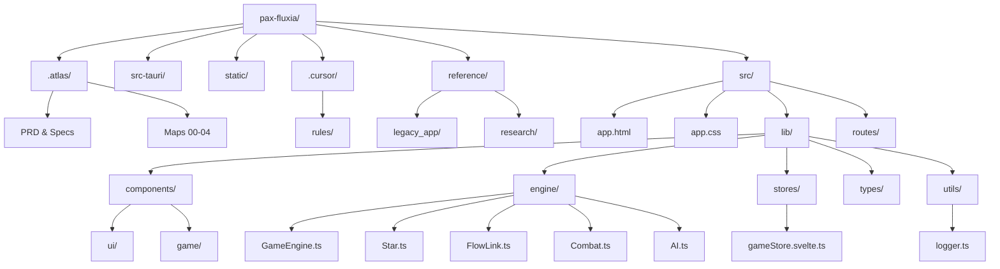

# VIEW A: THE PHYSICAL MAP (Space)

**Last Updated:** 2026-02-03
**Project:** Pax Fluxia  
**Stack:** Tauri 2.x + SvelteKit + PixiJS 8.x + TypeScript

---

---

## Physical Inventory

### Core Directories

| Path | Purpose |
|------|---------|
| [`src/lib/components/ui/`](../pax-fluxia/src/lib/components/ui/) | Svelte UI components (Menu, HUD, Modals) |
| [`src/lib/components/game/`](../pax-fluxia/src/lib/components/game/) | Game rendering wrapper (PixiJS canvas host) |
| [`src/lib/engine/`](../pax-fluxia/src/lib/engine/) | Pure TypeScript game logic (no framework deps) |
| [`src/lib/stores/`](../pax-fluxia/src/lib/stores/) | Svelte 5 Runes-based state management |
| [`src/lib/types/`](../pax-fluxia/src/lib/types/) | TypeScript type definitions |
| [`src/lib/utils/`](../pax-fluxia/src/lib/utils/) | Helper functions (math, rendering, logging) |
| [`src/routes/`](../pax-fluxia/src/routes/) | SvelteKit routing (single page for MVP) |
| [`src-tauri/`](../pax-fluxia/src-tauri/) | Tauri Rust backend (minimal for MVP) |
| [`.atlas/`](./) | Living architecture documentation |
| [`.cursor/rules/`](../.cursor/rules/) | Agent behavioral rules |
| [`reference/`](../reference/) | Legacy code and research material |

---

### Key Files

| File | Layer | Purpose |
|------|-------|---------|
| [`GameEngine.ts`](../pax-fluxia/src/lib/engine/GameEngine.ts) | Engine | Authoritative tick loop, game state, rules |
| [`Star.ts`](../pax-fluxia/src/lib/engine/Star.ts) | Engine | Star entity: production, ships, ownership |
| [`gameStore.svelte.ts`](../pax-fluxia/src/lib/stores/gameStore.svelte.ts) | Store | Reactive game state bridge (Runes) |
| [`GameCanvas.svelte`](../pax-fluxia/src/lib/components/game/GameCanvas.svelte) | View | PixiJS Application host and render loop |
| [`logger.ts`](../pax-fluxia/src/lib/utils/logger.ts) | Utils | Structured visual telemetry (No console.log) |

---

*Update this file when: Creating, renaming, moving, or deleting files/directories.*
