# VIEW A: THE PHYSICAL MAP (Space)

**Last Updated:** 2026-02-12  
**Project:** Pax Fluxia  
**Stack:** SvelteKit + PixiJS 8.x + TypeScript + Colyseus (MP) + Bun

---

## Monorepo Structure

```mermaid
graph TD
    Root["PRISM-Atlas-DART v1/"] --> Common["common/"]
    Root --> Client["pax-fluxia/"]
    Root --> Server["pax-server/"]
    Root --> Atlas[".atlas/"]
    Root --> Agent[".agent/"]

    %% Common Package (@pax/common)
    Common --> CSrc["src/"]
    CSrc --> CEngine["engine/"]
    CSrc --> CConfig["config.ts"]
    CSrc --> CCombat["combat.ts"]
    CSrc --> CConquest["conquest.ts"]
    CSrc --> CProduction["production.ts"]
    CSrc --> CRepair["repair.ts"]
    CSrc --> COrders["orders.ts"]
    CSrc --> CTypes["types.ts"]
    CEngine --> CGameEngine["GameEngine.ts (stateless)"]

    %% Client Package (pax-fluxia)
    Client --> FLib["src/lib/"]
    FLib --> FEngine["engine/"]
    FLib --> FComponents["components/"]
    FLib --> FStores["stores/"]
    FLib --> FConfig["config/"]
    FLib --> FTypes["types/"]
    FLib --> FUtils["utils/"]

    FEngine --> FGameEngine["GameEngine.ts (stateful, SP)"]
    FEngine --> FStar["Star.ts"]
    FEngine --> FCombat["Combat.ts"]
    FEngine --> FAI["AI.ts"]
    FEngine --> FHexGrid["HexGrid.ts"]

    FComponents --> FUI["ui/"]
    FComponents --> FGame["game/"]
    FGame --> FCanvas["GameCanvas.svelte"]
    FUI --> FMenu["MainMenu.svelte"]
    FUI --> FHUD["GameHUD.svelte"]
    FUI --> FCombatPanel["CombatDebugPanel.svelte"]

    FStores --> FActiveStore["activeGameStore.svelte.ts"]
    FStores --> FGameStore["gameStore.svelte.ts"]
    FStores --> FMPStore["multiplayerStore.svelte.ts"]

    FConfig --> FGameConfig["game.config.ts"]

    %% Server Package (pax-server)
    Server --> SSrc["src/"]
    SSrc --> SRooms["rooms/"]
    SSrc --> SSchema["schema/"]
    SRooms --> SGameRoom["GameRoom.ts"]
    SSchema --> SGameState["GameState.schema.ts"]
```

---

## Package Inventory

| Package | Path | Purpose | Key Dependency |
|---------|------|---------|----------------|
| **@pax/common** | `common/` | Shared game logic (stateless), types, config | None |
| **pax-fluxia** | `pax-fluxia/` | SvelteKit client (PixiJS rendering, SP engine, UI) | `@pax/common` |
| **pax-server** | `pax-server/` | Colyseus MP server (room lifecycle, tick delegation) | `@pax/common` |

---

## Key Directories

| Path | Purpose |
|------|---------|
| `common/src/` | Shared game logic: combat, conquest, production, repair, orders, config |
| `common/src/engine/` | Stateless `GameEngine` (used by server) |
| `pax-fluxia/src/lib/engine/` | Stateful SP engine (tick loop, AI, map gen, combat) |
| `pax-fluxia/src/lib/components/ui/` | Svelte UI components (menus, HUD, debug panels) |
| `pax-fluxia/src/lib/components/game/` | PixiJS canvas host and render loop |
| `pax-fluxia/src/lib/stores/` | Svelte 5 Runes state — `activeGameStore` is the SP/MP facade |
| `pax-fluxia/src/lib/config/` | Client-side `GAME_CONFIG` (mutable, localStorage-persisted) |
| `pax-fluxia/src/lib/types/` | TypeScript type definitions |
| `pax-fluxia/src/lib/utils/` | Helpers: logger, math, rendering |
| `pax-server/src/rooms/` | Colyseus `GameRoom` (MP tick loop, AI, map gen) |
| `pax-server/src/schema/` | Colyseus schema definitions (`GameRoomState`, `StarSchema`, etc.) |
| `.atlas/` | Living architecture documentation |
| `.agent/` | Agent behavioral rules and workflows |

---

## Key Files

| File | Layer | Purpose |
|------|-------|---------|
| [`GameEngine.ts`](../common/src/engine/GameEngine.ts) | Common | Stateless tick processor (production → orders → repair → win check) |
| [`config.ts`](../common/src/config.ts) | Common | `STAR_TYPE_STATS`, `EngineConfig`, `DEFAULT_ENGINE_CONFIG` |
| [`combat.ts`](../common/src/combat.ts) | Common | `calculateCombat()` — symmetric damage with lethality split |
| [`conquest.ts`](../common/src/conquest.ts) | Common | `applyConquest()` — ownership transfer, scatter/retreat |
| [`production.ts`](../common/src/production.ts) | Common | `applyProduction()` — overflow-based integer ship generation |
| [`repair.ts`](../common/src/repair.ts) | Common | `applyRepair()` — overflow-based healing with combat penalty |
| [`orders.ts`](../common/src/orders.ts) | Common | Order validation, `calculateTransfer()` |
| [`GameEngine.ts`](../pax-fluxia/src/lib/engine/GameEngine.ts) | Client | SP engine: tick loop, AI, map gen, combat, logging (1594 lines) |
| [`Star.ts`](../pax-fluxia/src/lib/engine/Star.ts) | Client | Star entity with `produce()`, `repair()`, `takeDamage()` |
| [`AI.ts`](../pax-fluxia/src/lib/engine/AI.ts) | Client | Configurable AI with thresholds |
| [`HexGrid.ts`](../pax-fluxia/src/lib/engine/HexGrid.ts) | Client | Hex grid + Delaunay map generation |
| [`game.config.ts`](../pax-fluxia/src/lib/config/game.config.ts) | Client | Mutable `GAME_CONFIG` with localStorage persistence |
| [`activeGameStore.svelte.ts`](../pax-fluxia/src/lib/stores/activeGameStore.svelte.ts) | Client | SP/MP facade — routes calls to either SP engine or MP Colyseus |
| [`GameCanvas.svelte`](../pax-fluxia/src/lib/components/game/GameCanvas.svelte) | Client | PixiJS render loop, ship animation, input handling |
| [`GameRoom.ts`](../pax-server/src/rooms/GameRoom.ts) | Server | Colyseus room: lifecycle, message handlers, tick delegation |
| [`GameState.schema.ts`](../pax-server/src/schema/GameState.schema.ts) | Server | Colyseus schema definitions for synced state |

---

*Update this file when: Creating, renaming, moving, or deleting files/directories.*
