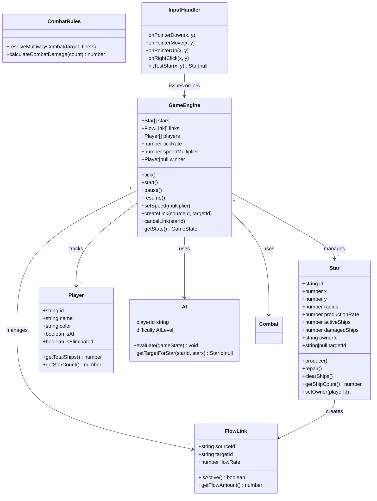

# VIEW B: THE ASSET INVENTORY (Matter)

**Last Updated:** 2026-01-29  
**Project:** Pax Fluxia

---

## Class Diagram



---

## Types & Interfaces

### Core Game Types (`src/lib/types/game.types.ts`)

| Type | Definition | Purpose |
|------|------------|---------|
| `GameView` | `'menu' \| 'game' \| 'results'` | Current screen state |
| `GameSpeed` | `0 \| 1 \| 2 \| 4 \| 10` | Speed multiplier (0 = paused) |
| `GameState` | `{ stars, links, players, tick, winner }` | Snapshot for UI binding |
| `CombatResult` | `{ attackerLoss, defenderLoss, captured }` | Combat resolution output |
| `Order` | `{ type, sourceId, targetId? }` | Player/AI command |

### Star Types (`src/lib/types/star.types.ts`)

| Type | Definition | Purpose |
|------|------------|---------|
| [`StarId`](../pax-fluxia/src/lib/types/star.types.ts) | `string` | Unique star identifier |
| [`StarConfig`](../pax-fluxia/src/lib/types/star.types.ts) | `{ x, y, radius, productionRate }` | Star spawn configuration |
| [`StarState`](../pax-fluxia/src/lib/types/star.types.ts) | `{ id, x, y, activeShips, damagedShips, ownerId }` | Runtime star state |

### Player Types (`src/lib/types/player.types.ts`)

| Type | Definition | Purpose |
|------|------------|---------|
| `PlayerId` | `string` | Unique player identifier |
| `PlayerConfig` | `{ name, color, isAI, difficulty? }` | Player initialization |
| `AILevel` | `'easy' \| 'normal' \| 'hard' \| 'expert'` | AI difficulty level |

---

## Exported Functions

### Engine Functions

| Function | File | Signature | Purpose |
|----------|------|-----------|---------|
| `createEngine` | `GameEngine.ts` | `(config: EngineConfig) => GameEngine` | Factory for game engine |
| `generateMap` | `GameEngine.ts` | `(players: Player[], template: string) => Star[]` | Create star layout |

### Combat Functions

| Function | File | Signature | Purpose |
|----------|------|-----------|---------|
| [`resolveMultiwayCombat`](../pax-fluxia/src/lib/engine/CombatRules.ts) | `CombatRules.ts` | `(target, fleets, stars, tick) => void` | Multi-faction combat resolution |
| [`calculateCombatDamage`](../pax-fluxia/src/lib/engine/CombatRules.ts) | `CombatRules.ts` | `(attack, defense, isDefending) => number` | Asymmetric Damage Calculation |

### Utility Functions

| Function | File | Signature | Purpose |
|----------|------|-----------|---------|
| `lerp` | `math.utils.ts` | `(a, b, t) => number` | Linear interpolation |
| `distance` | `math.utils.ts` | `(x1, y1, x2, y2) => number` | Euclidean distance |
| `clamp` | `math.utils.ts` | `(value, min, max) => number` | Constrain value |
| [`randomColor`](../pax-fluxia/src/lib/utils/render.utils.ts) | `render.utils.ts` | `() => string` | Generate player color |
| [`getOrbitSlot`](../pax-fluxia/src/lib/utils/render.utils.ts) | `render.utils.ts` | `(index, cx, cy, starRadius, time, biasAngle?, biasStrength?) => {x, y, multiplier}` | Ship orbit packing with stacking |
| [`getOuterOrbitRadius`](../pax-fluxia/src/lib/utils/render.utils.ts) | `render.utils.ts` | `(starRadius, shipCount) => number` | Outermost occupied ring radius |
| [`renderStars`](../pax-fluxia/src/lib/components/game/GameCanvas.svelte) | `GameCanvas.svelte` | `(stars: StarState[]) => void` | Render static star field and attributes |
| [`updateTerritories`](../pax-fluxia/src/lib/engine/GameEngine.ts) | `GameEngine.ts` | `(width, height) => void` | Calculate Voronoi territory ownership |

---

## Stores

| Store | File | State Shape | Purpose |
|-------|------|-------------|---------|
| `gameStore` | `gameStore.svelte.ts` | `GameStoreState` | Reactive bridge between Engine and UI |

### UI Components (Svelte)
- **GameLayout**: Main container.
- **GameMap**: PixiJS Stage wrapper.
- **GameHUD**: Overlay for UI controls.
- **TickOrb**: Visualizer for game tick progress (Pulsing Orb).

### GameStoreState

```typescript
interface GameStoreState {
  currentView: GameView;
  engine: GameEngine | null;
  settings: GameSettings;
  tickProgress: number;  // 0-1 for metronome
  lastSnapshot: GameState | null;
}

interface GameSettings {
  map: 'empire' | 'random';
  playerCount: 2 | 3 | 4 | 5 | 6;
  difficulty: AILevel;
}
```

---

## Constants

| Constant | File | Value | Purpose |
|----------|------|-------|---------|
| [`BASE_TICK_MS`](../pax-fluxia/src/lib/config/game.config.ts) | `game.config.ts` | `750` | 80 BPM tick interval |
| [`MIN_TICK_MS`](../pax-fluxia/src/lib/config/game.config.ts) | `game.config.ts` | `75` | Max speed (10x) tick |
| [`REPAIR_RATE`](../pax-fluxia/src/lib/config/game.config.ts) | `game.config.ts` | `0.20` | Repair per tick (20%) |
| [`REPAIR_COMBAT_PENALTY`](../pax-fluxia/src/lib/config/game.config.ts) | `game.config.ts` | `0.1` | Penalty when pinned (Effectively 2%) |
| [`OVERWHELM_THRESHOLD`](../pax-fluxia/src/lib/config/game.config.ts) | `game.config.ts` | `0.1` | <10% force = Instant Surrender |
| [`ORBIT_DENSITY`](../pax-fluxia/src/lib/config/game.config.ts) | `game.config.ts` | `1.5` | Ship spacing per ring (higher = fewer per ring) |
| [`ATTACK_SURGE_MULT`](../pax-fluxia/src/lib/config/game.config.ts) | `game.config.ts` | `0.4` | Attack surge displacement (fraction of star radius) |
| [`SHIP_BASE_SIZE`](../pax-fluxia/src/lib/config/game.config.ts) | `game.config.ts` | `4` | Base ship circle radius (px) |
| [`ORBIT_RING_MULT`](../pax-fluxia/src/lib/config/game.config.ts) | `game.config.ts` | `1.4` | Ring spacing = BASE_SIZE × this |
| [`SETTLE_DURATION_MS`](../pax-fluxia/src/lib/config/game.config.ts) | `game.config.ts` | `150` | Ship settle-into-orbit time |
| [`WOBBLE_AMP`](../pax-fluxia/src/lib/config/game.config.ts) | `game.config.ts` | `12` | Travel wobble amplitude (px) |

---

*Update this file when: Exporting new functions, classes, or types; changing signatures.*
