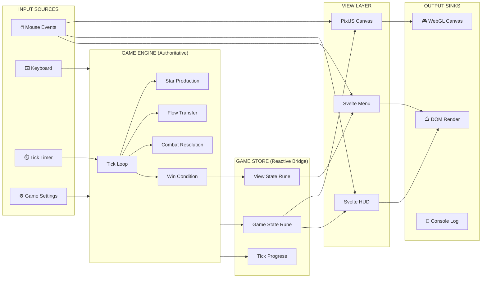

# VIEW C: THE I/O REGISTRY (Boundaries)

**Last Updated:** 2026-01-29  
**Project:** Pax Fluxia

---

## System Data Flow



---

## Data Sources

| Source | Type | Location | Data Shape | Frequency |
|--------|------|----------|------------|-----------|
| Mouse Click | DOM Event | `GameCanvas.svelte` | `{x, y, button}` | On demand |
| Mouse Drag | DOM Event | `GameCanvas.svelte` | `{startX, startY, endX, endY}` | On demand |
| Right Click | DOM Event | `GameCanvas.svelte` | `{x, y, targetStarId}` | On demand |
| Tick Timer | setInterval | `GameEngine.ts` | `tickNumber: number` | 75-750ms |
| Settings Form | Rune | `MainMenu.svelte` | `GameSettings` | On change |
| Speed Button | Click | `SpeedControls.svelte` | `GameSpeed` | On demand |
| Debug Panel | Tweakpane | `DebugPanel.svelte` | `GameConfig` | Real-time |

---

## Data Sinks

| Sink | Type | Location | Data Shape | Update Trigger |
|------|------|----------|------------|----------------|
| [Star Sprites](../pax-fluxia/src/lib/components/game/GameCanvas.svelte#L269) | PixiJS | `GameCanvas.svelte` | `{x, y, color, shipCount}[]` | Every tick |
| [Ship Animations](../pax-fluxia/src/lib/components/game/GameCanvas.svelte#L437) | PixiJS | `GameCanvas.svelte` | `{orbitAngle, surgeProgress}` | Every frame |
| [Flow Lines](../pax-fluxia/src/lib/components/game/GameCanvas.svelte#L394) | PixiJS | `GameCanvas.svelte` | `{fromX, fromY, toX, toY, color}[]` | Every tick |
| Leaderboard | DOM | `Leaderboard.svelte` | `PlayerStats[]` | Every tick |
| Tick Metronome | DOM | TickOrb | `tickProgress` (0.0-1.0), `opacity`, `scale` | Visual pulse |
| Console Log | Browser | Various | Debug messages | Dev only |

---

## Transformations

| Transform | Input | Output | Location | Purpose |
|-----------|-------|--------|----------|---------|
| `screenToWorld` | `{screenX, screenY}` | `{worldX, worldY}` | `render.utils.ts` | Mouse position to game coords |
| `starAtPoint` | `{x, y, stars[]}` | `Star \| null` | `GameEngine.ts` | Raycast hit detection |
| `interpolateShips` | `{prev, next, t}` | `{x, y}[]` | `render.utils.ts` | Animation frame positions |
| `engineToSnapshot` | `GameEngine` | `GameState` | `GameEngine.ts` | Serializable state for UI |
| `snapshotToRender` | `GameState` | `RenderData` | `GameCanvas.svelte` | Pixi-ready render data |

---

## Contract: Engine ↔ Store

```typescript
// What the Engine PROVIDES to the Store
interface EngineOutput {
  getState(): GameState;       // Full snapshot
  getTickProgress(): number;   // 0-1 for metronome
  getWinner(): Player | null;  // Win condition
}

// What the Store SENDS to the Engine
interface StoreCommands {
  start(settings: GameSettings): void;
  pause(): void;
  resume(): void;
  setSpeed(multiplier: GameSpeed): void;
  createLink(sourceId: StarId, targetId: StarId): void;
  cancelLink(starId: StarId): void;
  restart(): void;
  destroy(): void;
}
```

---

## Contract: Store ↔ View

```typescript
// Reactive state the View READS (Runes)
interface ViewReads {
  currentView: GameView;
  settings: GameSettings;
  tickProgress: number;
  snapshot: GameState | null;
}

// Actions the View DISPATCHES
interface ViewActions {
  setView(view: GameView): void;
  updateSettings(settings: Partial<GameSettings>): void;
  startGame(): void;
  pauseGame(): void;
  resumeGame(): void;
  setSpeed(speed: GameSpeed): void;
  issueOrder(source: StarId, target: StarId): void;
  cancelOrder(star: StarId): void;
  surrender(): void;
  playAgain(): void;
  returnToMenu(): void;
}
```

---

## Contract: View ↔ PixiJS

```typescript
// Data the Pixi Renderer CONSUMES
interface RenderData {
  stars: {
    id: StarId;
    x: number;
    y: number;
    radius: number;
    color: string;
    activeShips: number;
    damagedShips: number;
    isSelected: boolean;
  }[];
  links: {
    fromX: number;
    fromY: number;
    toX: number;
    toY: number;
    color: string;
    strength: number;
  }[];
  animations: {
    type: 'surge' | 'orbit';
    progress: number;  // 0-1
  };
}

// Events PixiJS EMITS to Svelte
interface PixiEvents {
  onStarClick(starId: StarId): void;
  onStarRightClick(starId: StarId): void;
  onDragStart(starId: StarId): void;
  onDragEnd(targetStarId: StarId | null): void;
  onCanvasClick(x: number, y: number): void;
}
```

---

## Boundary Rules

> [!IMPORTANT]
> **The Engine knows nothing about Svelte or PixiJS.** It only exposes pure TypeScript interfaces.

> [!IMPORTANT]
> **The Store is the ONLY bridge.** Views never import from `$engine/*` directly.

> [!IMPORTANT]
> **PixiJS runs in requestAnimationFrame.** Engine runs in setInterval. They sync via Store snapshots.

---

*Update this file when: Adding API calls, storage operations, new stores, or changing data contracts.*
