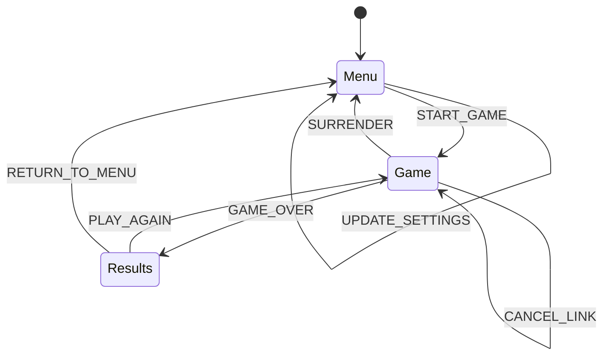
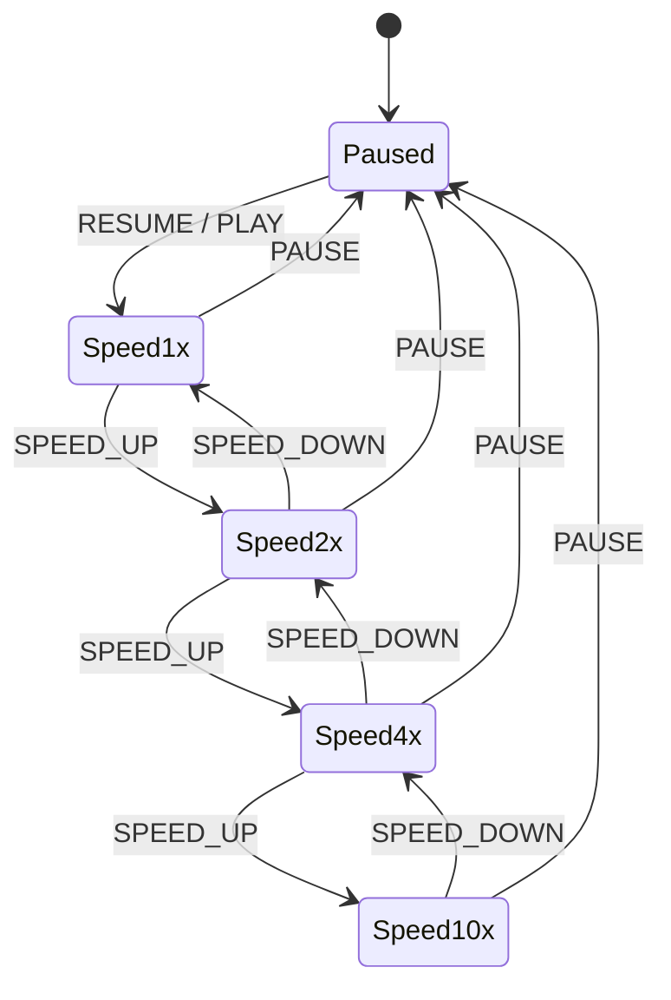
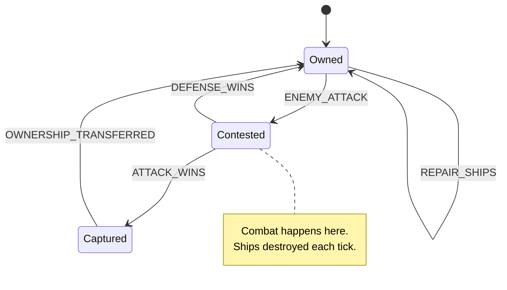

# VIEW D: THE EVENT MATRIX (Time/Causality)

**Last Updated:** 2026-01-29  
**Project:** Pax Fluxia

---

## State Machines

### Application View FSM



### Game Speed FSM



### Star Ownership FSM



### Ship State FSM

    stateDiagram-v2
    [*] --> Idle
    
    Idle --> Attacking : FLOW_LINK_CREATED
    Idle --> Idle : ORBIT_ANIMATION
    
    Attacking --> Idle : LINK_CANCELLED / RETREAT
    Attacking --> Attacking : SURGE_ANIMATION
    Attacking --> Combat : TICK_RESOLVES
    
    Combat --> Damaged : TOOK_DAMAGE
    Combat --> Destroyed : KILLED
    Combat --> Attacking : SURVIVED
    
    Damaged --> Idle : REPAIRED
    Damaged --> Destroyed : KILLED_WHILE_CONQUERED
    Damaged --> Captured : CAPTURED_ON_CONQUEST
    
    Destroyed --> [*]
    Captured --> Damaged : OWNERSHIP_FLIP

---

## Event → Handler Mapping

### User Input Events

| Trigger | Source | Handler | State Change | Linked Story |
|---------|--------|---------|--------------|--------------|
| `click:start` | MainMenu | [`startGame()`](../pax-fluxia/src/lib/components/ui/MainMenu.svelte) | Menu → Game | US-001 |
| `click:pause` | SpeedControls | [`pauseGame()`](../pax-fluxia/src/lib/components/ui/SpeedControls.svelte) | Speed → Paused | US-004 |
| `click:speed` | SpeedControls | [`setSpeed(n)`](../pax-fluxia/src/lib/components/ui/SpeedControls.svelte) | Speed FSM transition | US-004 |
| `drag:start` | GameCanvas | [`beginLinkDrag()`](../pax-fluxia/src/lib/components/game/GameCanvas.svelte) | UI drag state | US-002 |
| `drag:end` | GameCanvas | [`createLink()`](../pax-fluxia/src/lib/components/game/GameCanvas.svelte) | Create FlowLink | US-002 |
| `rightclick:star` | GameCanvas | [`cancelLink()`](../pax-fluxia/src/lib/components/game/GameCanvas.svelte) | Remove FlowLink | US-003 |
| `click:surrender` | GameHUD | [`surrender()`](../pax-fluxia/src/lib/components/ui/GameHUD.svelte) | Game → Results | US-006 |
| `click:playAgain` | ResultsModal | [`restartGame()`](../pax-fluxia/src/lib/components/ui/ResultsModal.svelte) | Results → Game | US-007 |
| `click:menu` | ResultsModal | [`returnToMenu()`](../pax-fluxia/src/lib/components/ui/ResultsModal.svelte) | Results → Menu | US-007 |
| `change:debug` | DebugPanel | [`gameStore.updateConfig()`](../pax-fluxia/src/lib/stores/gameStore.svelte.ts) | Config Update | Dev |

### Engine Events

| Trigger | Source | Handler | State Change | Linked Story |
|---------|--------|---------|--------------|--------------|
| `tick` | Timer | [`engine.tick()`](../pax-fluxia/src/lib/engine/GameEngine.ts) | Game state update | Core Loop |
| `production` | Tick | [`star.produce()`](../pax-fluxia/src/lib/engine/Star.ts) | activeShips++ | US-002 |
| `flow` | Tick | [`link.transfer()`](../pax-fluxia/src/lib/engine/FlowLink.ts) | Ships move | US-002 |
| `combat` | Tick | [`combat.resolveMultiwayCombat()`](../pax-fluxia/src/lib/engine/CombatRules.ts) | Ships damaged/destroyed | US-005 |
| `capture` | Combat | [`star.setOwner()`](../pax-fluxia/src/lib/engine/Star.ts) | Ownership transfer | US-005 |
| `elimination` | Capture | [`player.eliminate()`](../pax-fluxia/src/lib/engine/Player.ts) | Player removed | US-006 |
| `victory` | Elimination | [`engine.setWinner()`](../pax-fluxia/src/lib/engine/GameEngine.ts) | Game → Results | US-006 |

### Animation Events

| Trigger | Source | Handler | Visual Effect | Frequency |
|---------|--------|---------|---------------|-----------|
| `frame` | rAF | `renderLoop()` | All animations | 60 FPS |
| `orbit` | Frame | `updateOrbit()` | Ship circles star | Every frame |
| `surge` | Tick Progress | Engine Loop | Update `tickProgress` store (0-1) | Every tick |
| Orb Pulse | Store Sub | UI (TickOrb) | Scale/Opacity transition | Every frame |

---

## Event Chains

### Chain 1: Create Flow Link

```
User drags from Star A to Star B
    ↓
GameCanvas detects drag gesture
    ↓
Emits onDragEnd(starA, starB)
    ↓
Store calls engine.createLink(starA, starB)
    ↓
Engine validates: Is starA owned by player?
    ↓
    YES → FlowLink created, old link removed
    NO  → Command ignored
    ↓
Engine emits new state snapshot
    ↓
Store updates gameState rune
    ↓
GameCanvas renders flow line
    ↓
Ships begin surge animation on next tick
```

### Chain 2: Combat Resolution (Per Tick - Remote Engagement)

```
Timer fires TICK event
    ↓
Engine iterates all Stars with incoming Fleets (Vectors)
    ↓
For each Contested Star:
    Mark Combat (Pinning):
        Source.isEngaged = true (90% Repair Penalty)
        Target.isEngaged = true (90% Repair Penalty)
    ↓
    Check Overwhelm:
        If Target.Active < (Attackers * 0.10)
            → Instant Surrender
    ↓
    Calculate Damage Exchange:
        DmgToDefender = Attackers * DAMAGE_RATE
        DmgToAttacker = Defenders * DAMAGE_RATE * DEFENSE_MULTIPLIER
    ↓
    Apply Damage:
        Target takes DmgToDefender (Active → Damaged → Dead)
        Source takes DmgToAttacker (Active → Damaged → Dead) [Remote Return Fire]
    ↓
    Check Resolution:
        If Target.Active <= 0:
            Identify Winner (Largest Attacker)
            50% of Winner's Ships Transfer to Target (Instant Occupation)
            Target.Owner = Winner
            Clear Flow Links
```

### Chain 3: Win Condition Check

```
After each tick
    ↓
Engine.checkWinCondition()
    ↓
For each player:
    Count stars owned
    If starsOwned === 0 && !player.isEliminated:
        player.isEliminated = true
        Emit PLAYER_ELIMINATED event
    ↓
Count active players
    ↓
If activePlayers === 1:
    engine.winner = lastActivePlayer
    gameStore.currentView = 'results'
    ↓
ResultsModal displays with stats
```

---

## Lifecycle Hooks

| Hook | Component | Purpose | Cleanup |
|------|-----------|---------|---------|
| `onMount` | `GameCanvas.svelte` | Initialize PixiJS Application | `app.destroy()` |
| `onMount` | `GameHUD.svelte` | Subscribe to engine state | - |
| `$effect` | `GameCanvas.svelte` | Sync snapshot to Pixi sprites | - |
| `$effect` | `Leaderboard.svelte` | Update player stats display | - |
| `$effect` | `TickMetronome.svelte` | Update progress bar width | - |

---

## Timers & Intervals

| Timer | Location | Interval | Purpose | Cleanup |
|-------|----------|----------|---------|---------|
| `tickInterval` | `GameEngine.ts` | 75-750ms | Game loop heartbeat | `clearInterval` on destroy |
| `requestAnimationFrame` | `GameCanvas.svelte` | ~16ms | Render loop | Cancel on unmount |

---

## Guards & Conditions

| Guard | Condition | Effect if False |
|-------|-----------|-----------------|
| `canCreateLink` | Source star owned by player | Command ignored |
| `canCreateLink` | Source ≠ Target | Command ignored |
| `canCancelLink` | Star owned by player | Command ignored |
| `canStart` | Settings valid, players ≥ 2 | Button disabled |
| `canPause` | Game is running | Button hidden |
| `canResume` | Game is paused | Button hidden |

---

*Update this file when: Adding event listeners, lifecycle hooks, timers, state machines, or subscriptions.*
