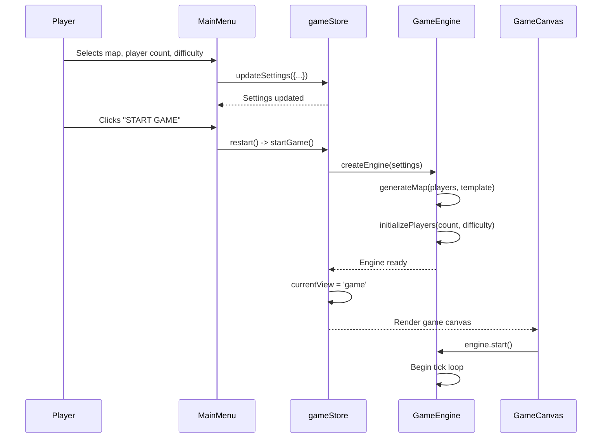
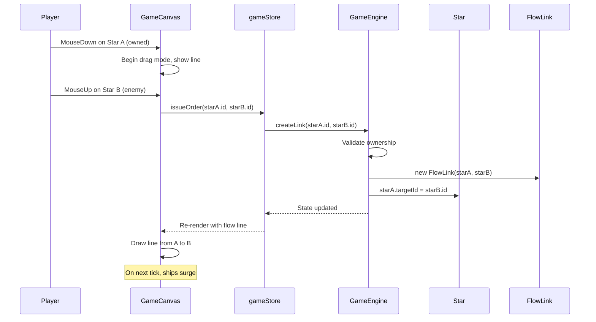
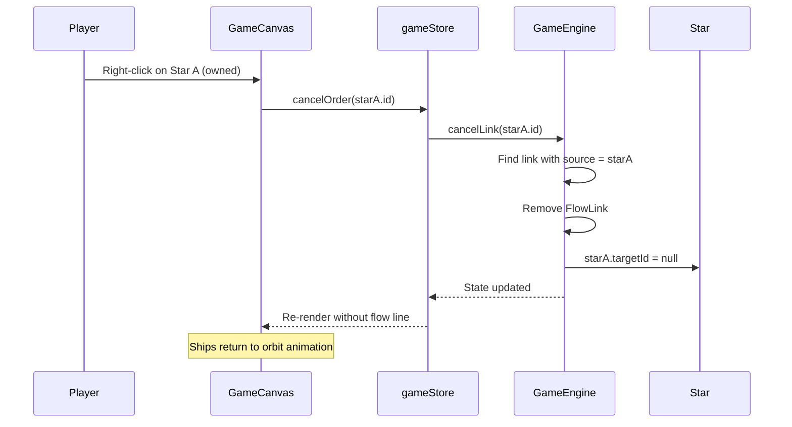
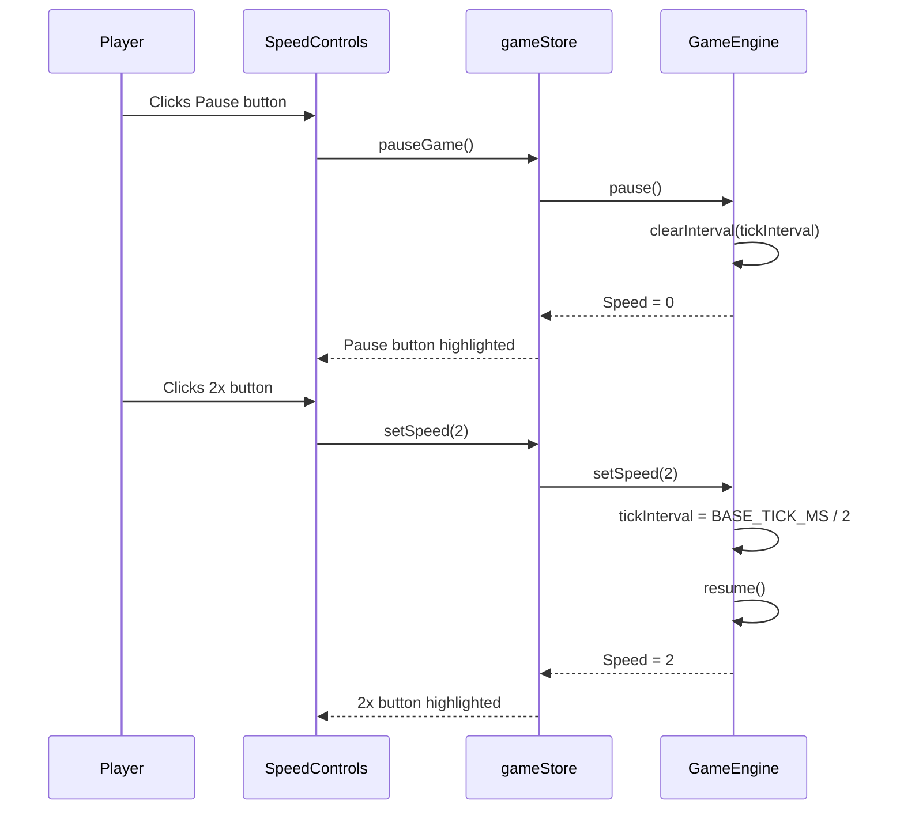
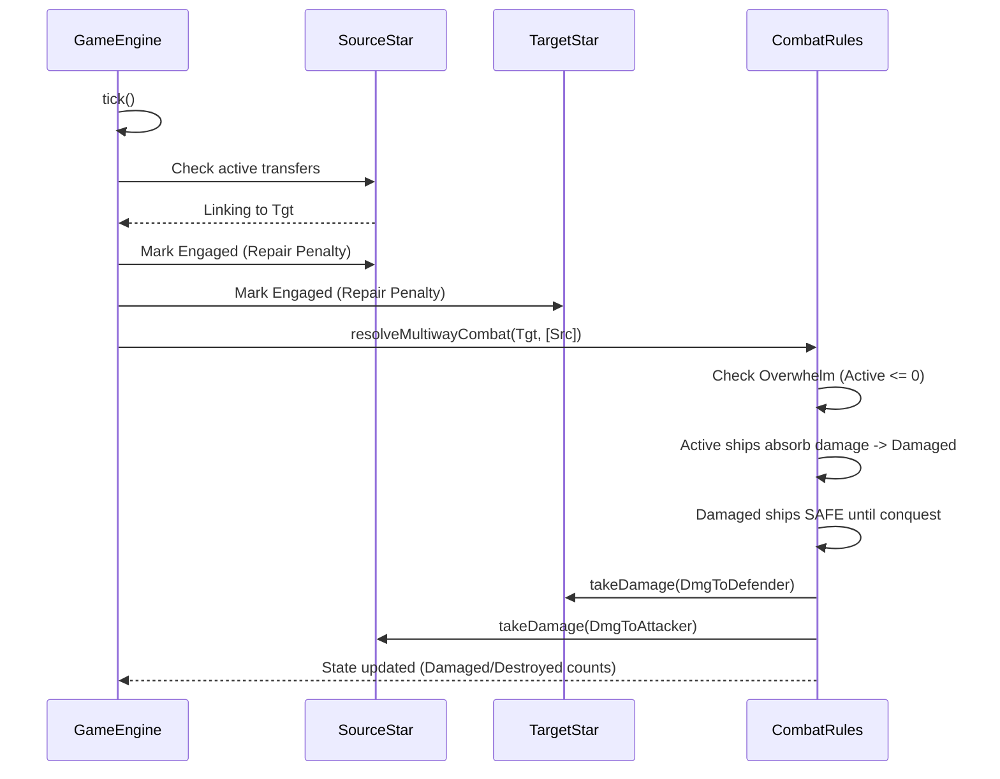
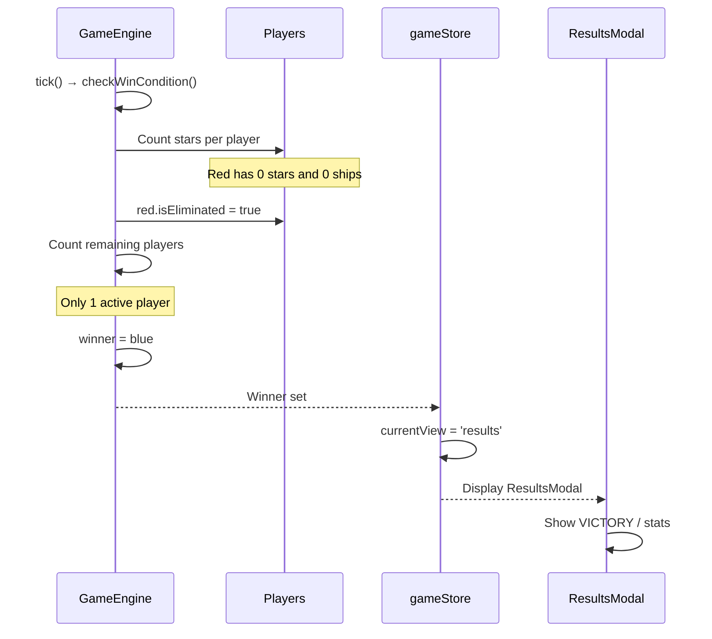
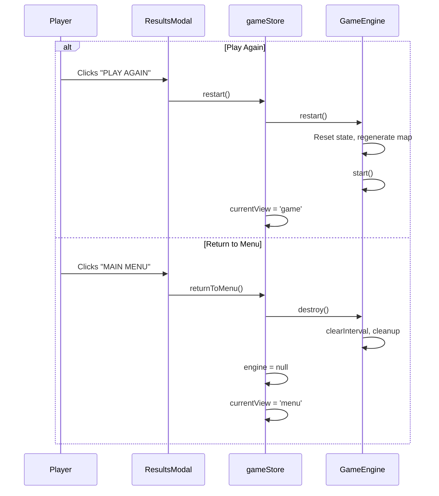
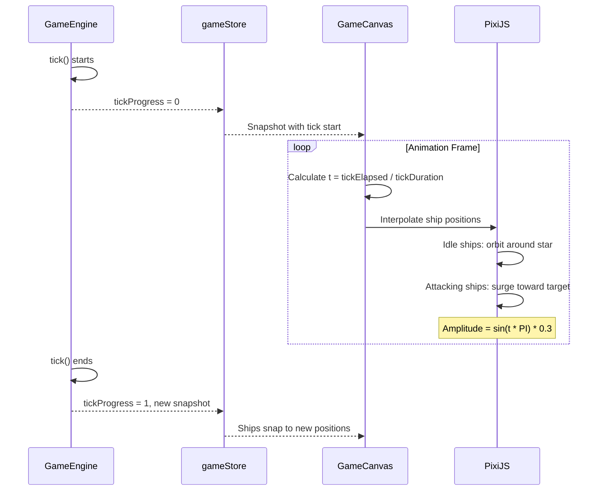

# VIEW E: FUNCTIONAL STORIES (Narratives)

**Last Updated:** 2026-01-29  
**Project:** Pax Fluxia

---

## Story Index

| ID | Title | Priority | Status |
|----|-------|----------|--------|
| US-001 | Start a Game | P0 | `[x] COMPLETED` |
| US-002 | Issue Attack Order | P0 | `[x] COMPLETED` |
| US-003 | Cancel Attack Order | P0 | `[x] COMPLETED` |
| US-004 | Control Game Speed | P0 | `[x] COMPLETED` |
| US-005 | Conquer Enemy Stars | P0 | `[x] COMPLETED` |
| US-006 | Win or Lose | P0 | `[x] COMPLETED` |
| US-007 | Replay or Return to Menu | P1 | `[x] COMPLETED` |
| US-008 | Visual Feedback (Surge Animation) | P1 | `[x] COMPLETED` |

---

## [US-001] Start a Game

**Narrative:** As a **Player**, I want to **configure and start a new game**, so that I can **begin playing against AI opponents**.

**Status:** `[x] COMPLETED`

### Functional Trace
1. **TRIGGER:** User clicks `[MainMenu: START_GAME button]`
2. **GUARD:** Check `settings.playerCount >= 2`
3. **DATA FLOW:** Settings passed to `createEngine()`
4. **SIDE EFFECT:** Engine initializes, tick loop starts
5. **FEEDBACK:** View transitions to Game screen, canvas renders
6. **UPDATE:** MainMenu now overlays and uses `restart()` logic.

### Validation Criteria
- [x] Map selector changes available options
- [x] Player count changes opponent count
- [x] Difficulty selector works (console log for MVP)
- [x] Click START transitions to game view
- [x] Stars appear on canvas with correct colors
- [x] Tick loop begins (metronome pulses)

---

## [US-002] Issue Attack Order

**Narrative:** As a **Player**, I want to **drag from my star to an enemy star**, so that I can **send ships to attack and capture it**.

**Status:** `[x] COMPLETED`

### Functional Trace
1. **TRIGGER:** User drags from `[Star: owned]` to `[Star: enemy or friendly]`
2. **EVENT:** Canvas emits `onDragEnd(sourceId, targetId)`
3. **GUARD:** Check `source.ownerId === currentPlayer.id`
4. **DATA FLOW:** FlowLink created, replaces any existing outbound link
5. **FEEDBACK:** Flow line rendered, ships begin surge animation

### Validation Criteria
- [x] Drag gesture detected correctly
- [x] Visual line follows mouse during drag
- [x] Link created only from owned stars
- [x] Previous link from same star is replaced
- [x] Flow line rendered between stars
- [x] Ships animate toward target each tick

---

## [US-003] Cancel Attack Order

**Narrative:** As a **Player**, I want to **right-click on my star**, so that I can **stop sending ships and defend instead**.

**Status:** `[x] COMPLETED`

### Functional Trace
1. **TRIGGER:** User right-clicks `[Star: owned with active link]`
2. **EVENT:** Canvas emits `onStarRightClick(starId)`
3. **GUARD:** Check `star.ownerId === currentPlayer.id`
4. **DATA FLOW:** FlowLink removed from engine
5. **FEEDBACK:** Flow line disappears, ships return to idle orbit

### Validation Criteria
- [x] Right-click detected on star
- [x] Context menu prevented
- [x] Link removed only from owned stars
- [x] Flow line disappears immediately
- [x] Ships transition to orbit animation
- [x] Right click also clears active selection.

---

## [US-004] Control Game Speed

**Narrative:** As a **Player**, I want to **pause and change game speed**, so that I can **think strategically or speed up boring parts**.

**Status:** `[x] COMPLETED`

### Functional Trace
1. **TRIGGER:** User clicks `[SpeedControls: speed button]`
2. **EVENT:** Button emits speed value
3. **GUARD:** None (always allowed)
4. **DATA FLOW:** Engine tick interval adjusted
5. **FEEDBACK:** Active button highlighted, metronome speed changes

### Validation Criteria
- [x] Pause button stops tick loop
- [x] Speed buttons change tick interval
- [x] Metronome pulses at correct rate
- [x] Active speed button is visually distinct
- [x] Game state frozen while paused

---

## [US-005] Conquer Enemy Stars

**Narrative:** As a **Player**, I want my **ships to battle and capture enemy stars**, so that I can **expand my territory**.

**Status:** `[x] COMPLETED`

### Functional Trace
1. **TRIGGER:** Tick fires with active FlowLink to enemy
2. **EVENT:** Engine processes combat vector
3. **COMBAT:** Asymmetric Damage + Pinning applied
4. **DATA FLOW:** Source & Target take damage simultaneously
5. **FEEDBACK:** Damaged ship counts rise, Repair inhibited
6. **CAPTURE:** If Active <= 0, attacker conquers. Damaged ships 50% destroyed, 50% captured.

### Validation Criteria
- [x] Attackers take damage at Source (Remote Return Fire)
- [x] Defenders accumulate Damaged status
- [x] Repair rate drops when under attack
- [x] Overwhelm triggers instant win for massive disparity
- [x] Damaged ships persist until conquest

---

## [US-006] Win or Lose

**Narrative:** As a **Player**, I want the **game to end when I conquer all stars or lose all mine**, so that I can **see my final score**.

**Status:** `[x] COMPLETED`

### Functional Trace
1. **TRIGGER:** Tick completes, win check runs
2. **EVENT:** Player star count reaches 0
3. **GUARD:** Check if only 1 player remains
4. **DATA FLOW:** Winner set, view transitions
5. **FEEDBACK:** Results modal displays with stats

### Validation Criteria
- [x] Eliminated toast shown when player loses all stars
- [x] Game ends when only 1 player remains
- [x] Results modal shows correct winner
- [x] Stats displayed (time, peak fleet, etc.)
- [x] VICTORY or DEFEAT shown appropriately

---

## [US-007] Replay or Return to Menu

**Narrative:** As a **Player**, I want to **play again or return to menu after game ends**, so that I can **continue playing**.

**Status:** `[x] COMPLETED`

### Functional Trace
1. **TRIGGER:** User clicks result screen button
2. **EVENT:** Button action dispatched
3. **DATA FLOW:** Engine reset or destroyed
4. **FEEDBACK:** View transitions appropriately

### Validation Criteria
- [x] PLAY AGAIN resets with same settings
- [x] MAIN MENU returns to menu view
- [x] Engine properly cleaned up on menu return
- [x] New game starts fresh (no lingering state)

---

## [US-008] Visual Feedback (Surge Animation)

**Narrative:** As a **Player**, I want to **see ships pulse outward when attacking**, so that I can **intuitively understand the flow of battle**.

**Status:** `[x] COMPLETED`

### Functional Trace
1. **TRIGGER:** Tick fires, requestAnimationFrame loops
2. **ANIMATION:** Ships interpolate between states
3. **ORBIT:** Idle/damaged ships circle their star
4. **SURGE:** Attacking ships pulse outward (30% at peak) and return
5. **FEEDBACK:** Visual rhythm matches tick rate (sinusoidal pulse)

### Validation Criteria
- [x] Idle ships orbit in circular/chaotic pattern
- [x] Attacking ships surge outward on tick (30% distance at peak)
- [x] Surge uses sinusoidal interpolation (smooth pulse-return)
- [x] Animation feels "rhythmic" and "pulsing"
- [x] Damaged ships stay in orbit, never surge

---

*Update this file when: Starting new features, refactoring user-facing flows, marking stories complete.*
