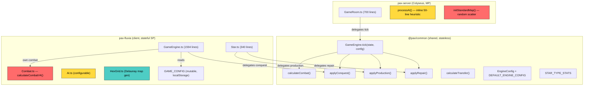

# Engine Architecture — Current State

**Last Updated:** 2026-02-12  
**Purpose:** Document where game logic currently lives across all three packages

---

## Architecture Overview



**Legend**: 🔴 Red = Duplicated/conflicting, 🟡 Yellow = Different implementations, 🟢 Teal = Unique (should be shared)

---

## Duplication Matrix

| Feature | Common | Client | Server | Status |
|---------|--------|--------|--------|--------|
| **Combat formula** | `calculateCombat()` | `calculateCombatV4()` | via Common | ⚠️ **Two different functions** |
| **Transfer rate** | `EngineConfig.TRANSFER_RATE = 0.1` | `GAME_CONFIG.TRANSFER_RATE` | via Common | ⚠️ **3 sources** (also `ORDER_CONFIG = 0.25`) |
| **Tick orchestration** | `GameEngine.tick()` | Own `executeTick()` | Calls `GameEngine.tick()` | ⚠️ **Client reimplements** |
| **Combat resolution** | `resolveMultiSourceCombat()` | Own `resolveMultiSourceCombat()` + `resolveCombat()` | via Common | ⚠️ **Client reimplements** |
| **Transfer processing** | `processOrders()` | Own `executeTransferOrders()` | via Common | ⚠️ **Client reimplements** |
| **Win condition** | Star count only | Star count + 99% dominance | via Common | ⚠️ **Client is richer** |
| **Map generation** | ❌ | Hex grid + Delaunay | Random scatter | ⚠️ **Two algorithms** |
| **AI** | ❌ | Configurable `AI.ts` | 50-line inline heuristic | ⚠️ **Two implementations** |
| Production | `applyProduction()` | `Star.produce()` → delegates | via Common | ✅ Unified |
| Repair | `applyRepair()` | `Star.repair()` → delegates | via Common | ✅ Unified |
| Conquest | `applyConquest()` | Delegates + logging wrapper | via Common | ✅ Mostly unified |
| Star type stats | `STAR_TYPE_STATS` | Reads from Common | Reads from Common | ✅ Unified |

---

## Data Flow — Single Player

```
GAME_CONFIG (mutable, localStorage)
    ↓ reads
Client GameEngine.executeTick()
    ├── executeTransferOrders()     ← duplicated from Common
    │   └── calculates transfer amount using GAME_CONFIG.TRANSFER_RATE
    ├── resolveMultiSourceCombat()  ← duplicated from Common
    │   └── calls calculateCombatV4()  ← NOT Common's calculateCombat()
    │   └── calls executeConquest()
    │       └── delegates to applyConquest()  ✅ shared
    ├── production                  ✅ Star.produce() → applyProduction()
    ├── repair                      ✅ Star.repair() → applyRepair()
    ├── AI.evaluate()               ← client-only configurable AI
    ├── checkWinCondition()         ← richer than Common (99% dominance)
    └── emits TickEvents → activeGameStore → GameCanvas
```

## Data Flow — Multiplayer

```
Client: gameplayConfig from GAME_CONFIG → sent to server at room creation
    ↓
Server: GameRoom.executeTick()
    ├── processAI()                ← inline 50-line heuristic (weaker than client AI)
    ├── GameEngine.tick(state, engineConfig)  ✅ shared
    │   ├── processProduction()    ✅ shared
    │   ├── processOrders()        ✅ shared (uses calculateCombat, NOT calculateCombatV4)
    │   ├── processRepair()        ✅ shared
    │   └── checkWinCondition()    ✅ shared (but simpler)
    └── broadcasts TickEvents to clients
```

---

## Three Transfer Rates

| Source | Value | Used By |
|--------|-------|---------|
| `GAME_CONFIG.TRANSFER_RATE` | User-set (default 10) | Client SP engine |
| `DEFAULT_ENGINE_CONFIG.TRANSFER_RATE` | `0.1` | Server (via Common) |
| `ORDER_CONFIG.TRANSFER_RATE` | `0.25` | `calculateTransfer()` in `orders.ts` |

Only `GAME_CONFIG.TRANSFER_RATE` is connected to the UI slider. The user sets it to (e.g.) 10, which becomes 0.10. The Common engine uses `DEFAULT_ENGINE_CONFIG` which defaults to 0.1. `ORDER_CONFIG` at 0.25 is a stale orphan likely never called.

---

## Combat Formula Comparison

| Aspect | `calculateCombatV4` (Client) | `calculateCombat` (Common) |
|--------|------------------------------|---------------------------|
| File | `pax-fluxia/src/lib/engine/Combat.ts` | `common/src/combat.ts` |
| Used by | Client SP engine | Server via Common engine |
| Parameters | `(defenderForce, attackerForce, defenderIsAttacking, attackerIsAttacking)` | Needs verification |
| Lethality split | `killed = damage × LETHALITY`, `disabled = damage × (1 - LETHALITY)` | Needs verification |
| Force ratio | `1 + log₂(ratio) × FORCE_RATIO_EFFECT` | Needs verification |

> [!WARNING]
> The two combat functions may have diverged. This is the highest-priority item to verify and unify.

---

*This document describes the AS-IS state. See `ENGINE_ARCHITECTURE_TARGET.md` for the desired state.*
